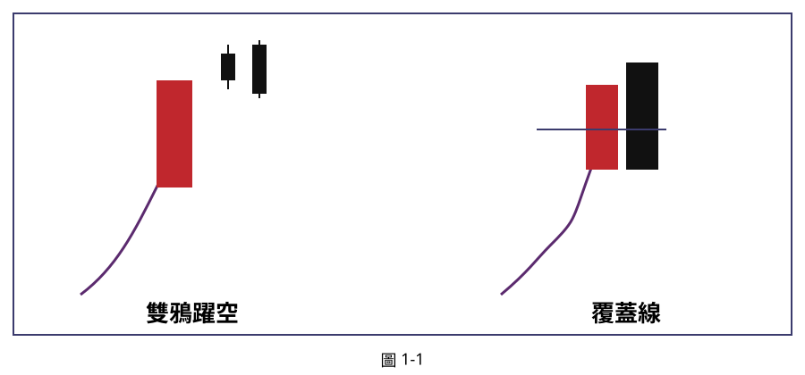

## p.12

[blank page — faint mirrored bleed-through from facing page only, no content]

## p.13

# 第一章 頂底雙紅黑

空在最高點及買到最低點，那是當沖客夢寐想做到的交易，但空在尖頂或尖底附近，倒是有機會辦到，所謂尖頂或尖底極端位置乃是當下盤中的最高點或最低點位置；如果某種K線組合，後續行情將發生反轉，由漲轉跌或由跌轉漲；而這種高勝率的K線組合，稱為頂雙黑或底雙紅，具有超高機率帶動反轉趨勢，而且辨識容易，我們將深入解析極端位置K線組合的條件及其細節。

**圖 1-1**

> 圖說（figure notes）: 手繪示意圖，藍色方框內左右各一組K線組合。左半：一根紫色曲線由左下方向右上方竄升，接一根中長紅K線，隨後出現兩根小黑K線依序向右上方墊高，標示為「雙鴉躍空」，表示紅K線後連二根黑K線自頂端下壓。右半：紫色曲線同樣由左下向右上方竄升（中間略有一段小停頓再續揚），接一根紅K線，其右側緊接一根黑K線，黑K線實體下壓穿越紅K線實體中線（以藍色水平線標示中線位置），標示為「覆蓋線」，表示黑K線收盤跌破紅K線實體中線之下。圖說對應本文：雙鴉躍空與覆蓋線皆為頂部反轉K線組合，前者連二根黑K線自高點下壓，後者黑K線跌破前一根紅K線實體中線。

在K線戰法裡，有個著名的頂點反轉組合，在個股漲勢的末端出中長紅K線，通常是實體長度在昨收盤價3%以上，多頭氣勢銳不可擋，隔天出現跳高開盤，卻緩步走低，形成開高收低的黑K線，但與紅K線之間仍存在跳空缺口，雖仍屬上漲，卻隱隱有空軍壓境徵兆，繼之再一根開高走低續跌的黑K線，換言之，中長紅K線後，連二黑K線自頂端下壓，叫做雙鴉躍空，如圖1-1左半圖所示，當出現雙鴉躍空，再配合大量，則反轉之勢更加明顯，但這樣就能大
