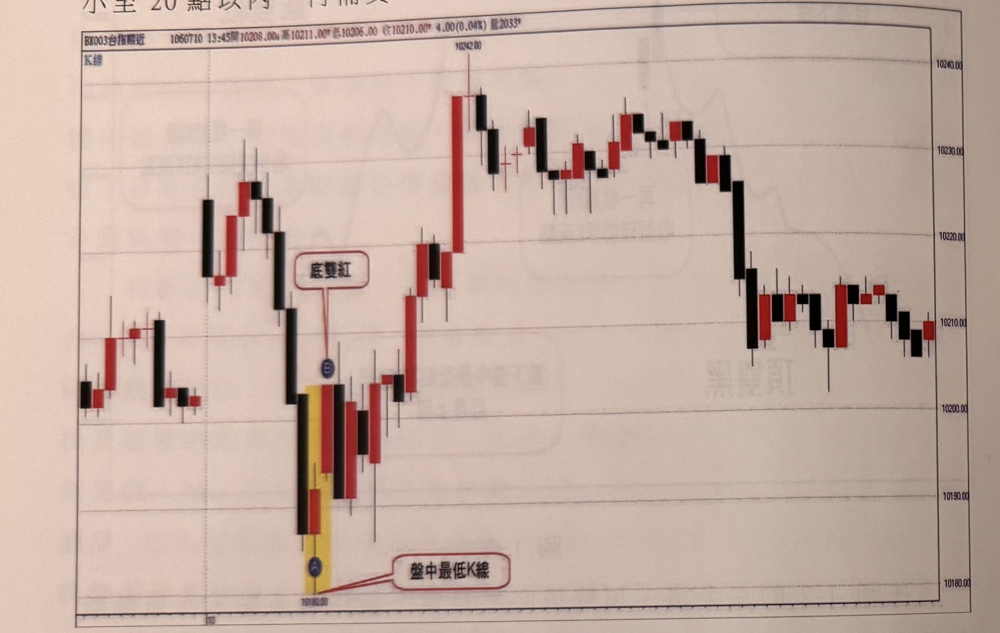
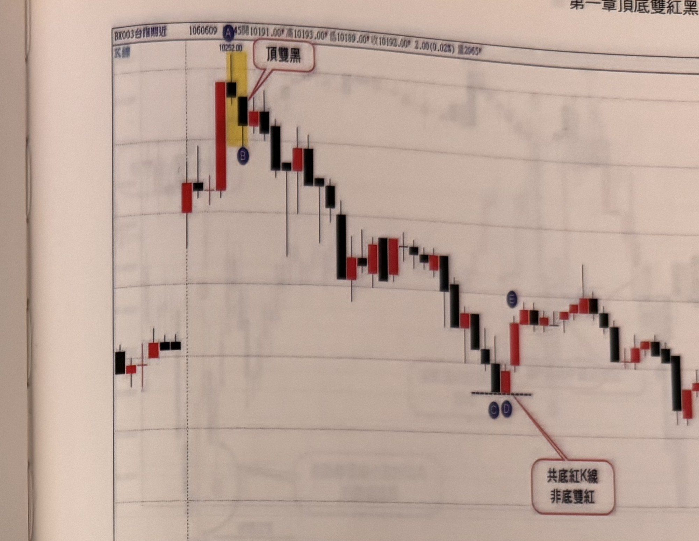

## p.16

位置，當符合上述的條件時，最低點必須為紅K線，並且為上漲紅K線，隔一根紅K線收盤，必須突破最低紅K線的高點，而從最低點到第二根紅K線收盤的幅度，最好保持在20點以內，可以立刻進場買進，若幅度超過20點以上，則可等待價格拉回，離停損點縮小至20點以內，再補買。

**圖 1-3**

> 圖說（figure notes）: 台指期分時K線走勢圖，頁首標示「BX003台指期近 1060710 13:45開10208.00 高10211.00 低10206.00 收10210.00 4.00(0.04%) 量2033」，左上角標示「K線」，右側價格座標軸由上而下為10240.00、10230.00、10220.00、10210.00、10200.00、10190.00、10180.00。走勢左側先小幅震盪，一根長黑K線後，出現黃底標示的兩根K線：黑K線（最低點標記圓圈「A」，價位10180.00，紅框標註「盤中最低K線」指向此處）與其後一根紅K線（標記圓圈「B」，紅框白底圓角矩形標註「底雙紅」指向此處），隨後行情持續上攻，經過一段震盪整理，於最高點10242.00附近盤整後，最終回落至10210.00附近收在低檔區間。此圖對應本文說明：A為盤中最低K線（黑K線），隔一根紅K線B收盤突破A高點，B與A之間幅度在20點以內，構成底雙紅買進訊號範例。

例如在圖1-3，行情以平高盤開出，稍後下殺到平盤下，在連續的黑線後，終於出現在A點出現紅K線，黑點出現的盤中最低K線，隔一根再出現一根過A的K線高點之b點紅k線，從盤中最低點至訊號B的K線收盤，幅度超過20點，操作上可以等價格稍作拉回再補進場，作買進動作，另一種作法亦容許立刻買進，但停損仍堅持控制在20點，只要風險能確實控制執行，彈性運用亦可。

## p.17

**圖 1-4**

> 圖說（figure notes）: 台指期分時K線走勢圖，頁首標示「BX003台指期近 1060609 A 45開10191.00 高10193.00 低10189.00 收10192.00 2.00(0.02%) 量2965」。走勢左側先小幅震盪，出現黃底標示的兩根K線：紅K線（最高點標記圓圈「A」，價位10252.00）與其後一根黑K線（標記圓圈「B」，紅框白底圓角矩形標註「頂雙黑」指向此處），隨後行情連續下跌，經過中段一小段反彈整理，續跌至一組標記圓圈「C」「D」的K線（黑K線與紅K線，底部以黑色虛線標示同一低點，紅框標註「共底紅K線 非底雙紅」指向此處），其後出現標記圓圈「E」的反彈K線，行情小幅反彈整理後再度走低。此圖對應本文說明：A為盤中最高點，B為頂雙黑訊號K線，A到B幅度符合40點要求（從昨日收盤起算跳空達40點），操作上可進場放空；C、D兩點同低，屬「共底紅K線」而非「底雙紅」，因D點的K線低點非當下盤中獨一無二的低點，不符合底雙紅買進條件，不能視為買進訊號。

在圖1-4的案例裡面，跳高開盤後，到達早盤最高點A，當下盤中高低幅不到30點，但若**從昨天收盤起算，跳空到A點，距離符合40點要求**，首先A點為下跌黑線，隔根B點的K線收盤跌破A的K線最低點，符合頂雙黑組合條件，雙黑的高至收盤小於20點，可以立刻進場操作空點，而當行情一路走跌到C點位置，D點跟E點形成底雙紅的組合結構，但此處得注意D點與C點同低，D點的K線低點非為當下盤中獨一無二的低點，這種共底的兩根K線，不符合底雙紅的條件，不能視為買進訊號。這個獨一無二的條件要特別注意，線形中發生同高雙頂或同低雙底的機率很高，必須加以剔除。
