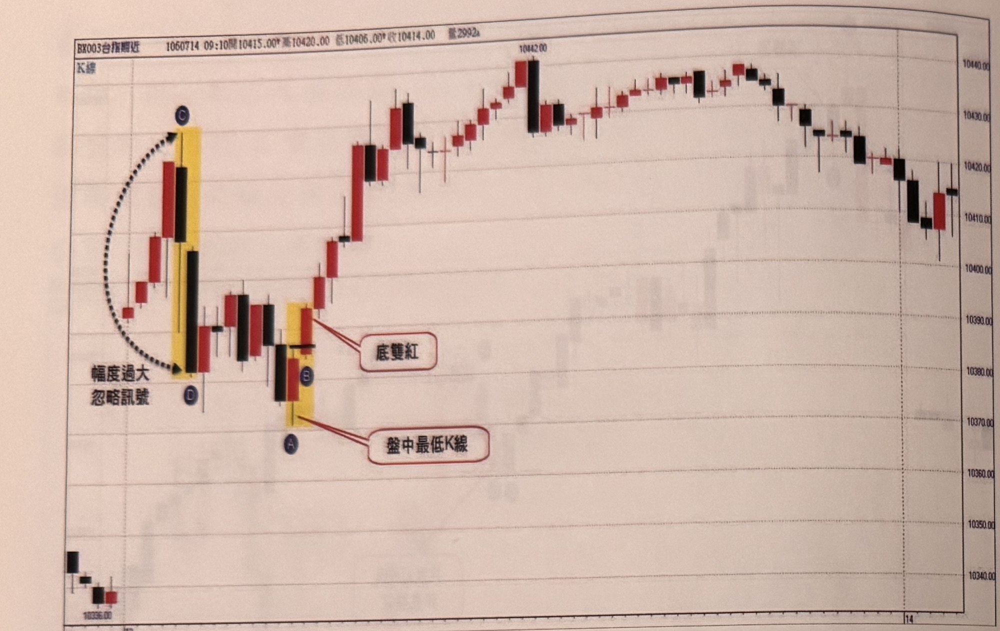
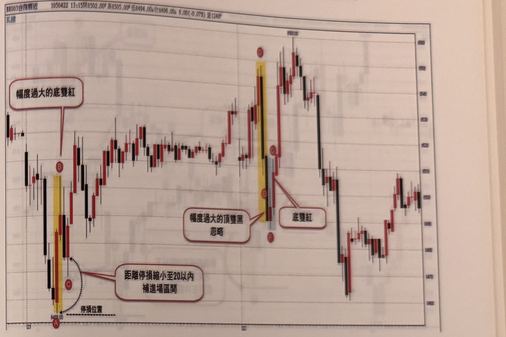

## p.18

不管訊號是來自極端高點或極端低點所發出，訊號本身不能離極端位置過遠，雖然超過 20 點幅度的訊號，可以稍後折返時補進場，然而假使極端反轉組合幅度過大時，宜忽略訊號，亦不必補進場，例如圖1-5中，當天跳高開盤，並且持續上攻到 C 頂點，接著以頂雙黑向下摜殺，D 點雖是空訊位置，但是從 C 頂點到 D，幅度超過 20 點以外，最不合理是 D 點變成當下行情最低點，經過 2 根 K 線就讓行情由最高點奔向最低點，這是相當不合理的變化，因此必須剔除這種操作訊號，如果 D 點不是當下行情最低點，若後續出現反彈，使得停損縮小至 20 點以內，則可以補進場。後來行情到達 A 低點，迅速出現底雙紅買訊，幅度 23 點，因此可以在隔根小拉回進場，或者立刻進場，但停損維持 20 點。

**圖 1-5**

> 圖說（figure notes）: 一張台指期分時K線走勢圖（頁首標示「BX003台指期近 1060714 09:10開10415.00 高10420.00 低10406.00 收10414.00 量2992口」），左上角標示「K線」，右側為價格座標軸（自上而下約10440.00、10430.00、10420.00、10410.00、10400.00、10390.00、10380.00、10370.00、10360.00、10350.00、10340.00），底部軸標示日期刻度「13」「14」。走勢左側先小跌，接著一根長紅K線後一根長黑K線（皆以黃底標示），黑K線最低點標記為圓圈「D」，紅K線最高點標記為圓圈「C」，兩點之間以黑色虛線弧線連接並標註「幅度過大 忽略訊號」，說明C到D之間跌幅過大（超過20點），應剔除該頂雙黑訊號。隨後行情持續下跌至一組黃底標示的紅黑K線組合，黑K線最低點標記圓圈「A」，紅K線標記圓圈「B」，並以紅框白底圓角矩形標註「底雙紅」指向此處，另有紅框標註「盤中最低K線」指向A點所在K棒，說明A為當下盤中最低點、隨後B為底雙紅買訊。此組合幅度23點（未超過20點過多），符合可操作條件。其後行情持續反彈上攻，經過盤整，於「10442.00」標示高點附近震盪後，緩步回落收在10410~10420區間。此圖對應本文說明：C到D幅度超過20點，属於「幅度過大、忽略訊號」之頂雙黑；而A到B幅度23點的底雙紅則因幅度不算過大，可於隔根小拉回或立刻進場，停損維持20點。

## p.19

幅度過大的極端訊號，一般若超過 20 點不多的情況下，立刻進場差別不大，只要停損控制在 20 點即可，如果超出 20 點甚多，達到 30 點以上，那最好等拉回縮小至停損 20 點以內，再補進場。再舉圖 1-6 來說明，左邊行情跳低開盤，呈現多空拉鋸，K 線上下影線長而實體小，接著突然長黑破低，連下三根黑 K 線，到達 A 點突然多頭奮力急彈，出現底雙紅買訊，但 AB 幅度超過 30 點以上，最好等拉回到 C 的虛線區間，停損縮小至 20 點以內，再進場補買，同樣幅度過大的訊號，發生在右邊則不同處理，行情雖跳低開盤，隨即反彈突破平盤，直達盤中最高點 D，隨即呈現頂雙黑組合，但 DE 幅度達 58 點，且 E 點變成當下盤中最低點，這明顯的不合理，因此這頂雙黑訊號選擇忽略不操作，隨後 FG 出現底雙紅買訊，果然迅速上攻。

**圖 1-6**

> 圖說（figure notes）: 一張台指期分時K線走勢圖（頁首標示「BX003台指期近 1050422 13:15開8502.00 高8505.00 低8494.00 收8496.00 6.00(-0.07%) 量1248口」），左上角標示「K線」，右側為價格座標軸（自上而下約8560、8550、8540、8530、8520、8510、8500、8490、8480、8470、8460），底部軸標示日期刻度「21」「22」。走勢開盤跳低，先小幅震盪（上下影線長、實體小），接著連續出現三根黑K線向下摜破（黃底標示其中一根，最低點標記圓圈「A」，價位標示「8455.00」，下方有水平虛線標註「停損位置」），隨後B點（紅K線，黃底標示）出現反彈，紅框標註「幅度過大的底雙紅」以線指向B點，另一組紅框標註「距離停損縮小至20以內 補進場區間」以黑色虛線弧線連接A與C點（C點在B右下方回檔處），說明AB幅度超過30點，須等待價格拉回至C的虛線區間、停損縮小到20點以內才補進場。其後行情反彈上攻至D點（紅K線，黃底標示，最高點標示「8560.00」），隨即出現E點（黑K線，黃底/灰底標示）向下摜破，紅框標註「幅度過大的頂雙黑 忽略」以線指向D、E一帶，另一紅框標註「底雙紅」指向E、F附近。F點位於E下方，G點標記於F右上方對應反彈起點。此圖對應本文：左側AB幅度超過30點的底雙紅，需等拉回至C的虛線區間、停損縮小至20點以內再補進場；右側DE幅度達58點的頂雙黑訊號因E點成為當下盤中最低點而不合理，故忽略不操作，隨後FG出現底雙紅買訊，行情隨即迅速上攻。
