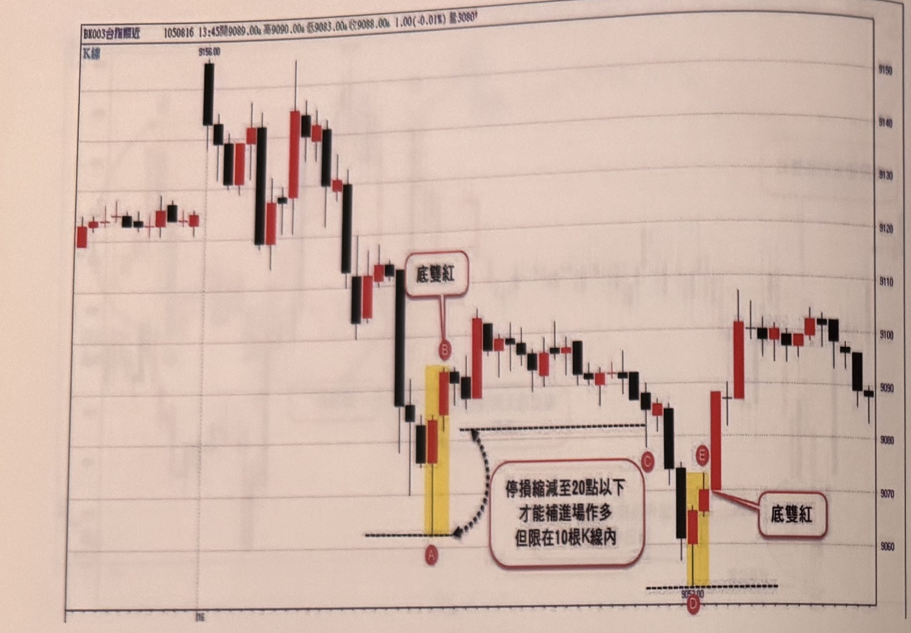
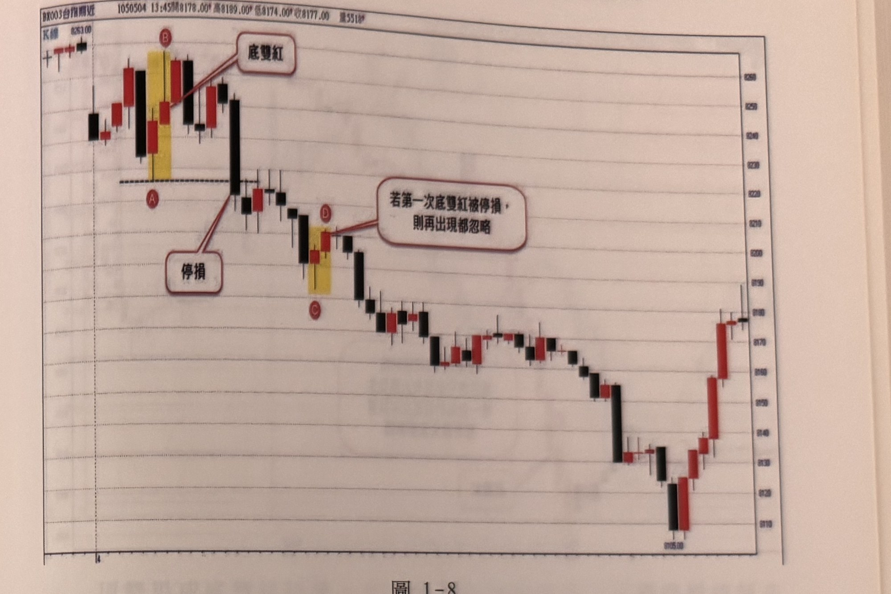

## p.20

另一個幅度過大的問題要特別討論，當頂雙黑或底雙紅訊號出現幅度超過 30 點時，大都等折返縮小停損點數時，再補進場，但這種折返不能拖太久，**最好在 10 根 K 線內**，價格進入合理的補進場區，超過 10 根 K 線，則時效過期，就不必再視為操作訊號了。如圖 1-7 的例子，行情跳高開盤後，多頭不攻不成，逐漸跌破平盤，直下到 A 點止跌，AB 形成底雙紅買進訊號，但幅度達 30 點，因此等待價格拉回至虛弧線區間，再補進場，但行情卻一直拖到 C 位置，才拉回讓停損縮小至 20 點以內，距離 B 點超過 10 根 K 線，已經失效，不能補買進；所幸在 D 點出現盤中最低點，DE 再次形成底雙紅買進訊號。

**圖 1-7**

> 圖說（figure notes）: 一張台指期分時K線走勢圖（頁首標示「BX003台指期近 1050816 13:45開9089.00 高9090.00 低9083.00 收9088.00 1.00(-0.01%) 量3080口」），左上角標示「K線」，右側為價格座標軸（自上而下約9150、9140、9130、9120、9110、9100、9090、9080、9070、9060），底部軸標示日期刻度「16」。走勢開盤附近小幅盤整後，在標示「9156.00」處出現一根長黑K線高點，隨後連續下跌，經過多根紅黑K線後跌破平盤，到達一組黃底標示的K線（黑K在左、紅K在右），黑K最低點標記圓圈「A」，其上方紅框標註「底雙紅」以線指向B點（紅K線頂端），B點另標記圓圈。A至B之間有一條水平虛線，並以黑色弧形虛線箭頭連接至右下方紅框文字「停損縮減至20點以下 才能補進場作多 但限在10根K線內」，箭頭指回A點下方水平虛線處，說明AB幅度達30點需等拉回至該水平虛線區間、且限10根K線內。其後行情反彈震盪上攻，到達C點（黑K線，標記圓圈「C」，位於右側水平虛線延伸處），行情持續下跌至一根長黑K線後，出現D點（黑K線最低點，標記圓圈「D」，價位標示「9052.00」，下方有水平虛線），隨後E點（紅K線，黃底標示，標記圓圈「E」）與D點附近另一根紅K線構成底雙紅，右側紅框標註「底雙紅」以線指向此處。此圖對應本文：AB底雙紅幅度達30點，需等待拉回C的虛線區間、停損縮小至20點以內再補進場，但因拖延超過10根K線已失效不能補買；隨後DE再次形成底雙紅買進訊號。

## p.21

幅度過大的極端訊號出現後，若沒能扭轉趨勢，而遭致停損時，代表市場變化可能超出理解，而後行情若繼續出現同向極端訊號，不宜再當作操作訊號看待。例如在圖 1-8 裡，行情在 A 位置出現 AB 組合底雙紅買訊，幅度也小於 20 點，進場操作後，卻發現多頭氣勢不振，向下跌破 A 低點，造成停損，這種狀況顯示跌勢力量正加壓，既然跌趨勢較強，那逆向訊號就不能寄望第二次能成功，因此在 CD 形成另一次底雙紅時，便不宜當作訊號，宜忽略不操作，果然行情一路向下砍殺破底。

**圖 1-8**

> 圖說（figure notes）: 一張台指期分時K線走勢圖（頁首標示「BX003台指期近 1050504 13:45開8178.00 高8189.00 低8174.00 收8177.00 量5518口」），左上角標示「K線」，起始價位標示「8263.00」，右側為價格座標軸（自上而下約8260、8250、8240、8230、8220、8210、8200、8190、8180、8170、8160、8150、8140、8130、8120、8110），底部軸標示日期刻度「4」。走勢開盤震盪，出現一組黃底標示的紅黑K線（B點在上方標記圓圈，紅框「底雙紅」以線指向此處；A點標記於下方水平虛線上，圓圈標示），A、B之間紅框另有一條線指向下方文字框「停損」，說明AB底雙紅進場後遭跌破A低點停損。隨後行情持續下跌，經過一根長黑K線後，到達C、D位置的黃底標示紅黑K組合（C點在下標記圓圈，D點在紅K線標記圓圈，右側紅框「若第一次底雙紅被停損，則再出現都忽略」以線指向D點），說明CD再次出現底雙紅訊號時應忽略不操作。其後行情持續破底下殺，經過長時間下跌至底部區「8105.00」附近，才緩步反彈回升。此圖對應本文：AB底雙紅進場後因跌破A低點而停損，顯示跌勢力量較強；隨後CD再次形成底雙紅時應忽略不操作，果然行情持續破底下殺。
