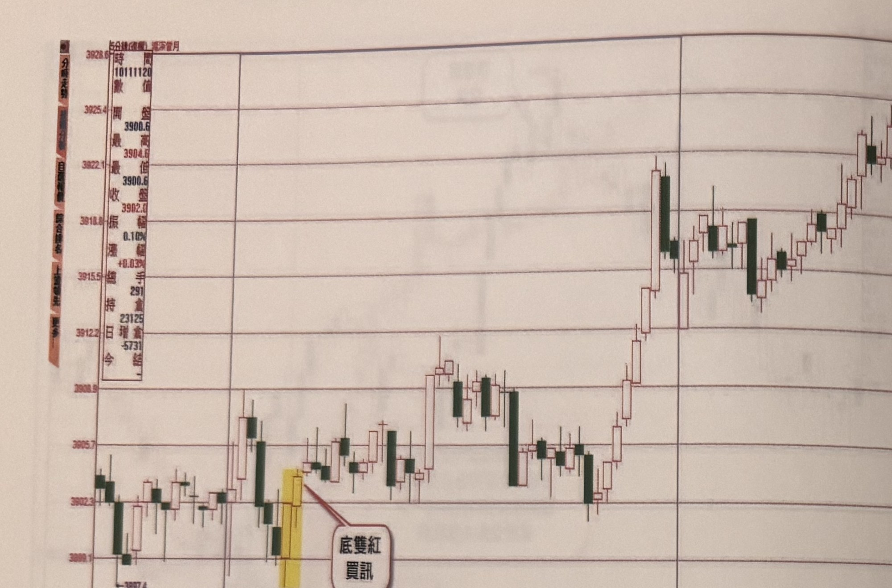
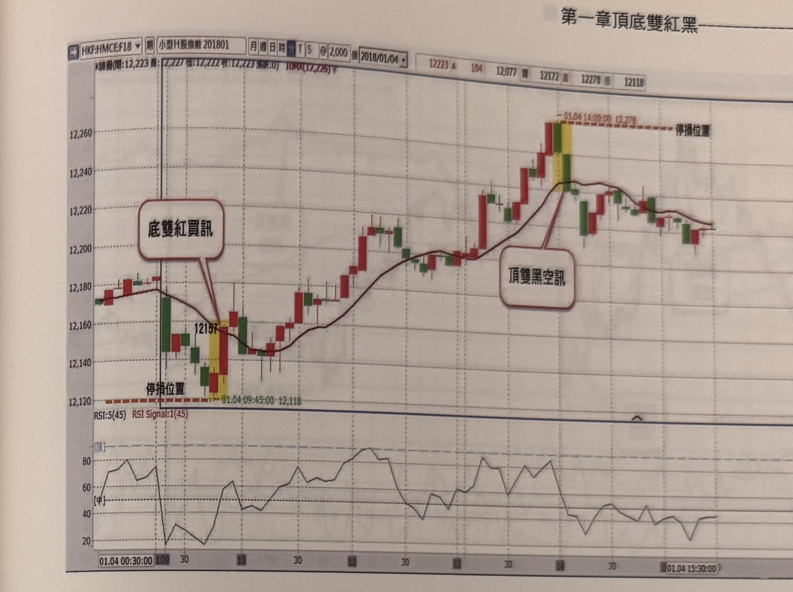

## p.24

**圖 1-11（同花順軟件提供）**

> 圖說（figure notes）: 滬深300指數5分鐘K線走勢圖，左上角資訊欄顯示「5分鐘(復權) 週漲跌幅」等欄位，時間「10111120」，開盤3900.6，最高3904.6，最低3902.0，收盤振幅0.10%，漲幅+0.03%，手數291，金額23125，今日結-5731。走勢圖左側先小幅震盪下探，於3899.1附近出現黃底標示的兩根紅K線組合，紅框標註「底雙紅買訊」以線條指向此處，隨後行情持續盤整上攻，中段一度於3908.9~3905.7區間反覆震盪，之後出現一根長黑K線與長紅K線的組合帶量上攻，最終持續墊高至3928.6高點附近，圖右側以豎直分隔線標示不同時段。此圖對應本文說明：滬深300指數開盤半小時後，於底部出現底雙紅買訊，進場位置離雙紅組合最低點不到6大點，以最低點為停損位置，至收盤為止利潤達10大點，更多時候有機會到達20大點以上。

海外商品期貨操作，一般人直覺認為一定比台指期難操作，其實不然，反而因為震幅大而能獲取較大的利潤，我認為台指的難度指數，鐵定能排入全球前三名，如果能嚴格執行風險控制，海外期貨操作根本不存在進入門檻。像在圖1-11的滬深300指數，開盤半小時後，出現底雙紅買訊，進場位置離雙紅組合最低點不到6大點，即以其最低點為停損位置，至收盤為止，利潤達10大點，更多時候有機會到達20大點以上；任何有利可圖的市場，長線趨勢雖然有其基本面背景因素，但在每一日的走勢裡，只有市場氛圍多空交戰拉鋸而已，比較能以技術層次來應對。

## p.25

**圖 1-12（永豐期貨 GLEADER 提供）**

> 圖說（figure notes）: 香港小型國企指數期貨（HKF:HMCE:F18，小型H股指數201801）5分鐘K線走勢圖，含下方RSI副圖。頁首資訊列顯示「K線圖(開:12,223 高:12,227 低:12,222 收:12,223 張數:0) IOMA(12,226)」，日期「2018/01/04」，右側數值「12223 漲104 12,077 跌 12,172 高 12,278 低 12118」。走勢左側於12,157附近出現黃底標示的紅K線與另一根紅K線組合，標示「12157」與虛線標示「停損位置」（12,118附近的紅色虛線），紅框白底圓角矩形標註「底雙紅買訊」以線條指向此區域；隨後行情沿黑色均線（IOMA）持續盤堅上攻，於12,240~12,278區間出現黃底標示的紅黑K線組合（頂部），上方紅色虛線標註「01.04 14:00:00 12,278」及「停損位置」，紅框標註「頂雙黑空訊」以線條指向此區域，其後行情自高點回落整理。下方RSI副圖顯示「RSI:5(45) RSI Signal:1(45)」，數值在20~90之間震盪，於底雙紅買訊處RSI約在20附近低檔，於頂雙黑空訊處RSI約在80以上高檔。橫軸時間刻度自「01.04 00:30:00」至「01.04 15:30:00」。此圖對應本文說明：2018年1月4日9點半後，在底部出現底雙紅買訊，進場點K線收盤在12157，雙紅低點在12118，停損約39點，到下午2點到達12278點，距離買訊進場點121點；到達頂點後再次出現頂雙黑空訊。

就在台期交易的時段，香港小型國企指數期貨（小H）是進軍海外期貨市場的另一個試身手的起始市場，1點=10港幣，約為台幣39元，與小台期相當，但震盪幅度顯然比台指大多，以圖1-12為例，2018年1月4日，9點半後，在底部出現底雙紅買訊，進場點的K線收盤在12157，雙紅低點在12118，停損約在39點，到下午2點，到達12278點，距離買訊進場點達121點，行進乾脆俐落，在抵達頂點後，再次出現頂雙黑空訊，如果第一趟買訊獲利出場後，覺得滿足，即可停止操作，多做不見得多獲利，操作永遠以自我滿足為最高指導原則。
