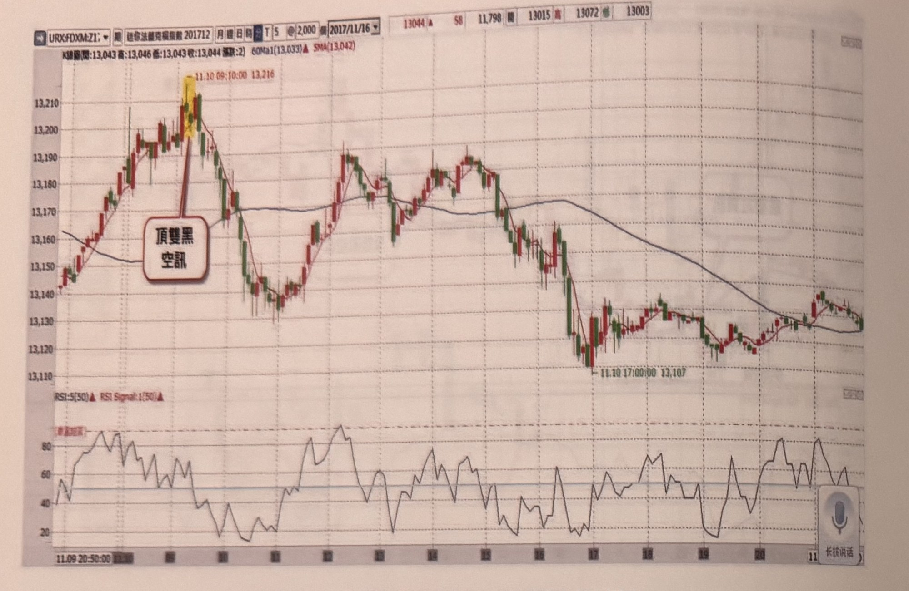
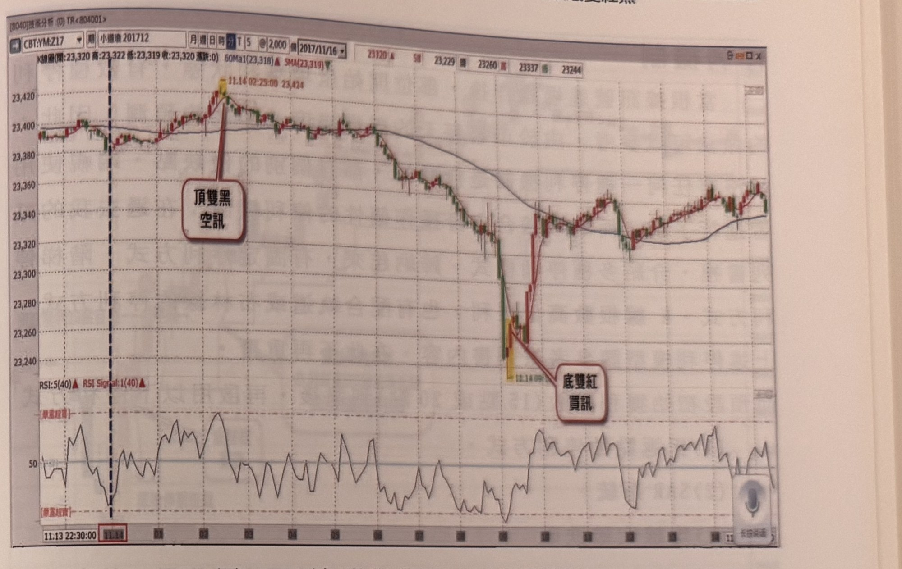

## p.26

當台指收盤後，緊接著在下午 1 點 50 分，德國小型法蘭克福指數期貨(小 DAX)登場，同樣的訊號特徵一樣適用，小 DAX 的 1 點代表 5 歐元，因此在停損點數規畫上，以 20～25 點為原則，約為 3500～5000 台幣之間，通常在最初的 3 小時，行情的震盪幅度較大，儘可能在這段時間操作完畢，如以圖 1-13 小 DX 指數在 2017 年 11 月 10 日的五分鐘 K 線圖為例，在當地時間 9 點附近，出現頂雙黑空訊，停損點設在雙黑高點位置，約 13 點距離，在 11 點時，行情自空點下挫 70 點以上，這種點數，在台指期是久久才一次的，卻在海期常常上演，這種獲利點數，一趟即可滿足操作目標，不會佔用過多的生活時間。

**圖 1-13（永豐期貨 GLEADER 提供）**

> 圖說（figure notes）: 永豐期貨GLEADER軟體截圖，德國小型法蘭克福指數期貨（迷你法蘭克福指數 201712，代碼URX/FDXM:Z1x）5分鐘K線走勢圖，上方標示日期「2017/11/16」及K線資訊「K線圖 開:13,043 高:13,046 低:13,043 收:13,044 張跌:2」，並顯示「60Ma1(13,033)」與「SMA(13,042)」均線數值，右上角報價欄顯示「13044 ▲ 58 11,798 買 13015 高 13072 低 13003」。走勢自左側13,150附近盤堅上攻，途中出現一組黃底標示的K線（時間標示「11.10 09:10:00 13,216」），紅框標註「頂雙黑 空訊」以線指向該處，說明此處出現頂雙黑放空訊號、停損點約在13點距離之高點位置。隨後行情自高點反轉下跌，經過多次震盪起伏（多個上下拉鋸區間，60Ma1均線與SMA均線交錯），持續走低，圖中標示「11.10 17:00:00 13,107」為途中低點註記。下方為RSI指標區（標示「RSI:5(50)」「RSI Signal:1(50)」），RSI線在20～90之間反覆震盪，底部軸標示日期時間刻度「11.09 20:50:00」至「11」，右下角有語音圖示按鈕「长按讲话」。此圖對應本文：以本圖為例，在當地時間9點附近出現頂雙黑空訊，停損點設在雙黑高點位置（約13點距離），至11點時行情自空點下挫70點以上，此種大幅獲利點數在海期市場中常見，可一趟操作滿足目標。

## p.27

又晚上時刻，來到美國市場時段，小道瓊走勢是最常被人關注的商品，由於非美國時間，有電子盤交易，真正交易都是從當地早上 8 點開始看盤，如圖 1-14 的例子，2017 年 11 月 14 日真正操作時，會以 9 點後的底雙紅買訊為操作訊號，至於 2 點多的頂雙黑空訊，除非在台灣時間中午過後，仍看著全盤期貨市場報價，不然不會去注意的，況且並不贊成整天處在操作狀態，而忽略生活品質；小道瓊每點為 5 美元（約 150 台幣），因此停損點設設在折合 3000～4500 台幣之間，即在 20 點～30 點之間，若進場點到雙紅最低點超過最大承受點數，則停損設在 20 點或 30 點位置即可。在本例進場後，到晚上 10 點時，獲利已經過過 70 點，顯然比台指的風報比更高。而操作美指期貨，建議前二個小時時段交易即可，若此時段內無操作訊號，就該休息，勿進行熬夜看盤，傷及身體健康及正常睡眠。

**圖 1-14（永豐期貨 GLEADER 提供）**

> 圖說（figure notes）: 永豐期貨GLEADER軟體截圖，標題列顯示「[8040]技術分析 (0) TR<804001>」，商品為小道瓊期貨（CBT:YM:Z17，小道瓊 201712）5分鐘K線走勢圖，上方顯示K線資訊「K線圖 開:23,320 高:23,322 低:23,319 收:23,320 張跌:0」及「60Ma1(23,318)」「SMA(23,319)」，右上角報價欄顯示「23320 ▲ 58 23,229 買 23260 高 23337 低 23244」。圖中左側有一條黑色垂直虛線標示「11.13 22:30:00」時間分界。走勢自左側23,395附近盤整，上攻至一組黃底標示的K線（時間標示「11.14 02:25:00 23,424」），紅框標註「頂雙黑 空訊」以線指向該處。隨後行情反轉急殺，一路下探至另一組黃底標示的K線低點（時間標示「11.14 09...」，數字部分因印刷模糊[?]），紅框標註「底雙紅 買訊」以線指向此處，說明此處出現底雙紅買進訊號。其後行情自低點23,240附近強力反彈，經過多次震盪整理（23,320～23,360區間來回），走勢緩步墊高。下方為RSI指標區（標示「RSI:5(40)」「RSI Signal:1(40)」，並有紅色文字標示「[單底超賣]」「[單底超賣]」區域參考線），RSI線在該時段內大幅震盪，底部軸標示日期時間刻度「11.13 22:30:00」「11.14」至「11」，右下角同樣有語音圖示按鈕。此圖對應本文：2017年11月14日操作時，以9點後的底雙紅買訊為進場依據，至於2點多的頂雙黑空訊則因非交易時段而不列入操作考量；小道瓊每點5美元（約150台幣），停損設在20～30點之間，本例進場後到晚上10點獲利已超過70點，風險報酬比優於台指期。
