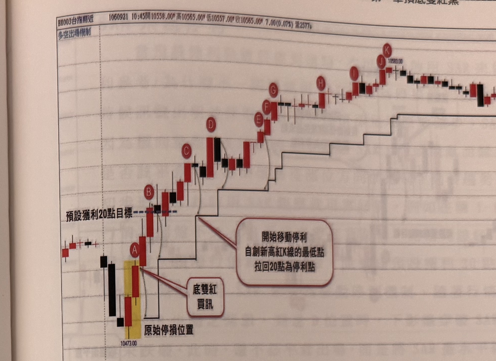

## p.28

### 停利機制

當根據訊號進場操作後，部位開始呈現獲利狀態，有數種停利的做法可以參考，由於市場每天的震盪幅度並非能夠預測，因此，並沒有任何一種停利機制是無敵的，都有個別的優缺點，端視使用者進行了解，而選取適合自身操作個性的停利機制；在過去我的系列書裡，介紹多種停利模式，歸納起來，有固定停利方式，階梯停利方式，K線根數高低停利，也有配合軌道或布林線的停利方式，上述停利模型請參考系列書內容，在此不再重覆。

而預設初始獲利點數(15點或20點)到達後，再啟用以下停利方式

(1) 折返點數停利方式，

(2) SAR 系統，

(3) 均線突破跌破

上述三種方式，不管在5分鐘或1分鐘K線圖均可使用，基本上這些都是基本款停利機制，某些特殊狀況，可以獨立使用K線組合反轉訊號當作停利參考，例如連續5根紅K線後接黑K線或連續5根黑K線後接紅K線，都是特殊的出場平倉訊號，我們會在內容上適時帶到。

(1) 折返點數停利方式

假設根據買進訊號進場，先設好20點的停損位置，若行情往上漲，先預設一個獲利目標，以20點為例，當K線觸及這預設獲利目標時，若該K線屬於創新高的無遮蔽紅K線，則從它的最高點，扣20點的位置當作停利位置，如果行情繼續向上，只要K線為自進場後的最高K線，收盤也是最高，就從其K線高點向下扣20點為新的停利位置，如果K線沒發生創新高，那停利位置就不動，直到價格向下觸及停利位置，即平倉出場，或者已經來到市場結束前一根K線，平倉出場。

## p.29

**圖 1-15**

> 圖說（figure notes）: 台指期分時K線走勢圖，頁首標示「BX003台指期近 1060921 10:45開10558.00 高10565.00 低10557.00 收10565.00 7.00(0.07%) 量2577」，左上角標示「多空出場機制」。走勢左側先小幅震盪後出現黑K線下殺，於黃底標示區出現兩根紅K線組合，最低點約10473.00，紅框標註「底雙紅買訊」與「原始停損位置」以線條指向此區。隨後行情逐根標記字母 A、B、C、D、E、F、G、H、I、J、K 依序上攻，各字母標示訊號進場後陸續創高的紅K線。B點附近以藍色虛線標示「預設獲利20點目標」；自C點起，圖中出現黑色階梯狀折線，逐步上移，代表移動停利點位，紅框白底圓角矩形標註「開始移動停利 自創新高紅K線的最低點 拉回20點為停利點」以線條指向階梯折線起始處（C點附近）；階梯持續隨D、E、F、G、H、I、J、K等創新高K線同步墊高，J點附近標示價位「10583.00」。走勢右側行情持續走高後於高點附近震盪整理。此圖對應本文說明：跳低開盤後，行情先壓低後在A位置出現底雙紅買訊，同時設好20點停損做為原始停損位置；行情上漲至B位置觸及預設獲利20點目標，B為訊號進場後最高且收盤也最高的K線，故從B最高點扣20點移動停損；C之前4根K線皆不符合「最高K線最高點」及「最高K線收盤」雙條件，故不移動停利位置，C位置才符合條件而移動停利；其後D至K皆符合雙條件，停利位置依序隨之抬升，直到市場結束前都未觸及停利點，最後於最後一根K線平倉出場。

例如在圖1-15裡，跳低開盤後，行情先壓低後，在A位置出現底雙紅買訊，同時設好20點停損做為原始停損位置，之後，行情真的漲上去，並在B位置觸及預設獲利20點目標，此時先確定K線是否為訊號進場後的最高K線，而且K線收盤也是最高收盤的，的確都符合，從B位置的K線最高點向下扣減20點，並將原始停損點移動到新的停利點，在C之前的4根K線都不符合最高K線最高點，及最高K線收盤，因此不移動停利位置，C位置才符合條件，因此再從C的K線高點向下扣減20點，成為新的停利位置，再來從D至K都是符合最高K線最高點及最高K線收盤兩條件，因此停利位置就依序抬升，在本例一直到市場結束時，都沒觸及停利點，便在最後一根K線平倉出場。
