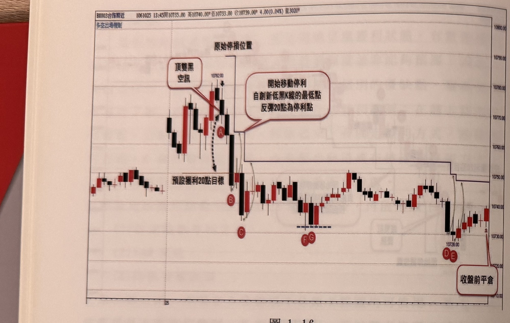
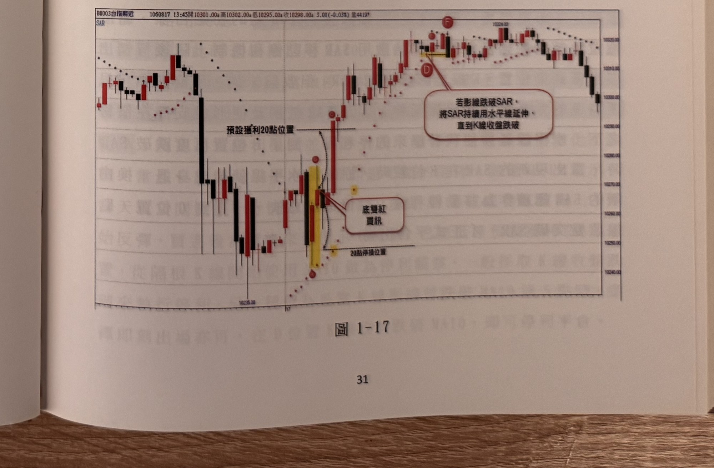

## p.30

**圖 1-16**

> 圖說（figure notes）: 台指期分時K線走勢圖，頁首標示「BX003台指期近 1061025 13:45開10735.00 高10740.00 低10733.00 收10739.00 4.00(0.04%) 量3020」，左上角標示「多空出場機制」。走勢左側先小幅震盪後上攻，於價位10782.00附近出現黑K線，紅框標註「頂雙黑空訊」以線條指向該K線，其K線最低點標記圓圈「A」；A上方水平線標示「原始停損位置」，A下方以虛線箭頭指向「預設獲利20點目標」水平線；隨後行情快速下跌，B點（黑K線）觸及該預設獲利水平線，紅框白底圓角矩形標註「開始移動停利 自創新低黑K線的最低點 反彈20點為停利點」以線條指向A、B之間的階梯轉折處；此後圖中出現黑色階梯狀折線隨後續K線最低點依序下移（C點附近起步，再到F、G附近，最後到D、E附近），階梯逐步向右下方遞移。C點標記於B下方一根黑K線最低點，其後行情於10730~10750區間反覆震盪，F、G兩點標記於一段近底部的兩根K線，下方有藍色虛線標示同一低點；其後行情持續在盤整區間內，直到D、E兩點標示行情再度走低破底，最終在圖右側以紅框標註「收盤前平倉」，以線條指向盤末最後一根K線。此圖對應本文說明：跳高開盤後緩步盤堅，在A位置出現頂雙黑空訊，進場放空並設20點為原始停損位置；行情下跌至B位置觸及預設獲利20點目標，B符合自空訊以來最低K線最低點及最低K線收盤雙條件，故從B的K線最低點向上加20點做為新停利位置；C位置亦符合最低K線最低點及最低收盤，故再度移動停利位置；其後的G位置雖K線收盤比C位置收盤低，但其最低點不是最低（被F位置的K線最低點擋住），故不移動停利位置；直到D點再度符合最低K線最低點及最低K線收盤，才再度移動停利位置，E亦符合移動停利位置；行情直到收盤前都未觸及停利點，因此在收盤前最後一根K線平倉離場。

如果訊號的空訊，以圖1-16為例子，跳高開盤後，緩步盤堅，在A位置出現頂雙黑空訊，進場放空並設20點做為原始停損位置，行情真的下跌，並在B位置觸及預設獲利20點目標，當下要確認B位置的K線是否符合自空訊以來最低K線最低點及最低K線收盤，都符合時，就自B的K線最低點向上加20點做為停利位置，接著到C位置亦是符合最低K線最低點及最低的收盤，而再來的G位置，雖然它的K線收盤比C位置收盤低，但它的最低點卻不是最低，被F位置的K線最低點擋了，因此不能移動停利位置，直到D點再度

## p.31

### (2) SAR 系統停利

當預設獲利點數目標到達時，亦可開始啟用SAR來做為停利參考，為什麼不一開始就用SAR來做為停損停利機制呢？有時候訊號出現並採取進場後，行情卻呈現原地踏步，SAR往往因為橫向整理，K線影線上下穿越SAR，形成錯亂而難以判斷是否該平倉，但如果價格往部位方向前進時，代表趨勢已然有初步形成，此時用SAR觀察就可靠好使，例如在圖1-17裡，行情在開盤不久，AB形成底雙紅買訊，一開始先設好20點停損位置，接著行情真的往上漲，且到達預設獲利20點的C位置時，開始啟用SAR來做為移動停利機制，隨著行情不斷上升，SAR也隨之緊跟，到達D位置時，下影線穿破SAR，但收盤未跌破，此時，還不必平倉出場，而是將SAR畫水平線延伸，觀察後續K線收盤有無跌破此水平線，隔根的E的影線雖跌破，收盤還是未破，直到F位置的K線收盤跌破，才正式平倉出場。

**圖 1-17**

> 圖說（figure notes）: 台指期分時K線走勢圖，頁首標示「BX003台指期近 1060817 13:45開10301.00 高10302.00 低10295.00 收10298.00 3.00(-0.03%) 量4419」，左上角標示「SAR」，圖中以紅色小圓點虛線繪出SAR指標軌跡。走勢左側先小幅上攻後出現一根長黑K線下殺，於價位10235.00附近止跌，隨後出現黃底標示的兩根K線（紅K線與黑K線），紅框白底圓角矩形標註「底雙紅買訊」以線條指向此區；其下方水平虛線標示「20點停損位置」，其上方水平虛線標示「預設獲利20點位置」；C點標記於突破預設獲利水平線的紅K線附近，其後行情持續上攻，D點標記於價位10324.00附近的K線，紅框白底圓角矩形標註「若影線跌破SAR，將SAR持續用水平線延伸，直到K線收盤跌破」以線條指向D點附近的黃底標示K線區；行情持續在高檔震盪後於F點（K線頂點標記圓圈）出現收盤跌破SAR訊號，其後行情回落。此圖對應本文說明：開盤不久AB形成底雙紅買訊，設20點停損；行情上漲到達預設獲利20點的C位置，啟用SAR做移動停利；SAR隨行情上升緊跟，到D位置下影線穿破SAR但收盤未破，將SAR水平延伸觀察；隔根E的影線雖跌破水平線但收盤未破；直到F位置K線收盤跌破，才正式平倉出場。
