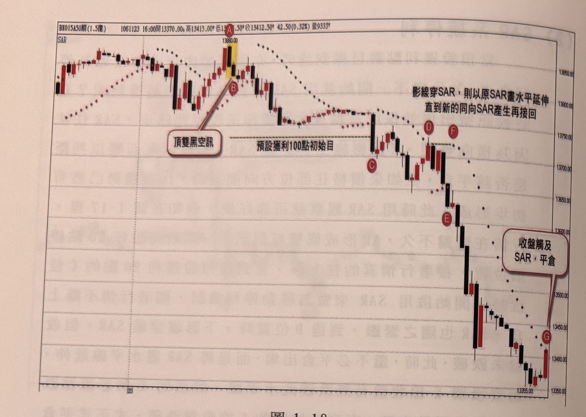
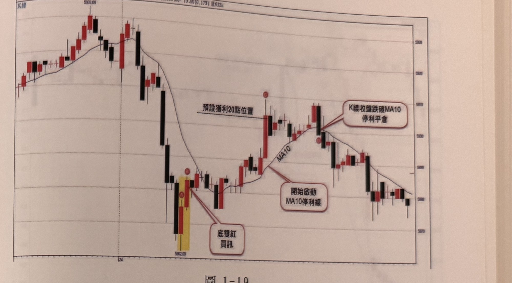

## p.32

再舉圖 1-18 的 A50 指數期貨例子，在 AB 形成頂雙黑空訊，可以設定 100 點停損位置（自定）並預設獲利 100 點的初始目標，當 C 位置跌超過初始目標後，開始啟用 SAR 移動停利機制，隨後行情出現反彈到 D 位置，K 線上影線穿越 SAR，但收盤未過，不必平倉，只要將 D 的 SAR 點畫水平線延伸，因為 SAR 被觸及便形成支撐在價格之下，水平線延伸便代替原來的停利點，到了 E 位置再度跌破 SAR 時，當出現新的 SAR 在 F 位置時，原來的水平線就功成身退，換由新的 SAR 繼續作為移動停利線，行情愈跌愈快，一直到 G 位置，K 線收盤突破 SAR，才正式平倉出場。

**圖 1-18**

> 圖說（figure notes）: 一張A50指數期貨5分鐘K線走勢圖，附SAR（拋物線轉向）指標（頁首標示「BX015A50期(1.5億) 1061123 16:00開13370.00 高13415.00 低13...50 收13412.50 42.50(0.32%) 量9335口」，左上角標示「SAR」），右側為價格座標軸（自上而下約13950.00、13900.00、13850.00、13800.00、13750.00、13700.00、13650.00、13600.00、13550.00、13500.00、13450.00、13400.00、13350.00），底部軸標示日期刻度「23」。走勢左側先小幅盤堅，出現一根黃底標示的長紅K線（最高點標示「13980.00」，標記圓圈「A」），隨後緊接一根長黑K線（標記圓圈「B」），紅框標註「頂雙黑空訊」以線指向B點，構成頂雙黑放空訊號。B點下方有一條水平虛線，標註「預設獲利100點初始目」，代表以B點為基準預設獲利100點的初始停利目標。走勢圖上方疊加SAR點（黑色小圓點虛線構成的拋物線），SAR點在下跌趨勢中位於K線上方隨行情下移。行情持續下跌至C點（標記圓圈「C」，跌破預設獲利100點目標線），此後啟用SAR移動停利機制。行情出現反彈至D點（標記圓圈「D」，K線上影線穿越SAR但收盤未穿越），右側有一條由D點延伸的水平虛線（代表SAR被觸及後原地畫水平線支撐），直到F點（標記圓圈「F」，新的同向SAR產生）才重新接回SAR追蹤線；右上方文字框說明「影線穿SAR，則以原SAR畫水平延伸 直到新的同向SAR產生再接回」。隨後行情持續下跌，經過E點（標記圓圈「E」，再度跌破SAR），最終跌至G點（標記圓圈「G」，最低點約13355.00～13400.00區間），右側紅框標註「收盤觸及SAR，平倉」以線指向G點，說明K線收盤觸及/突破SAR時正式平倉出場。此圖對應本文：AB形成頂雙黑空訊，可設100點停損並預設獲利100點初始目標，C位置跌破初始目標後啟用SAR移動停利機制，D位置僅影線穿SAR、收盤未過故不平倉，將D的SAR點畫水平延伸支撐，直到F位置新同向SAR產生才重新接回，E位置再度跌破SAR後行情加速下跌，最終在G位置K線收盤突破SAR，正式平倉出場。

## p.33

（3）均線移動停利方式

　第三種停利方式，當預設獲利點數目標到達時，開始啟用均線（本例用 MA10）來做為停利參考，用均線來停利，並不見得一定是 MA10 一路用到底，如果個股出現急拉或急殺盤，速度加快下，**行進角度變陡，此時若繼續沿用 MA10，距離現況價格可能過於遙遠，應該可以改用 MA5 或 MA4 當做停利均線來使用，甚至當一根 K 線漲跌幅超過 30 點以上，隔根突然不再創高或創低，亦可改變成立即停利動作**，換言之，停利機制並不必一成不變，可以隨著行情變化而調整。當然一般情況，使用 MA10 即是不錯的選擇，如圖 1-19 顯示，當天現貨開盤後，行情即節節下殺，直到 AB 形成底雙紅買訊，才開始反彈，買進後當價格來到標示 C 位置，已經抵達預設獲利 20 點位置，從隔根 K 線開始使用 MA10 做為停利觀察，一般採取 K 線收盤跌破來執行停利，另一種做法是當 K 線影線曾跌破 MA10 達 5 點時，選擇即刻出場亦可，在 D 位置 K 線收盤跌破 MA10，即可停利平倉。

**圖 1-19**

> 圖說（figure notes）: 一張台指期日K線走勢圖（頁首可見殘留標示「...5888.00 10.00(0.17%) 量632口」，左上角標示「K線」），右側為價格座標軸（自上而下約5930、5920、5910、5900、5890、5880、5870），最高點標示「5933.00」。走勢自左側高點5933.00起持續下跌，經過多根黑紅K線後跌至一組黃底標示的K線（A點在下標記圓圈「A」，價位標示「5862.00」；B點為其上紅K線標記圓圈「B」），右側紅框標註「底雙紅買訊」以線指向AB處，說明AB構成底雙紅買進訊號。圖中有一條水平虛線標註「預設獲利20點位置」，對應AB買進後預設獲利20點之目標價位。行情自AB買訊後反彈上攻，觸及C點（標記圓圈「C」，達到預設獲利20點位置），隨後續漲並帶出一條均線MA10（標示於圖中「MA10」，一開始貼近K線下方作為支撐），紅框標註「開始啟動MA10停利線」以線指向MA10均線起漲處。行情持續上攻至一個高點後回落，在D點附近（標記圓圈「D」）K線收盤跌破MA10，右側紅框標註「K線收盤跌破MA10 停利平倉」以線指向該K線，說明此處觸發停利出場。其後行情持續下跌至圖右側低點。此圖對應本文：當天現貨開盤後行情節節下殺，直到AB形成底雙紅買訊才反彈，買進後價格到達C位置已達預設獲利20點，自隔根K線起改用MA10作為停利觀察，最終在D位置K線收盤跌破MA10，即執行停利平倉。
