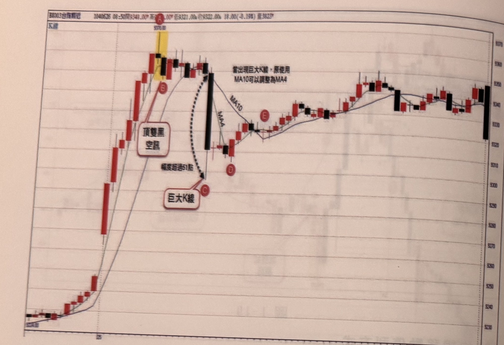
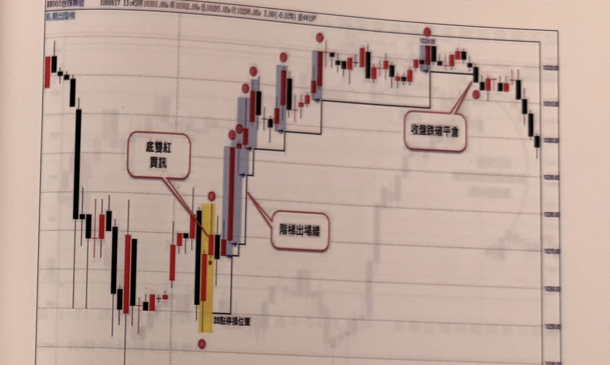

## p.34

**圖 1-20**

> 圖說（figure notes）: 一張台指期分時K線走勢圖（頁首標示「BX003台指期近」，時間戳「1040626 08:50開9348.00」，高、低、收與量等數據），左側縱軸未標示、右側為價格座標軸（自下而上約9230、9240、...、9370，等距刻度）。走勢自左下方低點連續急拉直上，途中出現一段以黃色網底標示的紅K棒（最高點標示紅底字「A」，價位「9376.00」），其後緊接一根黑K棒，並以紅圈字母「B」標示。「A」「B」兩根K棒組合被紅框白底圓角矩形標註框「頂雙黑空訊」指出（線由框指向B棒），代表頂雙黑訊號出現。圖上另有兩條移動平均線，分別標示「MA10」與「MA4」。隨後行情急速下殺，出現一根巨大黑K棒，以紅圈字母「C」標示其低點，並以黑色虛線箭頭連接B棒與C棒下緣，虛線旁文字「幅度超過51點」，說明B、C之間跌幅超過51點；紅框白底圓角矩形標註框「巨大K線」以線指向C棒。此巨大黑K棒右側另有說明文字「當出現巨大K線，原使用MA10可以調整為MA4」，並以細線分別指向MA10、MA4兩條均線。巨大黑K棒之後行情止跌小幅反彈，出現紅圈字母「D」標示一點，其後行情持續緩步walking上並在圖右段以紅圈字母「E」標示另一低點，其後行情進入區間盤整走勢直到圖右端。此圖對應本文說明：A為盤中最高位置，AB組合成頂雙黑空訊；其後C處爆出巨大長黑K線，最低跌幅達51點；停利可於長黑K線出現時平倉，或於長黑K線後隔根不創新低時撤出，或改用MA4取代MA10作為停利基礎，當D位置收盤突破MA4時停利平倉。

在圖1-20的案例裡，行情跳高開盤後，即連續猛烈推升，直到A抵達盤中最高位置，AB組合了頂雙黑空訊，中止多頭攻勢，空訊出現後，行情卻呈現橫走，不願讓空頭樂著，直到C位置突然爆出一根巨大長黑K線，最低跌幅達51點，這種狀況下，停利的應對方式可以在當根長黑平倉出場，這是基於自我滿足的前提，另一種是在長黑K線出現隔根不見創新低即撤，也可以由原先MA10為停利基礎調整用MA4來取代停利位置，因此當D位置收盤突破MA4時，停利平倉。

## p.35

停利機制也可以採取階梯出場方式，進場後先設定20點停損位置，若行情往對的方向前進時，先預設獲利目標15點或20點，甚至30點後，再啟動以創新高或新低的K線及前一根K線，比較兩者最低位置（多單）或最高位置（空單）做為移動停利位置；此處新高或新低是以進場K線後為基準，而非盤中最高或最低。如圖1-21在AB出現底雙紅買訊，進場後先設20點停損位置，等到行情向上前進，並在C到達預設20點獲利目標，啟動階梯停利機制，比較C及前一根K線兩者最低位置做為新的停利位置，稍後D的紅K線也是創新高K線，因此再次比較D與C兩者最低位置，為C的最低點為新的停利位置，準此，只要遇到創新高的紅K線，即比較並取得新的停利位置，不斷移動向上，直到停利位置被K線收盤觸及跌破，本例在J位置觸及平倉出場，完成階梯停利。

**圖 1-21**

> 圖說（figure notes）: 一張台指期分時K線走勢圖（頁首標示「BX003台指期近」，時間戳「1060817 13:45賣10301.00」，高、低、收與量等數據，圖左上另有藍色小字「氏.買三潛伏」），右側為價格座標軸（自下而上多個等距刻度，數值模糊但可辨識約10225～10350區間）。走勢先於圖左段下殺至低點，區域內出現一段以黃色網底標示的紅K棒（下方以紅圈字母「A」標示其低點）與其後一根黑K棒（以紅圈字母「B」標示），「A」「B」組合被紅框白底圓角矩形標註框「底雙紅買訊」指出（線由框指向A、B交界處），代表底雙紅訊號出現。此後行情連續以一系列藍灰色網底標示的K棒向上跳升，每一根新高K棒下緣以藍色小箭頭連接前一根K棒的低點，形成階梯狀向上抬升的走勢，並以紅框白底圓角矩形標註框「階梯出場線」（線指向這些藍灰網底K棒的下緣連線處）說明這些階梯狀連線代表移動停利的階梯出場線；沿途各根創新高K棒上方均以紅圈符號（未標明確字母或以小圓點）標示。走勢持續墊高至圖右段一根标示「10324」字樣的黑K棒（其上方以紅圈符號標示最高點），隨後行情反轉走平，出現一根K棒收盤跌破先前階梯出場線的水平線，以紅框白底圓角矩形標註框「收盤跌破平倉」（雙線分別指向該跌破處與其右側對應的水平線）。跌破之後行情持續走低直到圖右端。圖下方另標示「20點停損位置」字樣，指向圖左段黃色網底K棒下方的水平線，代表A、B底雙紅買訊進場後所設定的20點初始停損位置。此圖對應本文說明：AB出現底雙紅買訊，進場後先設20點停損位置；行情向上前進，C到達預設20點獲利目標後啟動階梯停利機制，比較每根創新高K線與前一根K線的最低位置，取較高者為新的移動停利位置，隨後D等創新高紅K線持續墊高停利位置，直到停利位置被K線收盤觸及跌破，本例在J位置觸及平倉出場，完成階梯停利。
