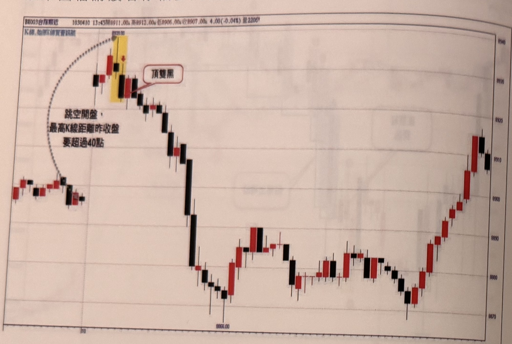
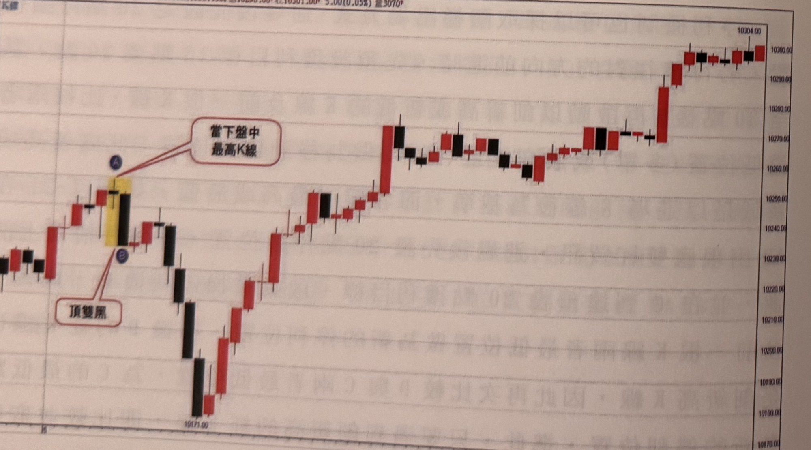
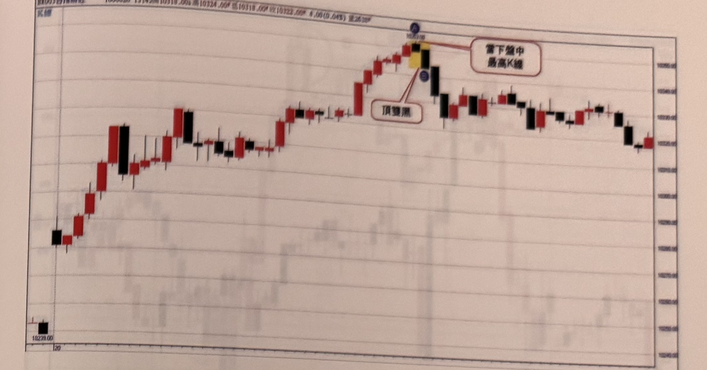
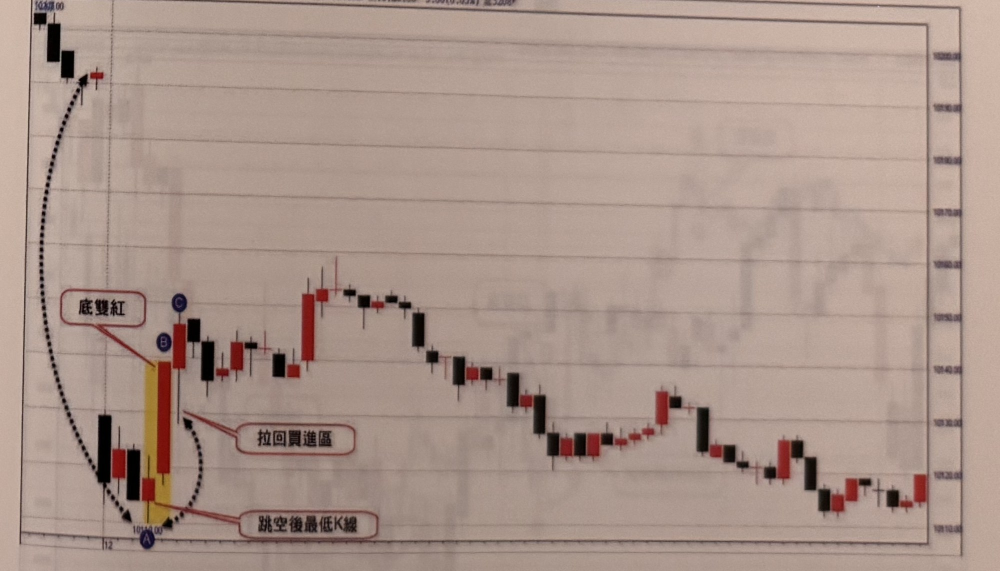

## p.36

以下圖檔請讀者仔細參閱案例。

**圖 1-22** 若當下震幅小於30點，則要高點距平盤是否超過40點

> 圖說（figure notes）: 一張台指期分時K線走勢圖（頁首標示「BK003台指期近 1030410 13:45開8911.00，高8912.00，低8906.00，收8907.00，4.00(-0.04%) 量2206」，左上另有小字「K線,始跌C線實看訊號」），左側為震盪走勢起點，右側為價格座標軸（自下而上約8870、8880、...、8940等距刻度）。走勢自左段小區間震盪後，以一段黑色虛線弧線標示跳空跳升的過程，虛線旁文字「跳空開盤，最高K線距離昨收盤要超過40點」。虛線頂端指向一段以黃色網底標示的紅K棒（其上另有一根黑K棒），此紅黑K棒組合右側以紅框白底圓角矩形標註框「頂雙黑」標示（線指向該黑K棒收盤處）。頂雙黑訊號出現後，行情連續重挫下殺至圖中段低點（約8865.00附近，圖上以文字「8865.00」標示低點K棒），其後止跌緩步walking回升，最終在圖右段以一組紅黑K棒收在約8910上下作收。此圖對應本文說明「開盤跳空最高K線距離昨收盤要超過40點」的判斷條件，用以界定頂雙黑訊號是否成立於極端跳空開盤情境。

**圖 1-23** 開盤跳空小於10點，雖可沿用昨日尾盤行情，但當日震幅也是要有30點以上，才稱為極端位置。

> 圖說（figure notes）: 一張台指期分時K線走勢圖（頁首標示「BK003台指期近 1060705 13:45開10296.00，高10301.00，低10296.00，收10301.00，5.00(0.05%) 量3070」），右側為價格座標軸（自下而上約10170.00、10180.00...至10304.00等距刻度），底部軸上可見刻度「16」及低點標示「10171.00」。走勢左段先小幅盤堅，出現一段以黃色網底標示的紅K棒（其上方以藍圈字母「A」標示，紅框白底圓角矩形標註框「當下盤中最高K線」以線指向A），其下緊接一根黑K棒（以藍圈字母「B」標示，紅框白底圓角矩形標註框「頂雙黑」以線指向B），構成頂雙黑訊號後行情反轉重挫，一路下探至圖左下方低點「10171.00」，其後行情止跌反彈，一路震盪盤堅上攻，最終於圖右段大幅上攻收在約10300上方，以一連串紅黑K棒收斂於高檔區作收。此圖對應本文說明：開盤跳空小於10點時，雖可沿用昨日尾盤行情判斷，但當日震幅仍須達30點以上，才能稱為極端位置，據以確認頂雙黑訊號的有效性。

## p.37

**圖 1-24** 訊號發生位置若離開盤超過中午12點半，表現空間與時間都可能縮小，此時可以忽略訊號。

> 圖說（figure notes）: 一張台指期分時K線走勢圖（頁首標示「BX003台指期近 1060620 13:45開10318.00，高10324.00，低10318.00，收10322.00，4.00(0.04%) 量2638」），右側為價格座標軸（自下而上約10245.00至10360.00等距刻度），左下角低點標示「10239.00」及刻度「20」。走勢自左下低點「10239.00」持續盤堅上攻，途中出現多段紅黑K棒交錯上升，最終攻抵圖中段高點，出現一段以黃色網底標示的紅K棒（其上方以藍圈字母「A」及數值標示「10324.00」標示最高點，紅框白底圓角矩形標註框「當下盤中最高K線」以線指向A），其下緊接一根黑K棒（以藍圈字母「B」標示，紅框白底圓角矩形標註框「頂雙黑」以線指向B），構成頂雙黑訊號後行情反轉走弱，隨後呈現區間橫向盤整走勢，於約10320～10345區間來回震盪直到圖右端。此圖對應標題說明：由於此訊號發生位置（時間戳13:45，即接近尾盤）已離開盤時間超過中午12點半，其後續表現空間與時間可能因此縮小，此時操作上可以考慮忽略此一訊號。

**圖 1-25** 跳低開盤，在當下震幅未達30點，但低點離平盤超過40點，則以尋找極端位置買訊為主，底雙紅買訊的停損點為超過20點，可以等拉回再考慮進場。

> 圖說（figure notes）: 一張台指期分時K線走勢圖（頁首資訊部分模糊，可辨識價格與量資訊「...5.00(0.05%) 量3208」），右側為價格座標軸（自下而上約109.10.00至104.00.00等距刻度，數值模糊），底部軸上可見刻度「12」。走勢左段開盤即以黑色虛線弧線標示跳空低開的過程（虛線由圖左上方一根紅K棒經弧線繞至圖左下方低點），隨後下殺至一段以黃色網底標示的紅K棒（下方以藍圈字母「A」及數值標示「10114.00」標示最低點，紅框白底圓角矩形標註框「跳空後最低K線」以線指向該紅K棒），其上緊接一根較長紅K棒（以藍圈字母「B」標示，紅框白底圓角矩形標註框「底雙紅」以線指向B），構成底雙紅買訊；B上方另有一根黑K棒與紅K棒（以藍圈字母「C」標示其上緣），並以紅框白底圓角矩形標註框「拉回買進區」（雙箭頭虛線指向B、C之間的拉回區間），說明可等待行情拉回至此區間再考慮進場。訊號出現後行情持續反彈盤堅，於圖中段攻抵局部高點後又緩步回落，一路震盪走低直到圖右端，最終收在約109.20左右的低檔區。此圖對應標題說明：跳低開盤情況下，若當下（盤中）震幅未達30點，但低點離平盤已超過40點，則應以尋找極端位置的買訊（如底雙紅）為主要依據；底雙紅買訊成立後，停損點設定為超過20點，實務上可以等待行情拉回後再考慮進場，如圖中「拉回買進區」所示。
