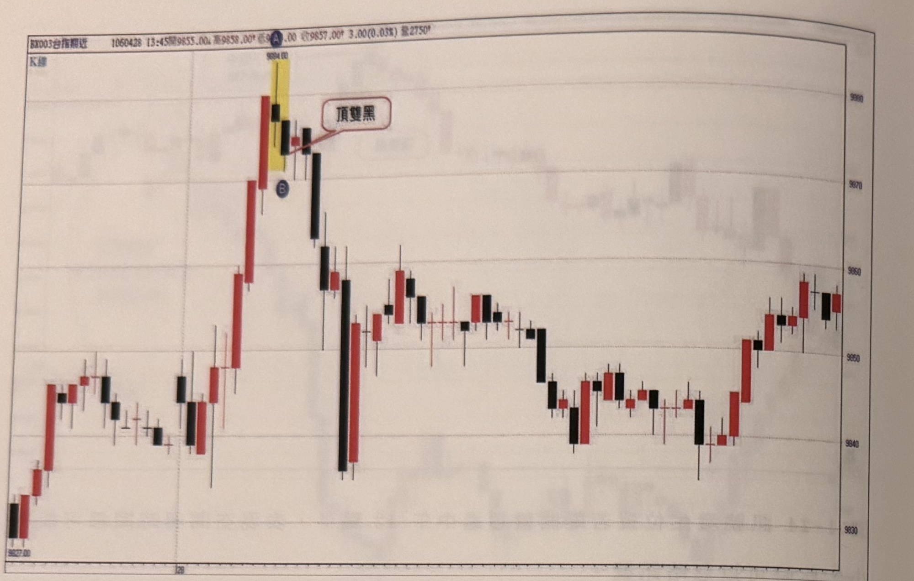
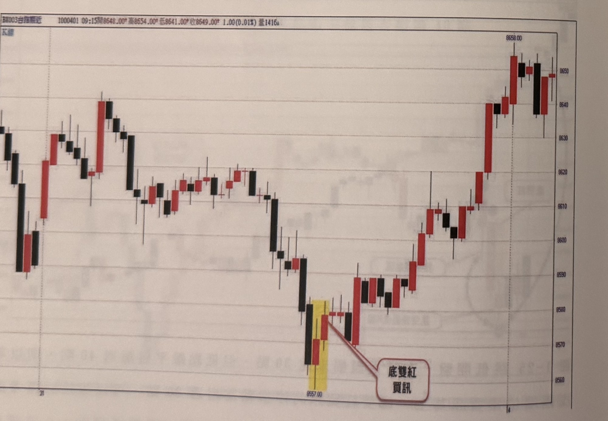
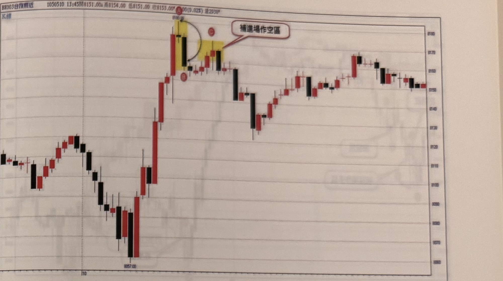
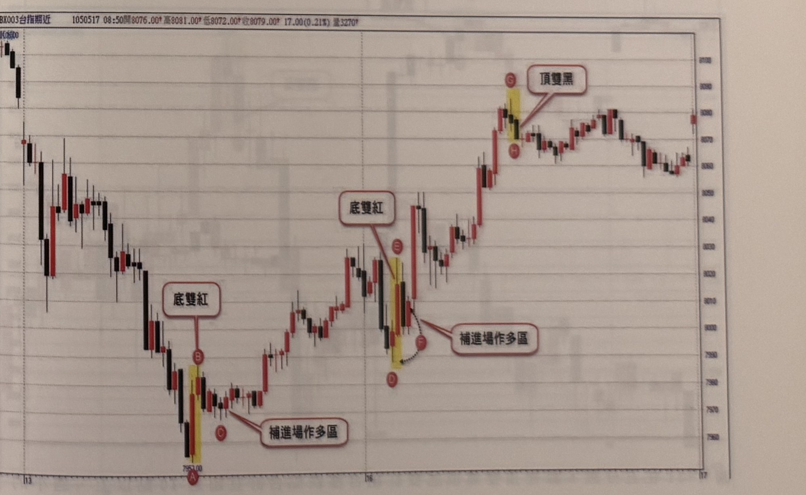

## p.38

**圖 1-26**

> 圖說（figure notes）: 一張台指期分時K線走勢圖（頁首標示「BK003台指期近 1060428 13:45開9855.00，高9858.00，低9...00，收9857.00，3.00(0.03%) 量2750」），右側為價格座標軸（自下而上約9830、9840...至9890等距刻度），左下角低點標示「9827.00」及刻度「28」。走勢自左下低點「9827.00」持續盤堅上攻，出現一段以黃色網底標示的紅K棒（其上方以藍圈字母「A」及數值標示「9894.00」標示最高點），其下緊接一根黑K棒（以藍圈字母「B」標示），紅框白底圓角矩形標註框「頂雙黑」以線指向黑K棒。頂雙黑訊號出現後，行情連續重挫下殺（一根長黑K棒大幅下跌），隨後呈現區間震盪走勢，於約9840～9860區間來回整理，最終於圖右段小幅回升收在約9955附近作收。此圖為頂雙黑訊號的案例展示，未附文字說明段落，僅標示A（最高K線）與B（頂雙黑之第二根黑K線）。

**圖 1-27**

> 圖說（figure notes）: 一張台指期分時K線走勢圖（頁首標示「BK003台指期近 I000401 09:15開8648.00，高8654.00，低8641.00，收8649.00，1.00(0.01%) 量1416」），右側為價格座標軸（自下而上約8560至8660等距刻度），底部軸上可見刻度「31」及「4」。走勢自圖左段高檔區（約8630～8650）反覆震盪後持續下探，一路重挫至圖中下方低點「8557.00」，出現一段以黃色網底標示的黑K棒與紅K棒組合（低點K棒），紅框白底圓角矩形標註框「底雙紅買訊」以線指向其中的紅K棒。底雙紅買訊出現後，行情止跌反彈，一路震盪盤堅上攻，最終於圖右段攻抵最高點「8658.00」（以文字標示），並以一連串紅黑K棒收在約8640～8650高檔區作收。此圖對應本文說明底雙紅訊號於低檔反轉的案例。

## p.39

**圖 1-28** 當訊號K線離頂點A超過20點，可以等待稍作反彈，使停損縮至20點以內，再補空。

> 圖說（figure notes）: 一張台指期分時K線走勢圖（頁首標示「BK003台指期近 1050510 13:45開8151.00，高8154.00，低8151.00，收8153.00，0.00(0.02%) 量2938」），右側為價格座標軸（自下而上約8050至8100等距刻度），左下角低點標示「8057.00」及刻度「10」。走勢自圖左段低點「8057.00」開始持續急拉上攻，攻抵圖中段高點，出現一段以黃色網底標示的紅K棒（其上方以紅圈字母「A」及數值標示「8180」標示最高點），其下緊接一根黑K棒（以紅圈字母「B」標示於下方），其後行情小幅反彈至一根紅K棒與黑K棒（以紅圈字母「C」標示於上方，此二棒亦以黃色網底標示），紅框白底圓角矩形標註框「補進場作空區」以線指向C處的黃色網底K棒。訊號出現後行情呈現小幅震盪走低，隨後於圖右段緩步回升，於約8150～8170區間反覆震盪整理直到圖右端。此圖對應標題說明：當訊號K線（A頂點）與實際進場點距離超過20點時，可以等待行情稍作反彈後，將停損縮小至20點以內，再於反彈處（C，補進場作空區）補空進場。

**圖 1-29** 本圖例為訊號K線離最低谷點A超過20點以上，可以等拉回縮小停損再買。

> 圖說（figure notes）: 一張台指期分時K線走勢圖（頁首標示「BX003台指期近 1050517 08:50開8076.00，高8081.00，低8072.00，收8079.00，17.00(0.21%) 量3270」），右側為價格座標軸（自下而上約7960至8100等距刻度），底部軸上可見刻度「13」、「16」、「17」。走勢自圖左段高檔區反覆下殺，一路重挫至圖左下方最低點（以紅圈字母「A」標示，數值「7953.00」），其上緊接一段以黃色網底標示的K棒（紅圈字母「B」標示於上方），紅框白底圓角矩形標註框「底雙紅」以線指向B；再上方另一根K棒以紅圈字母「C」標示，其下方紅框白底圓角矩形標註框「補進場作多區」以線指向A、C之間區域，說明可等待行情拉回至此區間再進場。行情自A處止跌反彈後持續盤堅上攻，於圖中段再度出現一次類似訊號：低點以紅圈字母「D」標示，其上一段以黃色網底標示的K棒以紅圈字母「E」標示，紅框白底圓角矩形標註框「底雙紅」以線指向E；其右側以虛線箭頭連接紅圈字母「F」，並有紅框白底圓角矩形標註框「補進場作多區」指向D、F一帶。訊號後行情再度急拉上攻，於圖右段攻抵高點，出現一段以黃色網底標示的K棒（紅圈字母「G」標示於上方，另一紅圈字母「H」標示於下方），紅框白底圓角矩形標註框「頂雙黑」以線指向G、H之間。頂雙黑訊號後行情由高檔緩步回落，於約8050～8080區間震盪整理直到圖右端。此圖對應標題說明：當訊號K線（A低點）與實際進場點距離超過20點以上時，可以等待行情拉回後，縮小停損幅度再行買進，如圖中兩處「底雙紅」與「補進場作多區」所示。
