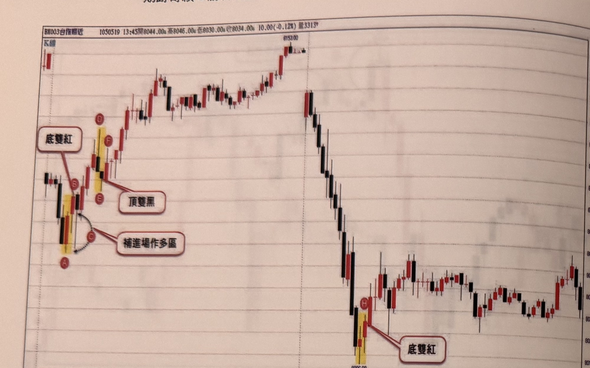
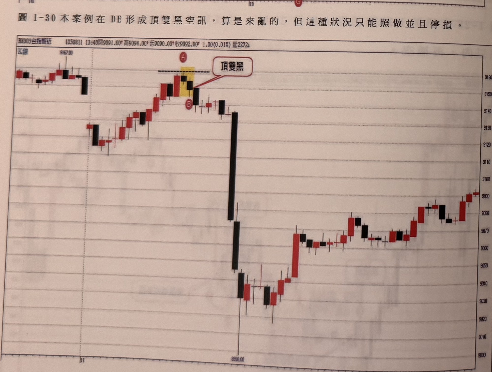
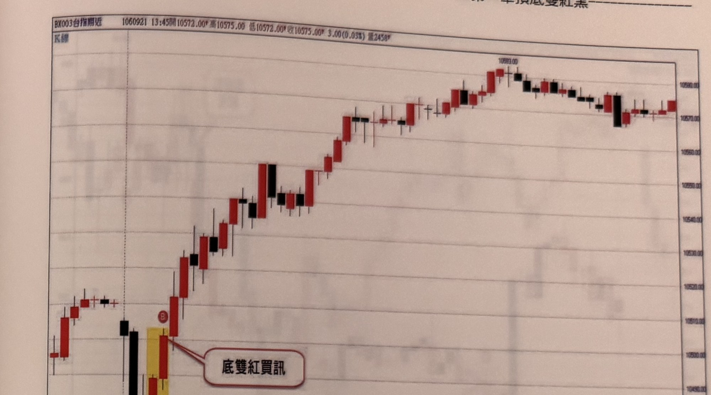
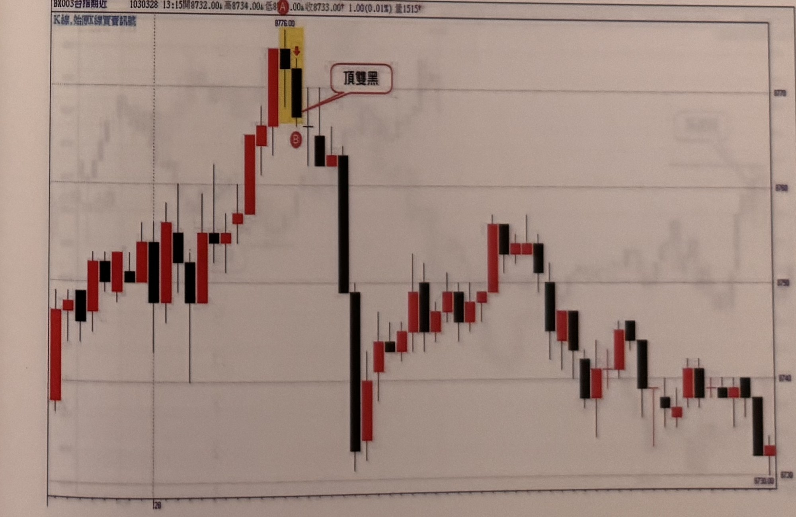

## p.40

**圖 1-30** 本案例在DE形成頂雙黑空訊，算是來亂的，但這種狀況只能照做並且停損。

> 圖說（figure notes）: 一張台指期分時K線走勢圖（頁首標示「BK003台指期近 1050519 13:45開8044.00，高8046.00，低8030.00，收8034.00，10.00(-0.12%) 量3315」），右側為價格座標軸（自下而上約8010至8150等距刻度），底部軸上可見刻度「18」、「19」。走勢左段先小幅震盪，出現一組以黃色網底標示的K棒（下方以紅圈字母「A」標示低點），其上緊接紅、黑K棒（以紅圈字母「B」標示），紅框白底圓角矩形標註框「底雙紅」以線指向B；「A」「C」之間以黑色虛線弧線連接（弧線下方另有紅圈字母「C」），紅框白底圓角矩形標註框「補進場作多區」以線指向C，說明A、C之間可視為拉回補進場作多的區域。底雙紅訊號後行情持續盤堅上攻，出現另一組以黃色網底標示的K棒（紅圈字母「D」標示於上方），其下緊接一根K棒（紅圈字母「F」標示、另一紅圈字母「E」標示於下方），紅框白底圓角矩形標註框「頂雙黑」以線指向E／F一帶，代表在D、E、F處形成頂雙黑空訊（此即標題所稱「本案例在DE形成頂雙黑空訊」）。行情持續上攻至圖中段最高點「8153.00」後，反轉重挫連續下殺，一路跌破多個價位，直到圖右段出現另一組以黃色網底標示的K棒（下方以紅圈字母「G」標示低點「8006.00」），其上緊接K棒（紅圈字母「H」標示），紅框白底圓角矩形標註框「底雙紅」以線指向H。此後行情止跌，於圖右端呈現區間震盪整理。此圖對應標題說明：雖然DE（實際為D、E、F三根K棒的頂部組合）形成了頂雙黑空訊，但事後看來是「來亂的」假訊號（因為訊號後行情仍先上攻至8153高點才真正反轉），操作上只能依訊號照做並確實執行停損，才能因應這種訊號失敗的狀況。

**圖 1-31** 在五分鐘K線裡頂雙黑或底雙紅組合漲跌點合計宜超過10點以上，過小的點數，表態性比較不足。可靠度稍差。

> 圖說（figure notes）: 一張台指期分時K線走勢圖（頁首標示「BK003台指期近 1050811 13:40開9091.00，高9094.00，低9090.00，收9092.00，1.00(0.01%) 量2272」），右側為價格座標軸（自下而上約9000至9160等距刻度），底部軸上可見刻度「11」及低點標示「8338.00」。走勢左段於高點「9167.00」附近小幅震盪走低後，一路盤堅上攻，攻抵一組以黃色網底標示的K棒（上方以紅圈字母「A」標示，並有水平虛線標示參考高度），紅框白底圓角矩形標註框「頂雙黑」以線指向其下方黑K棒（下方另以紅圈字母「B」標示）。頂雙黑訊號出現後，行情連續重挫下殺（一根巨大長黑K棒及接續黑K棒），一路跌破多個價位直探圖中段低點「8338.00」，其後止跌反彈，一路震盪盤堅回升，最終於圖右段收在約9090附近作收。此圖為頂雙黑訊號案例，僅標示A（頂雙黑上緣參考點）與B，未附額外文字框；對應標題文字說明：在五分鐘K線裡，頂雙黑或底雙紅組合的漲跌點數合計應超過10點以上，若點數過小則表態性較不足，訊號可靠度會較差。

## p.41

**圖 1-32**

> 圖說（figure notes）: 一張台指期分時K線走勢圖（頁首標示「BX003台指期近 1060921 13:45開10572.00，高10575.00，低10572.00，收10575.00，3.00(0.03%) 量2458」），右側為價格座標軸（自下而上約10480至10590等距刻度），底部軸上可見刻度「21」。走勢左段小幅震盪後下探，出現一組以黃色網底標示的K棒（下方以紅圈字母「A」及數值標示「10473.00」標示低點），其上緊接一根紅K棒（以紅圈字母「B」標示），紅框白底圓角矩形標註框「底雙紅買訊」以線指向該紅K棒。底雙紅買訊出現後，行情持續盤堅上攻，一路震盪走高攻抵圖右段最高點「10593.00」附近，其後小幅回落，於約10570～10590區間來回整理直到圖右端。此圖為底雙紅買訊的案例展示，未附額外文字說明段落。

**圖 1-33**

> 圖說（figure notes）: 一張台指期分時K線走勢圖（頁首標示「BX003台指期近 1030328 13:15開8732.00，高8734.00，低8...00，收8733.00，1.00(0.01%) 量1515」，左上另有小字「K線,始漲反線買賣訊號」），右側為價格座標軸（自下而上約8730至8790等距刻度），底部軸上可見刻度「28」。走勢左段震盪盤堅上攻，攻抵一組以黃色網底標示的K棒（上方以紅圈字母「A」及數值標示「8776.00」標示最高點），其下緊接一根黑K棒（以紅圈字母「B」標示），紅框白底圓角矩形標註框「頂雙黑」以線指向該黑K棒。頂雙黑訊號出現後，行情連續重挫下殺（一根長黑K棒），隨後呈現反覆震盪走低的走勢，中間夾雜多次小幅反彈與回落，最終於圖右段持續破底，收在約8730附近的全圖最低點作收。此圖為頂雙黑訊號後行情持續破底的案例展示，未附額外文字說明段落。
