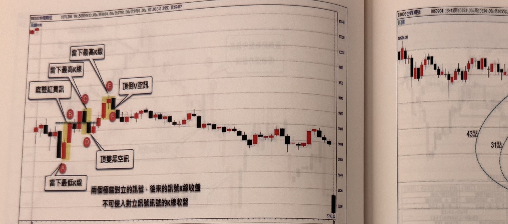
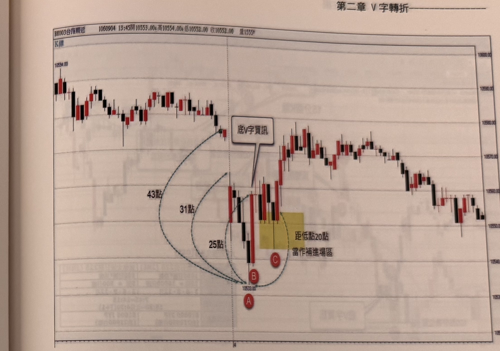

## p.56

**圖 2-7**

> 圖說（figure notes）: 一張台指期分時K線走勢圖（左上角標示「BX003台指期近」，行情資訊「1071206 08:50開9813.00 高9814.00 低9790.00 收9791.00 87.00(-0.88%) 量6948張」），右側縱軸價格刻度自上而下約10040、10020、10000、9980、9960、9940、9920、9900、9880、9860、9840、9820、9790.00。走勢左側先下跌後於低檔出現三組以黃色矩形反白標示的相鄰K線組合：第一組（最左）為一根黑K線與一根紅K線，黑K線下方有紅色圓圈標註「A」，白底黑框標註框「當下最低K線」指向A；紅K線頂部有紅色圓圈標註「B」，兩個白底黑框標註框「底雙紅買訊」與「當下最高K線」皆以線指向B。緊接右側第二組為一根紅K線與一根黑K線，紅K線頂部有紅色圓圈標註「C」，白底黑框標註框「當下最高K線」指向C；黑K線下方有紅色圓圈標註「D」，白底黑框標註框「頂雙黑空訊」指向D。再往右第三組為一根紅K線與一根黑K線，紅K線頂部有紅色圓圈標註「E」，白底黑框標註框「當下最高K線」指向E；黑K線右下方有紅色圓圈標註「F」，白底黑框標註框「頂倒V空訊」以線指向F。三組K線之後走勢轉為緩步上升再緩步下滑的長波段整理。圖下方另有兩行文字說明：「兩個極端對立的訊號，後來的訊號K線收盤」「不可侵入對立訊號訊號的K線收盤」。本圖對應本文：跳低開盤後，AB處在當下最低點出現底雙紅買訊，本可進場作多單，但距離很短，CD處旋即在當日極端高點出現頂雙黑空訊；因D的訊號K線收盤低於B的訊號K線收盤，不符合「對立訊號不可侵入對方K線收盤」的規定，故忽略D的空訊；其後EF處出現頂倒V空訊，F的收盤沒有與B的收盤重疊，符合對立訊號限制，且F收盤價低於E最低點1點，符合「跌破前一根K線低點」的條件，故EF訊號成立，可進場放空。

如果行情震盪幅度不夠大，可能發生訊號衝突的情境，買進訊號K線範圍，出現相反的放空訊號，原進場的操作，都還沒坐熱，就要反手，此時要不要依訊號行事呢？請注意對立訊號不可侵入對方K線收盤，若有要忽略後來者，這是為了防止在窄幅區間內反覆出現相反訊號互打，莫名停損的應對方式。例如在圖2-7的案例中，跳低開盤後，在標示AB當下最低處出現底雙紅買訊，當然進場操作多單，但非常短的距離，在標示CD出現當日極端位置的頂雙黑空訊，在B的多單，要不要立刻平倉，反手在D位置下空單呢？因為D的訊號收盤低於B的訊號收盤，不符合對立訊號不可侵入對方的K線收盤的規定，因此可以忽略D的空訊，而後再EF處出現頂倒V空訊，F訊號的收盤沒有與B的收盤重疊，符合對立訊號的限制，另外在F的頂倒V空訊，F收盤價低於E最低點1點，符合跌破前一根K線低點，即為訊號。

## p.57

極端位置在早盤的認定，我們不斷地提到第一種是盤中高低震盪超過30點，如果高低震盪幅度小於30點時，再檢定極端高低點距離平盤是否超過40點，二種方式只要其一符合，即可認定為極端位置，圖2-8跳低開盤，隨後繼續走低到標示A盤中最低點，此時與開盤第一根K線高點距離31點，剛好符合中盤震幅至少30點的條件，假設開盤跳得更低，而造成首根K線高點與A的距離小於30點，那麼就測量前一天收盤（最後一根K線收盤等於本日平盤）與A的距離，本例的距離為43點亦符合條件，標示B收盤突破A的最高點形成底V字買訊，但它的收盤離A低點25點，顯然設停損20點是不夠的，那麼可以選擇拉回，在價位離A低點縮小至20點以內的區域補進場，如C的位置，當然也可以在B直接進場，設20點停損就試一下運氣！

**圖 2-8**

> 圖說（figure notes）: 一張台指期分時K線走勢圖（左上角標示「BX003台指期近」、「K線」，行情資訊「1060904 13:45開10553.00 高10554.00 低10552.00 收10552.00 量1555張」），左上角起始價位標示「10594.00」，右側縱軸價格刻度自上而下約10600.00、10590.00、10580.00、10570.00、10560.00、10550.00、10540.00。走勢開盤後先上下小幅震盪，隨後跳低開盤並走低下殺至圖中下方的最低點，該處以紅色圓圈標註「A」，其正下方另標示價位「10533.00」。從走勢圖左上方（第一根K線高點附近及前一日收盤平盤位置）分別畫出三條藍色虛線弧線箭頭，指向A點，並各自標註距離：「43點」（最外側弧線，代表前一天收盤/平盤與A的距離）、「31點」（中間弧線，代表開盤第一根K線高點與A的距離）、「25點」（最內側弧線，代表B的收盤與A低點的距離）。緊接A之後的K線在其上方以紅色圓圈標註「B」，白底黑框標註框「底V字買訊」以線指向B所在K線，表示B收盤已突破A的最高點形成底V字買訊。B右側另有一黃色矩形反白區塊，涵蓋其後兩、三根K線，其中一根K線下方標註紅色圓圈「C」，區塊旁文字說明「距低點20點」「當作補進場區」，表示此區為距A低點20點以內、可用來加碼補進場的價格區域。其後走勢延續反彈上攻至右側區域，呈現多根紅黑K線交錯盤堅走高，最終在右側維持高檔震盪。本圖對應本文：圖2-8跳低開盤後走低至A（盤中最低點），與開盤第一根K線高點距離31點，符合中盤震幅至少30點的極端位置認定條件（若不符，則改測前一天收盤與A的距離，本例為43點，亦符合條件）；B的收盤突破A的最高點，形成底V字買訊，但B收盤距A低點僅25點，設20點停損不足，故可選擇等拉回至距A低點20點以內的C位置補進場，也可以直接在B進場並設20點停損。
