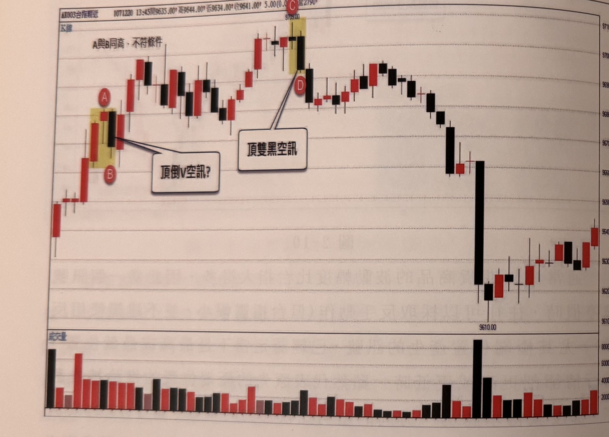
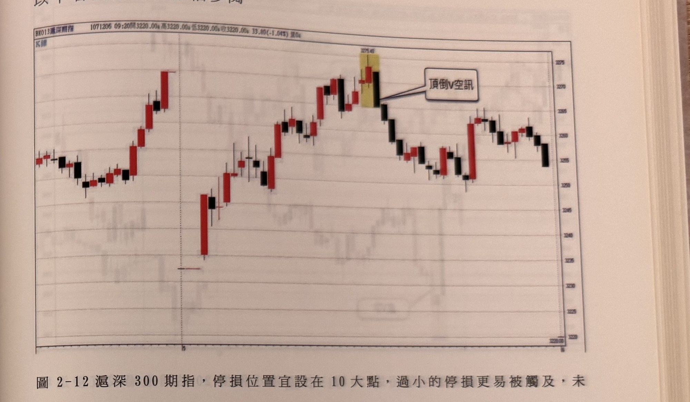
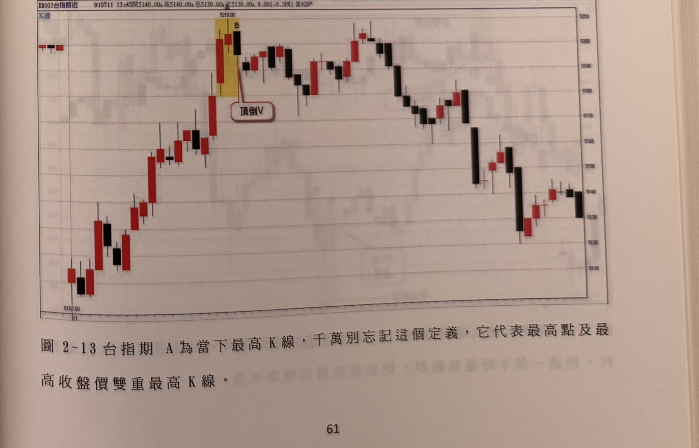

## p.60

　　當行情出現反手放空的訊號，顯然行情的趨勢力量很強，此後若再出現極端位置訊號的買訊，通常也會失敗居多，因此若極端低的買訊曾經被觸及停損，通常發現第二個極端低的買訊宜忽略不操作。好好控制操作的次數。如果反手放空所設的停損，再被觸及，代表當日連二輸，更要立即停止操作，倒霉的操作日要懂得離開，放鬆情緒，明日再戰。

**圖2-11**

> 圖說（figure notes）：台指期五分鐘K線圖搭配下方成交量柱狀圖。圖左側標題列顯示「AX003台指期近 1071220 13:45開9635.00 高9644.00 低9634.00 收9641.00 5.00(0.0 量2790」。圖中先是一段紅K連續上漲，標示A點（黃色網底標示）為當下盤中最高K線，隔一根黑K標示B點，A、B兩根K線高點相同，圖上以文字框註記「A與B同高，不符條件」，並有指線連到「頂倒V空訊?」文字框（帶問號，表示此處外觀像頂倒V但因A、B同高不符合條件，故非成立訊號）。其後股價續呈小幅震盪走高，來到一段黃色網底標示的C點（價位9709.00附近，兩根相鄰K線），旁邊文字框以指線連到「頂雙黑空訊」（不帶問號，代表此為成立的頂雙黑空訊）；隨後股價自高點反轉急跌，出現一根長黑K線跌至9610.00附近，成交量同步放大（下方成交量圖同一位置出現全圖最高的黑色量柱），其後止跌小幅回升震盪。右側縱軸為價格刻度（約9610～9710區間）。

　　頂底V字在辨認過程，頂點或底點只能有一個獨立K線，**不能出現兩根K線同高或同低的訊號組合**，例如在圖2-11的例子裡，連續上漲紅K線推升到A點為當下盤中最高K線，隔根B的收盤跌破A的低點，外觀上像頂倒V空訊，但是**B與A同高，不符合A是唯一最高**，因此不符條件要求，之後等到行情來到CD產生頂雙黑空訊，才是正確的操作訊號。

## p.61

以下各圖請讀者仔細參閱

**圖2-12** 滬深300期指，停損位置宜設在10大點，過小的停損更易被觸及，未來若有小滬深期指，應該就更容易上手。

> 圖說（figure notes）：滬深300期指五分鐘K線圖。標題列顯示「BX013滬深期指 1071206 09:20開3220.00 高3220.00 低3220.00 收3220.00 33.80(-1.04%) 量0」。K線走勢先小幅回檔整理，再一路上攻，中段出現一次急跌後迅速收復，續創高至約3275.40附近（黃色網底標示兩根相鄰K線），該處以指線連到文字框「頂倒V空訊」；創高後股價反轉走弱，呈階梯狀下跌，尾段小幅反彈後再度走低。右側縱軸價格刻度約3220～3275區間。

**圖2-13** 台指期A為當下最高K線，千萬別忘記這個定義，它代表最高點及最高收盤價雙重最高K線。

> 圖說（figure notes）：台指期五分鐘K線圖。標題列顯示「BX003台指期近 910711 13:45開5140.00 高5140.00 低5130.00 收5130.00 8.00(-0.16%) 量429」。左側先有低點附近的小段整理，隨後連續紅K上攻，於價位5210.00附近以黃色網底標示一組相鄰K線，上方標示「A」（當下最高點）、右側標示「B」，並以指線連到文字框「頂倒V」；創高後行情反轉，呈波浪狀下跌走勢，中段一度小幅反彈，尾段出現長黑K線加速下跌至約5120附近，最後小幅止跌整理，收在5130～5140區間。右側縱軸價格刻度約5110～5210。
