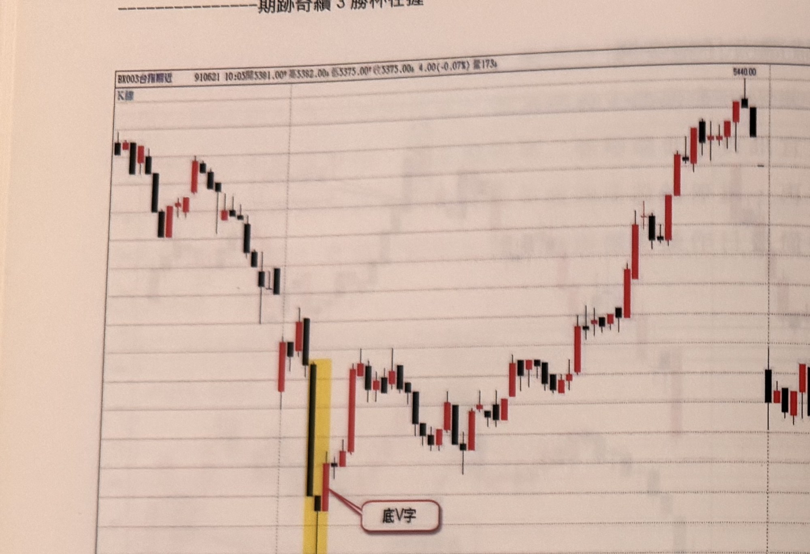
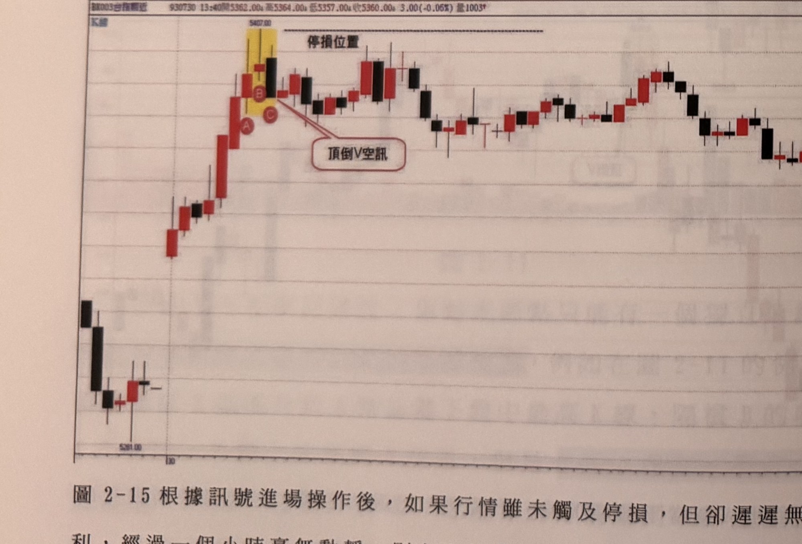
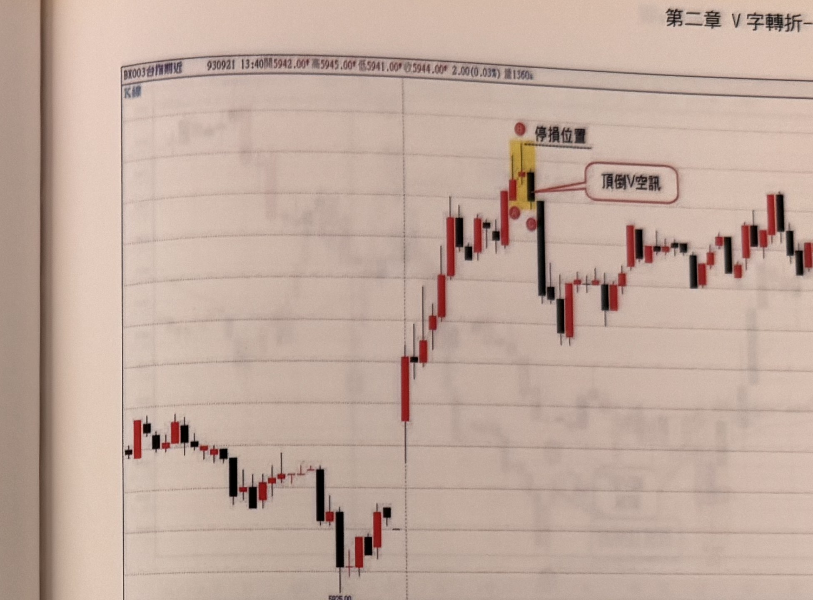
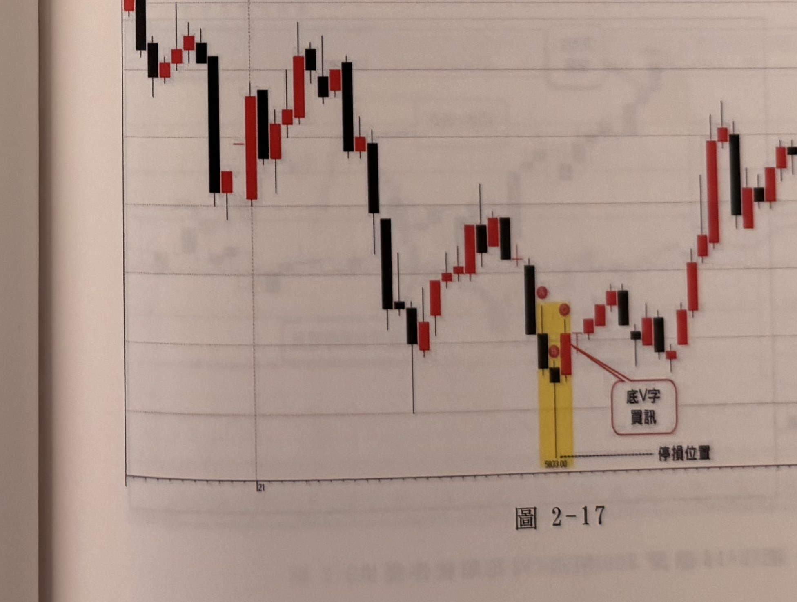

## p.62

**圖 2-14** 當訊號K線離谷點超過30點，拉回縮小停損20點補進場或直接進場設20點停損。

> 圖說（figure notes）: 台指期分時K線走勢圖，頁首標示「BX003台指期近 910621 10:05開5381.00 高5382.00 低5375.00 收5375.00 4.00(-0.07%) 量173」，左上角標示「K線」。走勢左側先小幅震盪走低，中段一根長黑K線快速下探至黃底標示區（K線最低點約5290.00），紅框標註「底V字」以線條指向黃底區下方的紅K線；隨後行情持續反彈上攻，經過中段小段整理，最終攀升至最高點「5440.00」附近，圖右側行情自高點回落震盪。此圖對應本文說明：當底V字訊號K線收盤離谷點（最低點）超過30點時，可以等待拉回縮小停損至20點以內再補進場，或直接進場並設20點停損。

**圖 2-15** 根據訊號進場操作後，如果行情雖未觸及停損，但卻遲遲無法推進獲利，經過一個小時毫無動靜，則在進場價位撤單平倉。

> 圖說（figure notes）: 台指期分時K線走勢圖，頁首標示「BX003台指期近 930730 13:40開5362.00 高5364.00 低5357.00 收5360.00 3.00(-0.06%) 量1003」，左上角標示「K線」。走勢左側先小幅下跌後止穩，隨即一根長紅K線快速上攻，於黃底標示區出現K線組合（標記圓圈「A」「B」「C」），最高點標示「5407.00」，其上方水平虛線標註「停損位置」，紅框標註「頂倒V空訊」以線條指向B、C之間；隨後行情自高點回落，於5340~5400區間反覆震盪盤整，圖右側行情持續緩步走低至5360附近。此圖對應本文說明：根據訊號進場操作後，若行情雖未觸及停損，卻遲遲無法推進獲利，經過一個小時毫無動靜，則應在進場價位撤單平倉。

## p.63

**圖 2-16**

> 圖說（figure notes）: 台指期分時K線走勢圖，頁首標示「BX003台指期近 930921 13:40開5942.00 高5945.00 低5941.00 收5944.00 2.00(0.03%) 量1360」，左上角標示「K線」，底部座標軸標示「5925.00」。走勢左側先小幅震盪下探，出現一根長紅K線快速上攻，於黃底標示區出現K線組合（標記圓圈「A」「C」），最高點附近上方水平虛線標註「停損位置」，紅框標註「頂倒V空訊」以線條指向A、C附近K線；隨後行情自高點快速回落一根長黑K線，於低檔震盪整理，其後緩步反彈至圖右側高檔區間。此圖為V字轉折頂部反轉範例，圖中黃底標示區即頂倒V空訊訊號K線組合及其停損位置。

**圖 2-17**

> 圖說（figure notes）: 台指期分時K線走勢圖，頁首標示「BX003台指期近 940121 13:40開5859.00 高5868.00 低5859.00 收5867.00 7.00(0.12%) 量542」，左上角標示「K線」。走勢左側先高檔震盪回落，經過一長段下跌後於中段止穩反彈，再度回落至黃底標示區（K線最低點標示「5803.00」，標記圓圈「A」「B」「C」），紅框標註「底V字買訊」以線條指向B、C附近K線，其下方水平線標註「停損位置」；隨後行情持續反彈上攻，於圖右側攀升至高檔區間。此圖為V字轉折底部反轉範例，圖中黃底標示區即底V字買訊訊號K線組合及其停損位置。
