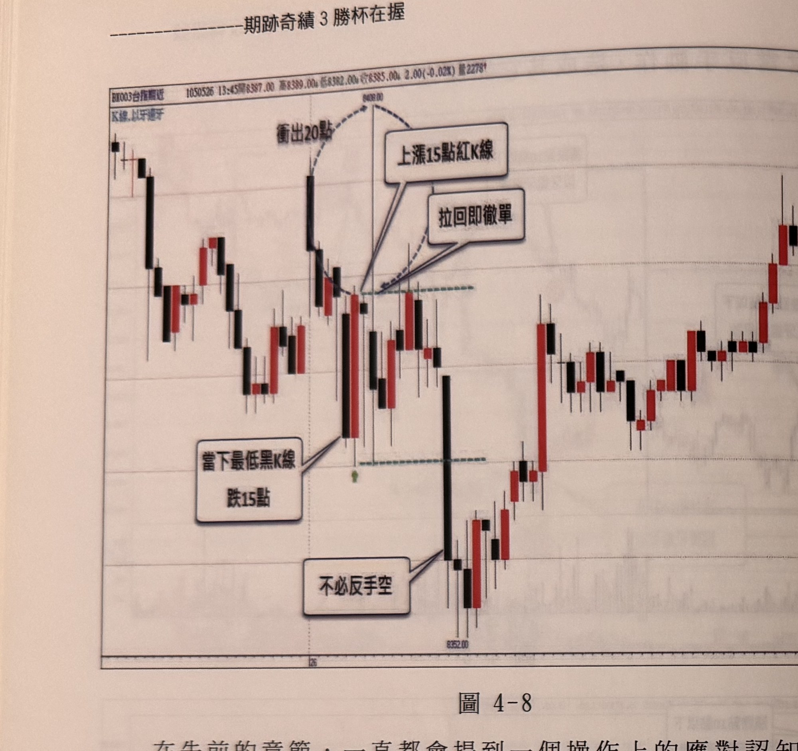
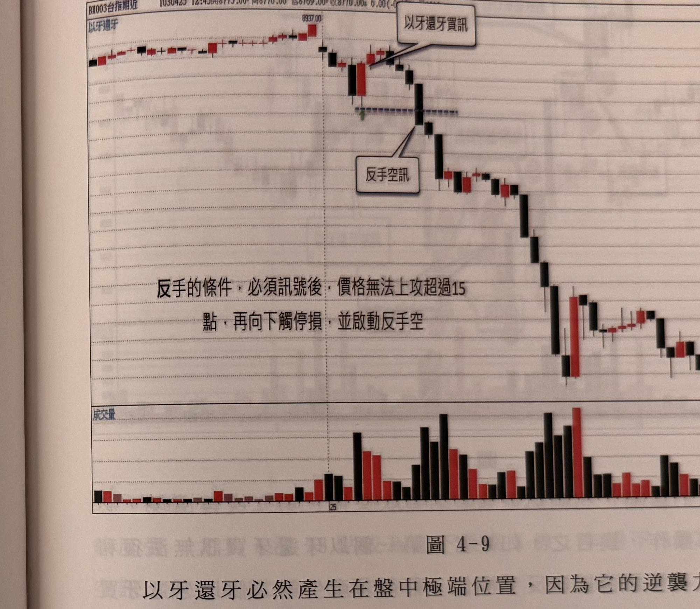

## p.90

**圖 4-8**

> 圖說（figure notes）: 台指期分時K線走勢圖，頁首標示「BX003台指期近 1050526 13:45開8387.00 高8389.00 低8382.00 收8385.00 2.00(-0.02%) 量2278」，左上角標示「K線,以牙還牙」。走勢左側先高檔震盪下探，出現一根長黑K線快速下殺（標示價位「8409.00」於上方），黑色虛線弧線標註「衝出20點」由該黑K線頂部畫向右方，紅框標註「上漲15點紅K線」與「拉回即徹單」以線條指向下跌後的紅K線及其下方藍綠色虛線；該長黑K線最低點下方紅框標註「當下最低黑K線 跌15點」以線條指向此K線；隨後行情持續下探至另一根長黑K線（標示價位「8352.00」），紅框標註「不必反手空」以線條指向此處；其後行情反彈整理，經過中段震盪，最終於圖右側持續上攻至高檔。此圖對應本文說明：早盤出現以牙還牙買訊，隔根迅速拉回收長下影線，沒觸及停損，再隔根向上衝到離進場點20點的位置，但再度火速下殺達38點，直抵以牙還牙組合的低點，當它上拉20點，當下自然對它有更高的期許，但當它快速折回進場點，甚至拉回15點時，就要啟動停利，或以不賺保平安，快速撤出平倉。

在先前的章節，一直都會提到一個操作上的應對認知，當根據訊號進場操作後，自然希望行情循著訊號的方向發展，產生獲利的結果；但世事很難如意進行，當發生價格朝訊號方向運動15點左右，即折返回到進場位置，此時要立刻做撤單平倉，不可覺得不甘願，它還有機會，當然未來充滿各種可能性，但往好的方向及往停損方向皆是一半機會，但這種原本獲利15點，若回頭觸及停損位置，比起一開始沒賺就被停損，心理上是更不爽的，絕對會影響操作的心情；與其如此，當它回到進場位置，撤單出場，當作沒操作，反而好過，像圖4-8的案例中，早盤出現以牙還牙買訊，隔根迅速拉回收長下影線，沒觸及停損，再隔根向上衝到離進場點20點的位置，但再度火速下殺達38點，直抵以牙還牙組合的低點，當它上拉20點，當下自然對它有更高的期許，但當它快速折回進場點，甚至

## p.91

拉回15點時，就要啟動停利，或以不賺保平安，快速撤出平倉，至於當它下殺破以牙還牙買訊的低點，為何不能反手放空呢？

**圖 4-9**

> 圖說（figure notes）: 台指期分時K線走勢圖含成交量副圖，頁首標示「BX003台指期近 1030425 12:45開8775.00 高8770.00 低8769.00 收8770.00 6.00(-0.0[?]%) 量[?]」，左上角標示「以牙還牙」。走勢左側高檔小幅震盪（標示價位「8937.00」），紅框標註「以牙還牙買訊」以線條指向該處的紅黑K線組合；其下方藍色虛線水平延伸，隨後出現一根長黑K線快速下殺，紅框標註「反手空訊」以線條指向此K線；圖中另有一段粗體文字框標註「反手的條件，必須訊號後，價格無法上攻超過15點，再向下觸停損，並啟動反手空」；隨後行情持續破底下殺，經過中段反彈整理，最終於圖右側緩步走低。下方成交量副圖以紅黑柱狀圖顯示各K線成交量，於下殺段落成交量明顯放大。此圖對應本文說明：以牙還牙必然產生在盤中極端位置，因為它的逆襲力道極強，因此停損位置通常都設在組合的最高點位置，但強中自有強中手，一山猶有一山高，如果價格不能朝訊號方向前行超過15點，折返去觸及停損位置，若K線收盤出現穿過停損位置，可以進行反手買進或放空動作；本例中，開低下行，盤中震幅亦超過30點，在低檔產生以牙還牙買訊，但操作多單後，價格只上行10點，即拉回向下觸及停損（以牙還牙組合的低點），K線收盤亦跌破停損位置，宜反手進行放空操作，並設20點停損。

以牙還牙必然產生在盤中極端位置，因為它的逆襲力道極強，因此停損位置通常都設在組合的最高點位置，但強中自有強中手，一山猶有一山高，如果價格不能朝訊號方向前行超過15點，折返去觸及停損位置，若K線收盤出現穿過停損位置，可以進行反手買進或放空動作，例如在圖4-9中，開低下行，盤中震幅亦超過30點，在低檔產生以牙還牙買訊，但操作多單後，價格只上行10點，即拉回向下觸及停損（以牙還牙組合的低點），K線收盤亦跌破停損位置，宜反手進行放空操作，並設20點停損，本例顯示原來極端買訊，卻想不到螳螂捕蟬，黃雀在後，以牙還牙買訊被空方拿來祭旗，當被停損時，情況顯示空方強勁時，應該隨勢翻轉看法。
