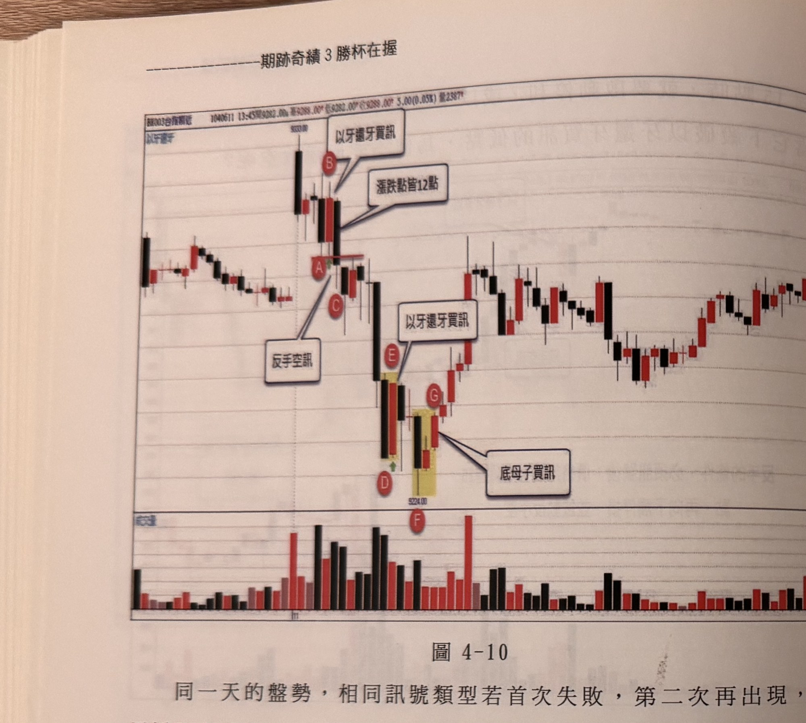
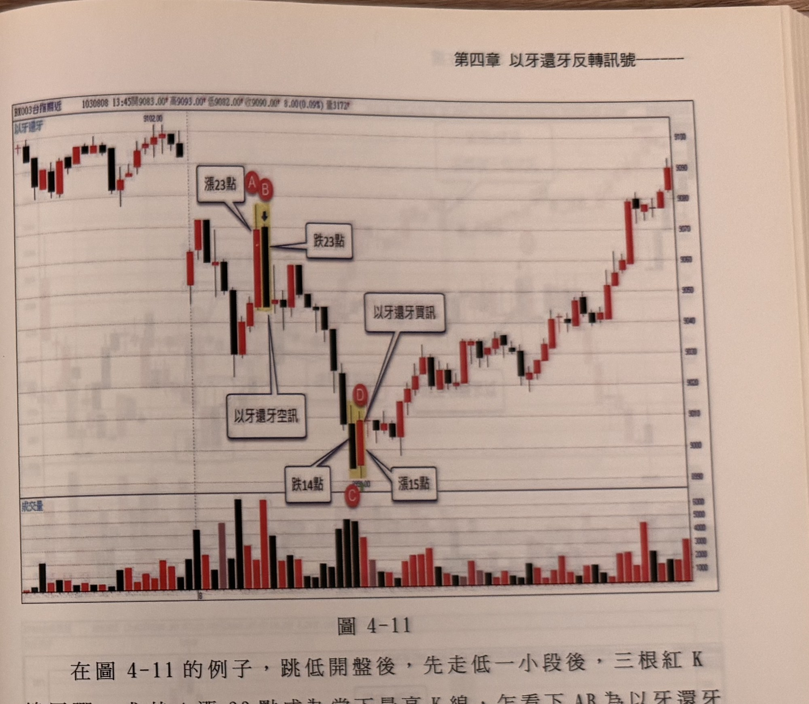

## p.92

**圖 4-10**

> 圖說（figure notes）：台指期近月 5 分鐘 K 線圖（含成交量副圖），標題列顯示「BX003台指期近 1040611 13:45開9282.00 高9288.00 低9282.00 收9288.00 5.00(0.05%) 量2387」，圖左上角標題「以牙還牙」。圖左側行情小幅震盪後，出現一根長黑 K 線急跌至波段高點下方（頂點標示 9330.00），隔根出現一根紅 K 線，標記 B 點，文字框「以牙還牙買訊」與「漲跌點皆12點」以線指向 B（B 與前一根黑 K 漲跌點皆為 12 點，形成以牙還牙買訊）；B 下方緊鄰標記 A、C 兩點，文字框「反手空訊」以線指向 A/C 一帶（此買訊隨後失敗觸及停損，依反手操作原則於 C 收盤處反手進場放空）。行情其後持續下探，於中段低點出現以黃底標示的相鄰 K 線並標記 D、E，文字框「以牙還牙買訊」以線指向 E（構成當日第二個以牙還牙買訊，但依內文說明，同一天同類型訊號首次失敗後第二次出現須忽略，不可再進場）。行情持續破底至更低點（標示 9224.00），出現以黃底標示的 K 線組合並標記 F（成交量副圖上）、G，文字框「底母子買訊」以線指向 G 一帶。G 之後行情止跌反彈，震盪走高至圖右側收斂。下方成交量副圖對應顯示各時段量能，D/E 與 F/G 訊號附近量能皆明顯放大。

同一天的盤勢，相同訊號類型若首次失敗，第二次再出現，必須採取忽略動作，換言之，如果當日第一個以牙還牙買訊無法獲利而被停損，不管是否採取反手操作，稍後若產生第二個以牙還牙買訊時，就不可再依這個訊號類型進場，任何逆向訊號類型要一次就成功，若無法達陣，就沒有第二次再使用的機會。例如圖 4-10 的狀況，假如在 AB 形成以牙還牙買訊（本例中漲跌點只有 12 點），一點上漲的機會都不給，直接打臉向下觸停損，符合反手操作空訊，可以在 C 收盤進場反空，當行情下跌到 DE 產生第二個以牙還牙買訊時，只能採取忽略訊號，AB 的買訊失敗後，以牙還牙的買訊在當日就不能再使用。

## p.93

**圖 4-11**

> 圖說（figure notes）：台指期近月 5 分鐘 K 線圖（含成交量副圖），標題列顯示「BX003台指期近 1030808 13:45開9083.00 高9093.00 低9082.00 收9090.00 8.00(0.09%) 量3172」，圖左上角標題「以牙還牙」。圖左側行情先小幅震盪（頂點標示 9102.00），跳空走低一小段後，出現以黃底標示的相鄰兩根 K 線並標記 A、B，文字框「漲23點」指向 A（該紅 K 線上漲 23 點，乍看為當下盤中最高 K 線），文字框「跌23點」指向 B 右側緊鄰的黑 K 線；文字框「以牙還牙空訊」另以線指向 A/B 一帶。行情持續下探至中段低點，出現以黃底標示的相鄰 K 線並標記 C、D，文字框「跌14點」與「漲15點」分別指向該黑 K（下跌 14 點）與紅 K（上漲 15 點，價位標示約 9034.00），文字框「以牙還牙買訊」以線指向 D 一帶。D 之後行情強勢反轉向上，連續多根紅黑交錯的 K 線震盪墊高，一路上攻至圖右側高點收在 9090.00 附近。下方成交量副圖對應顯示各時段量能，A/B 與 C/D 訊號附近皆可見放大的量能柱。

在圖 4-11 的例子，跳低開盤後，先走低一小段後，三根紅 K 線反彈，尤其 A 漲 23 點成為當下最高 K 線，乍看下 AB 為以牙還牙空訊，但仔細觀察，發現標示 A 並非當下盤中最高 K 線，再次強調最高 K 線的定義為盤中最高最高點及最高收盤價，兩者必須同時符合，本例中 A 的收盤價非最高收盤價，開盤第二根紅 K 線的收盤才是最高收盤價，因此 AB 不能當作以牙還牙空訊，即便後來行情還是向下大跌，矇到只能偷笑，不宜將錯就錯下去，所幸盤中低點出現以牙還牙買訊，好好向上賺一波。

以下附圖請讀者自行參考練習。
