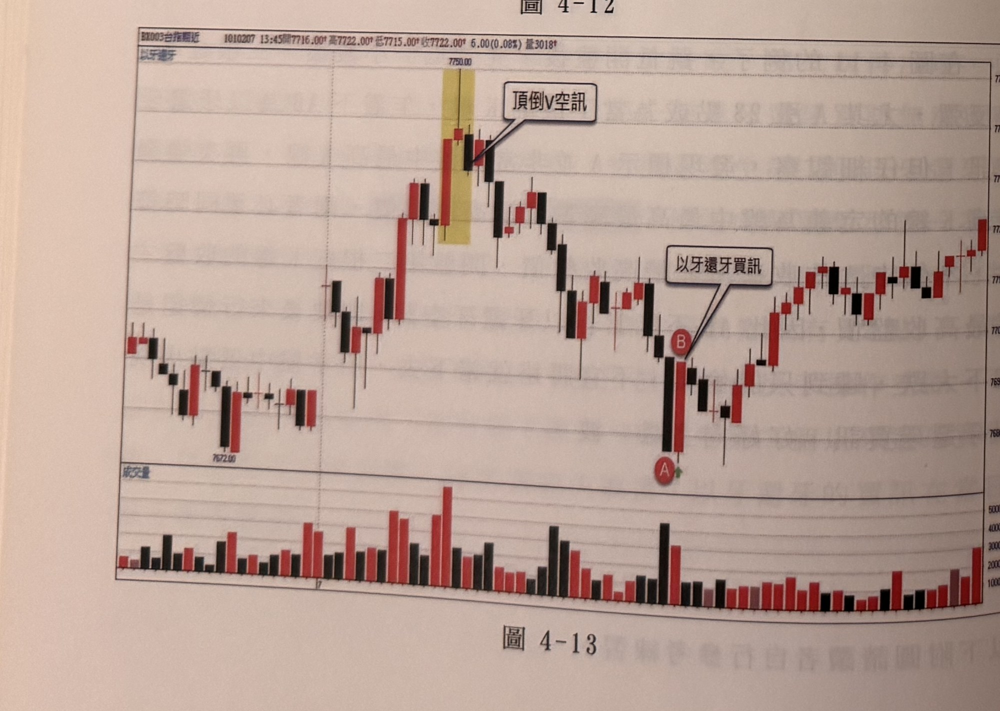
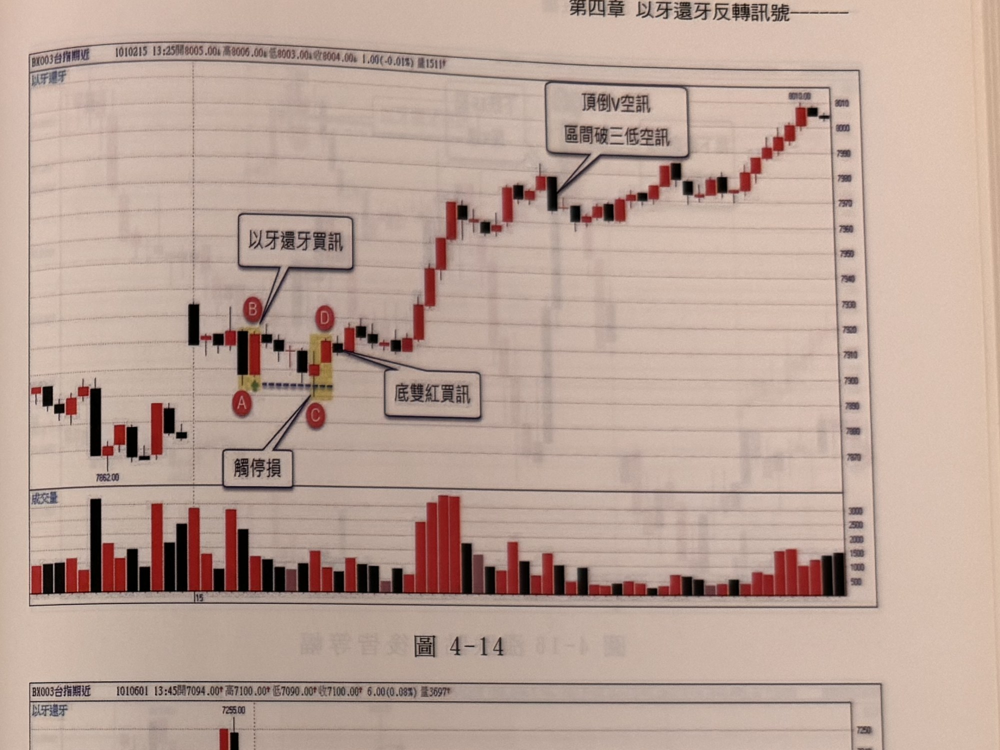

## p.94

以下附圖為練習範例（無內文說明），標題「以牙還牙」。

**圖 4-12**

> 圖說（figure notes）：台指期近月 5 分鐘 K 線圖（含成交量副圖），標題列顯示「AX003台指期近 980112 09:05開4397.00 高4436.00 低4396.00 收4420.00 24.00(0.55%) 量3111」。圖左側行情自高點急跌後止穩（低點標示 4344.00），隨後反彈走高，於波段高點出現以黃底標示的 K 線，標記 A（上方，以下箭頭指示）、B（下方黑 K），文字框「以牙還牙空訊」以線指向 B 一帶。B 之後行情反轉下跌一段後於中段呈紅黑交錯的橫向整理，接著出現一根長黑 K 線急跌，隨後止跌在低檔區間震盪，圖右側行情再度反彈走高，最右端出現一根長紅 K 線收於高點。下方成交量副圖對應顯示各時段量能，圖右端有一根特別放大的紅色量能柱。

**圖 4-13**

> 圖說（figure notes）：台指期近月 5 分鐘 K 線圖（含成交量副圖），標題列顯示「BX003台指期近 1010207 13:45開7716.00 高7722.00 低7715.00 收7722.00 5.00(0.08%) 量3018」。圖左側行情於低檔區間震盪（低點標示 7672.00），隨後強勢上攻至波段高點（標示 7750.00），高點處出現以黃底標示的相鄰紅黑 K 線，文字框「頂倒V空訊」以線指向該處（V 字形頂部反轉空方訊號）。行情其後反轉下跌，一路下探至圖中段低點，出現以黃底標示的相鄰黑紅 K 線並標記 A（下方黑 K，當下最低）、B（上方緊接紅 K），文字框「以牙還牙買訊」以線指向 B。B 之後行情止跌反彈，震盪走高至圖右側收斂。下方成交量副圖對應顯示各時段量能，波段高點與 A/B 訊號附近量能皆明顯放大。

## p.95

**圖 4-14**

> 圖說（figure notes）：台指期近月 5 分鐘 K 線圖（含成交量副圖），標題列顯示「BX003台指期近 1010215 13:25開8005.00 高8006.00 低8003.00 收8004.00 1.00(-0.01%) 量1511」。圖左側行情於低檔區間震盪（低點標示 7862.00），隨後出現以黃底標示的相鄰 K 線並標記 A、B、C、D 四點：B 位於上方，文字框「以牙還牙買訊」以線指向 B；A 位於 B 下方（另有虛線標示同價位水平延伸）；C、D 相鄰標記於稍右處，文字框「觸停損」以線指向 C，文字框「底雙紅買訊」以線指向 D（D 一帶為底部雙紅買進訊號）。D 之後行情強勢反轉向上，連續紅黑交錯的 K 線一路墊高，中段出現一根長黑 K 線後又止穩續漲，於圖右側波段高點處出現另一根黑 K，文字框「頂倒V空訊」與「區間破三低空訊」以線指向該根黑 K，其後行情持續盤堅走高至最右端（標示 8010.00）。下方成交量副圖對應顯示各時段量能，A/B/C/D 訊號附近及中段拉回處量能明顯放大。

**圖 4-15**

> 圖說（figure notes）：台指期近月 5 分鐘 K 線圖（含成交量副圖），標題列顯示「BX003台指期近 1010601 13:45開7094.00 高7100.00 低7090.00 收7100.00 6.00(0.08%) 量3697」。圖左側行情自波段高點（標示 7255.00）反轉下跌，一路下探至中段低點，出現以黃底標示的相鄰黑紅 K 線並標記 A（下方黑 K，當下最低）、B（上方緊接紅 K），文字框「以牙還牙買訊」以線指向 B。B 之後行情反彈走高一段（波段高點約 7190 附近），隨後再度反轉下滑，持續破底至圖右側低點（標示 7075.00），最終小幅止跌整理。下方成交量副圖對應顯示各時段量能，A/B 訊號附近及波段高點回落處量能明顯放大。
