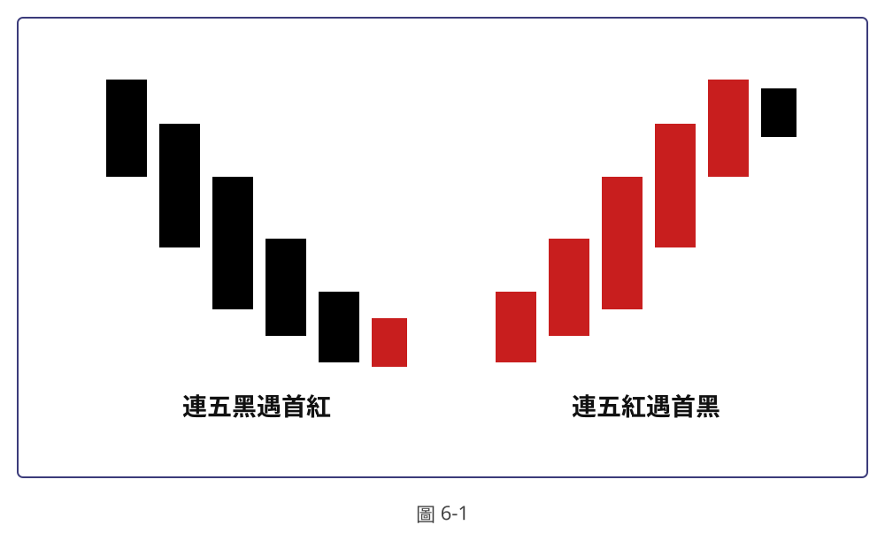

## p.120

[頁面空白，僅可見對面頁（121）內容透印的極淡痕跡（鏡像），無實際印刷文字或圖片，故不轉錄]

## p.121

# 第六章 K線慣性破壞訊號

**圖6-1**

> 圖說（figure notes）：示意圖（非實際走勢截圖，理想化K線圖形），以藍色細框圍住整張圖，框內左右各有一組情境。左半部「連五黑遇首紅」：五根黑K線呈階梯狀依序下降（每根實體依次降低、變短），其後緊接一根較小的紅K線，落於與第五根黑K線相近的低點位置。右半部「連五紅遇首黑」：與左半部鏡像對稱，五根紅K線呈階梯狀依序上升（每根實體依次升高、變長），其後緊接一根較小的黑K線，落於與第五根紅K線相近的高點位置。圖下方置中標示「圖6-1」。此圖對應本文定義：連續五根以上下跌黑K線（幅度超過40點）後，隔根出現未再破新低、且未超過最後一根黑K線最高點（過一高）、最後一根黑K線須為盤中最低點的紅K線，稱為「連五黑遇首紅買訊」；反之，連續五根以上上漲紅K線（幅度超過40點）後，隔根出現上影線未創新高、收盤未跌破最後一根紅K線低點（破一低）、且最後一根紅K線須為當下盤中最高點的黑K線，稱為「連五紅遇首黑」空訊。

　　連五黑遇首紅，在過去系列書中，都當作獨立的平倉訊號，但要當作操作訊號則要仔細解析特別的條件，當**連續五根以上下跌的黑K線，幅度超過40點以上**，隔根出現**未再破新低的紅K線**，紅K線**沒有超過最後一根黑K線最高點（過一高）**，**最後一根黑K線必須為盤中最低點**，這種狀況稱為連五黑遇首紅買訊，如圖6-1左半圖所示；若紅K線超過最後一根黑K線最高點，且最後一根黑K線為當下盤中最低，那就形成底V字買訊；若紅K線的最低點創新低，則只能做為空訊的平倉訊號。

　　反之，快速上漲走勢，若連出五根以上紅K線竄升，**幅度超過40點**，非常威猛的多頭氣場，卻突然出現下跌的黑K線，其特徵為**上影線沒有創新高**，K線收盤沒有跌破最後一根紅K線低點（破一低），而最後一根紅K線必須是當下盤中最高點，乃為空訊，請看圖6-1右半圖所示；如果黑K線未創新高，其收盤卻破紅K線最低點，且位在盤中極端位置，就形成頂倒V空訊；若黑K線上影線創新高，[cut off]
