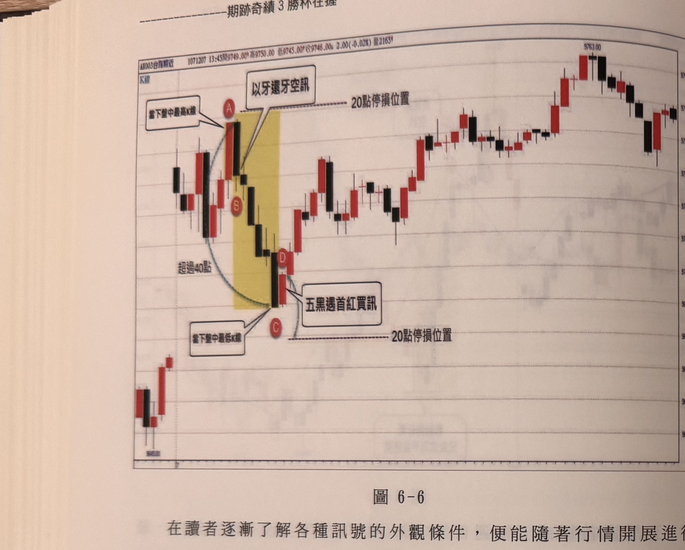
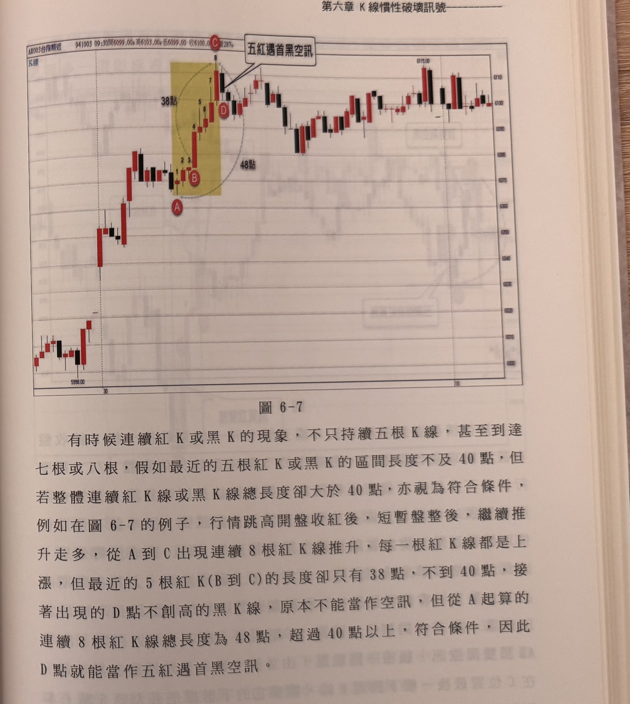

## p.126

**圖6-6**

> 圖說（figure notes）：台指期五分鐘K線圖。標題列顯示「AX003台指期近 1071207 13:45開9749.00 高9750.00 低9745.00 收9746.00 2.00(-0.02%) 量2165」。行情左段先小幅震盪走高，抵達A點（文字框「當下盤中最高K線」以線指向A），A、B之間為黃色網底標示區，B下方文字框「以牙還牙空訊」以線指向B，其右側虛線標示「20點停損位置」（位於A收盤上方20點）；隨後行情連續下跌，經C點（文字框「當下盤中最低K線」以線指向C，其下方虛線標示另一「20點停損位置」，位於C收盤下方20點），左側文字「超過40點」標示A至C跌幅；C隔一根為D，文字框「五黑遇首紅買訊」以線指向D，代表D不再創新低並反漲收紅；訊號後行情止跌回升，呈波浪狀走高，中段一度小幅拉回後再創高，最終於圖右上方觸及高點9763.00附近，尾段小幅震盪回落。右側縱軸價格刻度約9650～9770。

　　在讀者逐漸了解各種訊號的外觀條件，便能隨著行情開展進行多個訊號觀察，在圖6-6的行情，跳空超過40點開盤收黑，這是後面章節會提到的空訊，請注意停損設在收盤上方20點位置，行情先是向下達13點後，隨即紅K線拉升，轉盈為虧達17點左右，再度長黑下跌，再次轉為獲利17點，當長黑K線後，不再下跌，反漲回首根黑K線空訊進場位置時，要立刻撤單平倉。

　　而後來到A盤中最高K線，漲18點後即遭B倒殺17點，形成以牙還牙空訊，隨後，再繼殺五根黑K線到C點，整個五黑跌點也超過40點以上，隔根的D點，竟然不再創新低反漲收紅，符合五黑遇首紅的買進訊號，因此自D收盤價向下20點設停損位置，兩個訊號包辦了，當下盤中最高最低反轉訊號。

## p.127

　　有時候連續紅K或黑K的現象，不只持續五根K線，甚至到達七根或八根，假如最近的五根紅K或黑K的區間長度不及40點，但若整體連續紅K線或黑K線總長度卻大於40點，亦視為符合條件，例如在圖6-7的例子，行情跳高開盤收紅後，短暫盤整後，繼續推升走多，從A到C出現連續8根紅K線推升，每一根紅K線都是上漲，但最近的5根紅K(B到C)的長度卻只有38點，不到40點，接著出現的D點不創高的黑K線，原本不能當作空訊，但從A起算的連續8根紅K線總長度為48點，超過40點以上，符合條件，因此D點就能當作五紅遇首黑空訊。

**圖6-7**

> 圖說（figure notes）：台指期五分鐘K線圖。標題列顯示「AX003台指期近 941003 09:30開6099.00 高6103.00 低6099.00 收6100.00 漲287?」。行情左段自低點5998.00附近震盪走高，來到A點（黃色網底標示區起點），其後連續8根紅K線依序編號1至8推升（B標示於編號2、3附近），左側文字「38點」標示編號B至C（最近5根紅K）的漲幅，「48點」標示A至C（全部8根紅K）總漲幅；C點（頂點）隔一根收黑，文字框「五紅遇首黑空訊」以線指向該黑K線，D標示於其下方；訊號後行情短暫盤整，隨後持續呈波浪狀走高，中段數次小幅拉回後再創高，於高點6115.00附近震盪，圖右側收在約6100～6110區間。右側縱軸價格刻度約6000～6115。
