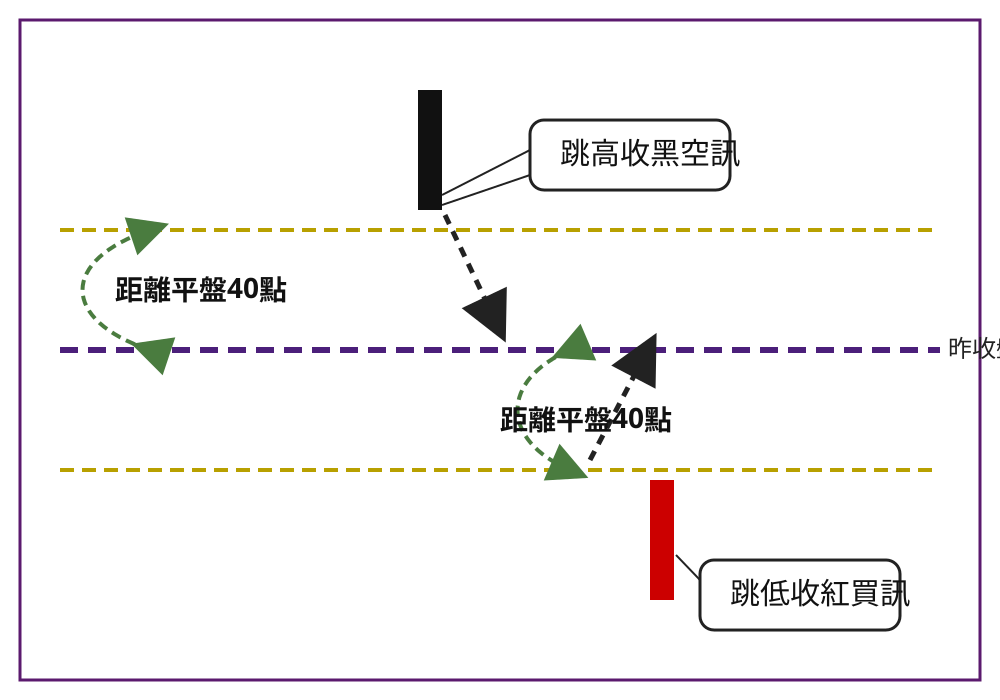

## p.138

進入本章主題，開盤第一根 K 線是紅是黑，代表什麼意義？當市場有利多消息刺激時，傾向跳高開盤，理論上它應該收紅 K 線，這是回應利多消息，市場看好的預期，那如果開盤 K 線是收黑 K 線，是不是仍看好呢？顯然第一根五分鐘 K 線在開盤看好，但被特定賣壓殺低，使得 K 線實體翻黑；那麼跳高收黑 K 線，表達一種事實，某些力量對利多的看法不一致，趁跳高開盤，迅速出脫持倉，甚至轉向放空，我們不需去深究誰是某些力量背後的影武者，黑 K 線本身就是一種偏空的表象，所以跳高收紅代表常態，那跳高收黑則是反常，特別把它挑出來當作空訊使用。

為什麼跳高收紅，不直接以去買呢？一般跳高開盤，必然需要消化一些留倉的獲利單，這些留倉單乃既得利益者，會隨勢觀望，一有風吹草動，隨便殺出隨便都賺，容易形成拉回走勢，因此買訊不容易在第一根 K 線收紅即能進場，因為停損控制在 20 點以內，必須更精細的找其它可靠的訊號來操作；但跳高收黑的空訊就不一般，它短時間繼續下滑的機率會更高，當然重點在於跳高開盤多少點，才適合用第一根黑 K 線，即能放空呢？我們在先前的各章極端訊號介紹中，凡是跳空到極端位置，必須離昨收盤（平盤）至少 40 點以上，因此跳高 40 點以上，容易成為極端位置，40 點以下，必須忽略不用，準此，凡是跳高 40 點開盤，第一根 K 線收黑，上影線必須小於（含）3 點，符合這樣的條件，即形成放空訊號，請見 7-1 左半邊圖示。

反之，出現利空消息，盤面傾向跳低，如果利空消息影響的層面經過解讀，認為不會擴散，那麼第一根 K 線極可能開低收紅，暗示有人利用開低之際，大撿低價部位，在五分鐘內逐步將收盤推升

## p.139

高於開盤；而想賣的，不看好的，都在開盤時刻，傾巢放掉，賣壓消化後，行情容易被撩撥反漲；因此，利空之下，開低收黑是常態，但不代表立刻可以放空，可能需要更精細的觀察放空訊號，但開低收紅是一種反常現象，可以拿來當作買訊看待，會對反常現象特別在意，與指標的背離具有異曲同工之處，當發生指標背離時，通常具有反轉的機會，自然值得聚焦，能夠抓到反轉，是一種觀察敏銳的得意之作；又如量價背離，也是反常現象，愈到高檔居然成交量變少，顯然被聯想成高處不勝寒，可能做頭反轉的暗示，所以反常就是聚焦的重點。當然，跳低收紅的第一根五分鐘 K 線，作為買進訊號，必須它跳低超過 40 點以上，且下影線長度必須小於（含）3 點，符合上述條件，才能視為買進訊號，請見 7-1 右半邊圖示。

**圖 7-1**

> 圖說（figure notes）: 手繪風示意圖（非真實行情截圖），以紫色粗虛線標示水平中線「昨收盤（平盤）」，其上、下各有一條橄欖色（金黃）細虛線，分別代表「距離平盤 40 點」的上、下門檻。圖左半：上方橄欖虛線之上畫有一根黑色實心 K 線（無影線的長黑棒），文字框「跳高收黑空訊」以線指向此黑 K 線，並有一條黑色虛線箭頭由黑 K 線底部向右下方指向上方橄欖虛線，表示該黑 K 線的開盤點必須高於平盤 40 點以上才成立空訊；左側另有綠色虛線雙向弧形箭頭，標示於「昨收盤」與上方橄欖虛線之間，文字「距離平盤 40 點」說明此段垂直距離即為 40 點門檻。圖右半（左右對稱）：下方橄欖虛線之下畫有一根紅色實心 K 線，文字框「跳低收紅買訊」以線指向此紅 K 線，另一條黑色虛線箭頭由下方橄欖虛線向右上方指向紅 K 線，同樣搭配綠色雙向弧形箭頭與「距離平盤 40 點」文字，標示「昨收盤」與下方橄欖虛線之間的 40 點距離。整體用以圖解本文所述：跳高開盤且收黑、乖離平盤 40 點以上為放空訊號；跳低開盤且收紅、乖離平盤 40 點以上為買進訊號。
