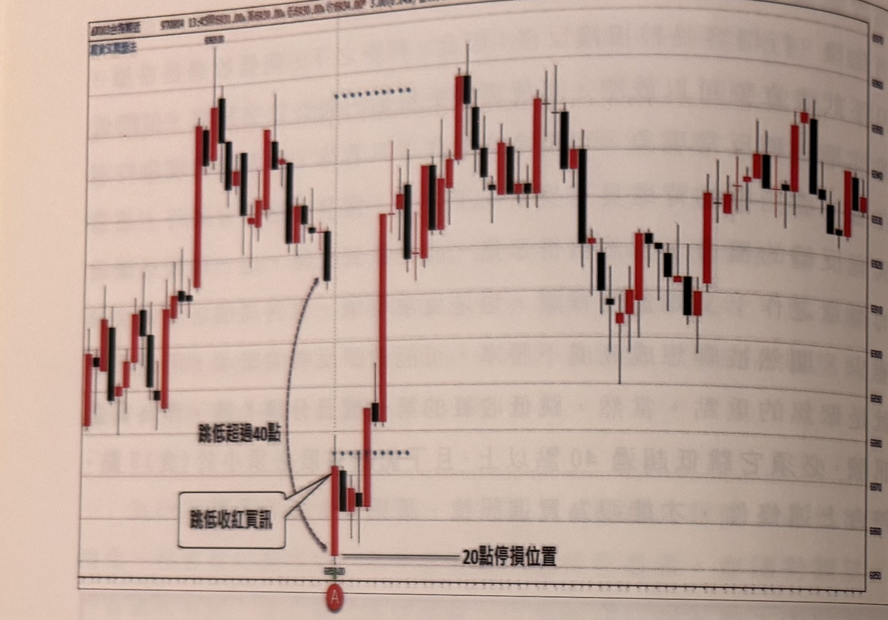
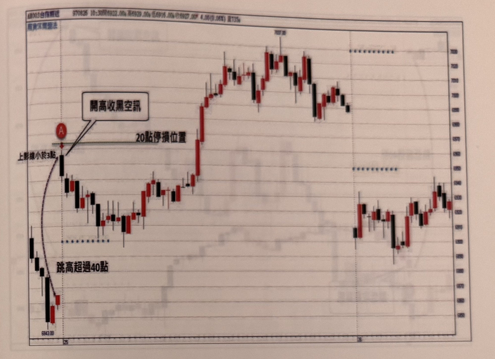

## p.140

當行情跳低超過 40 點開盤，顯然空頭占利空消息的優勢條件，但開低的同時，也有些敢趁低進場買的勇士，或者是趁開低將原先大獲全勝的空軍，不客氣地回補在開盤價，這些稱為市場先行者或智者，扮演著第一線衝峰，衝得過是英雄，衝不過是貓熊，成為造市先鋒，圖 7-2 的範例，跳低超過 40 點開盤，價格即向上反彈，使得第一根 K 線呈現開低收高，而下影線小於 3 點，符合開盤買進的條件，可以在 A 點進場買進，並直接在收盤價以下設 20 點停損，如果行情正確向上，非常高的機率將獲得更高的風報比，

**圖 7-2**

> 圖說（figure notes）：台指期 5 分鐘 K 線圖，標題列顯示「970804 13:45 開xxx.00 高xxx.00 低xxx.00 價xxx.00 3.00(0.04%) 量165張」，左上角有「群益法人專區」字樣。圖形左側行情先小幅盤堅震盪走高，接著一根長黑K 大跳空跌破前波，箭頭由「跳低超過40點」文字指向該跳空缺口下方一根開低收紅的 K 線，並以圓圈標示 A 點；圖下方文字框「跳低收紅買訊」以箭頭指向 A 點所在的紅K，A 點下方有水平虛線標示「20點停損位置」。A 點之後行情向上急拉數根紅K，隨後在高檔區間（圖中段以虛線點狀標示的水平參考線之間）呈現橫向震盪整理，最右側再度出現一根長黑K 急殺後止跌小幅反彈。整體呈現：先前一段下跌趨勢中，開盤跳空跌破 40 點，隨即收紅（開低收高、上影線<3點）於 A 點作為買進訊號，停損設於收盤價下方 20 點。

## p.141

跳高 40 點以上開盤時，第一個價格閃出螢幕，如果消息面看好度非常強勁，那必須快速克服留倉獲利單的賣壓，繼續向上推進，彰顯多方力道集結同盟，自然 K 線收紅機率增加，但向上推進若只幾檔距離，就後繼無力，檔數可能只有一、二點，就開始壓回，而造成首根收黑，重點在一種空方的表態行情，如果開盤價當作是一個關卡，多頭若推升多檔後，才被壓回，當成上影線很長，上影線長通常代表空壓力道，但總是被多方推進到後方，暗示空頭並沒有能力在一開盤就立刻展現打擊能力，因此開高收黑空訊，要表現空方最強的表態方式，規定多方推進的上影線不能超過 3 點，符合這樣的條件，才能視為空訊，例如在圖 7-3 的狀況，跳高達 90 點開盤，向上 3 點後，即向下破開盤價收黑 K 線，A 形成空訊，向上設 20 點停損，果然行情先呈現拉回近 45 點，多方再重新反攻。

**圖 7-3**

> 圖說（figure notes）：台指期 5 分鐘 K 線圖，標題列顯示「970825 10:30 開6922.00 高6920.00 低6916.00 價6927.00 4.00(0.06%) 量735張」，左上角「群益法人專區」字樣。圖左側起點標示 6843.00，行情先出現數根黑K 下跌，虛線垂直參考線（標示「25」）處以文字「跳高超過40點」搭配曲線箭頭，指向該垂直線右側第一根開高的長紅K，其上方標示紅圈 A 點，A 點K 線旁註記「上影線小於3點」，並有水平線標示「20點停損位置」（緊貼 A 點紅K實體上緣），文字框「開高收黑空訊」以兩條線指向 A 點與其上影線頂端。A 點之後行情持續下跌回檔數根，接著止跌反轉大幅向上急漲（一根長紅K跳漲），之後在高檔區間（頂點標示 7007.00 附近）呈現多根紅黑交錯的高檔盤整，右側另有一條垂直虛線參考線（標示「26」），其後行情自高檔拉回、再度出現一段震盪下探後小幅回升的走勢。圖右上角另有兩處以點狀虛線標示的水平參考線（分別位於高檔區與中段價位）。整體呈現：延續前一交易日跳空跳高情境，開盤跳高超過 40 點，上影線受限於 3 點內即收黑（A 點），形成空方訊號，停損設於 A 點紅K上方 20 點，隨後行情先拉回約 45 點，最終仍由多方重新主導向上。
