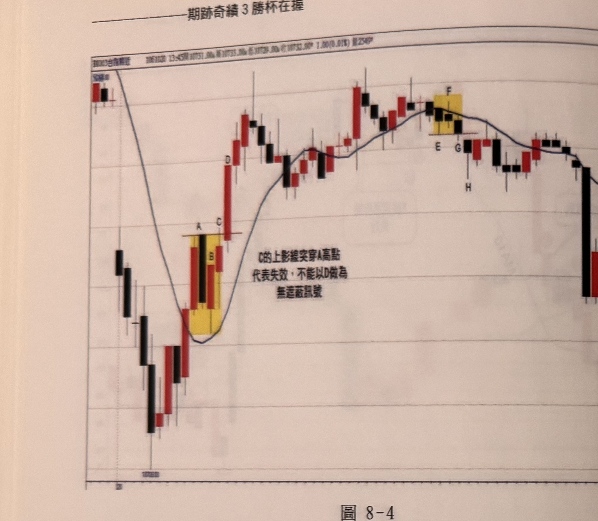
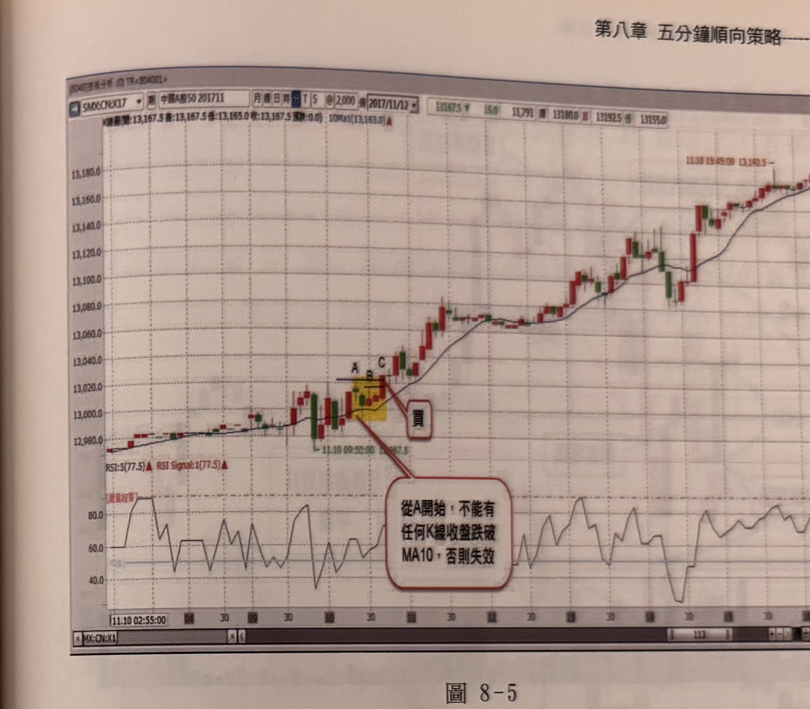

## p.160

**圖 8-4**

> 圖說（figure notes）: 台指期分時K線走勢圖，頁首標示「BX003台指期近 1063028 13:45開10731.00 高10731.00 低10729.00 收10732.00 1.00(0.01%) 量2549」，圖中另繪有黑色均線。走勢左側先高檔下探至最低點「10700」附近，隨後止穩反彈，均線由降轉升，於黃底標示區出現K線組合（標記「A」水平線於上方，「B」「C」於下方），旁註「C的上影線突穿A高點 代表失效，不能以D做為無遮蔽訊號」；隨後行情持續上攻，經過標記「D」的長紅K線，及中段震盪整理，於另一黃底標示區出現K線組合（標記「E」「F」「G」，均線於此處轉折向下），標記「H」於下方；隨後行情自高點回落整理，最終於圖右側持續下探。此圖對應本文說明：均線策略產生訊號過程，突破層級1峰點或跌破層級1谷點的機會只有一次，必須一次就產生訊號，否則就失效；本例中，價格突破均線後，在A位置形成層級1峰點，B縮頭後，接著C朝上彈升，結果上影線突破A高點，但收盤價卻沒有，雖然次根D完全突破A高點，也突破C高點，但當C出擊未成功，整個步驟就破壞而中止找買訊；另一種失效現象，則出現在E為跌破均線後產生第一個層級1谷點，接著F縮腳反彈，次根G向下再殺，卻出現下影線跌破E谷點低點，但收盤平了E的低點，一樣沒有跌破濾線，一樣就此失效。

均線策略產生訊號過程，突破層級1峰點或跌破層級1谷點的機會只有一次，必須一次就產生訊號，否則就失效；具體例子如圖8-4中，價格突破均線後，在A位置形成層級1峰點，B縮頭後，接著C朝上彈升，結果上影線突破A高點，但收盤價卻沒有，雖然次根D完全突破A高點，也突破C高點，但當C出擊未成功，整個步驟就破壞而中止找買訊，而另一種失效現象，則出現在E為跌破均線後產生第一個層級1谷點，接著F縮腳反彈，次根G向下再殺，卻出現下影線跌破E谷點低點，但收盤平了E的低點，一樣沒有跌破濾線，一樣就此失效，中止尋找空訊的流程，得重新找下一個層級1谷，再重演步驟來確定訊號是否一次就跌破谷點。

## p.161

# 第八章 五分鐘順向策略

如果突破均線後出現第一個層級1峰點，本該以此作為濾網，尋找後續K線收盤突破濾網，成為買訊，若還沒出現買訊之前，又出現較低的層級1峰點，這時候要以哪個峰點做為濾網呢？**只要K線收盤突破較低的峰點，而且一次就完成突破，就是板上釘釘的買點，不必以突破最高峰點為必要。**反之，跌破均線出現第一個層級1谷點後，在未產生空訊前，又形成另一種較高的谷點，那麼只要跌破較高的谷點，即使沒有跌破較低的谷點，空訊亦成立。如圖8-5中國A50的例子中，突破均線及拉回跌破均線，自然得重新來過，等到A位置出現層級1峰點，隨後又在較低的B形成另一個層級1峰點，接著在C突破B峰高點，也突破A峰高點，其實只要突破較低的B峰點，均線買訊就成立，剛好C一舉穿兩高，都是訊號。

**圖 8-5**

> 圖說（figure notes）: 中國A50期貨（SMX:CN:X17，中國A50 201711）5分鐘K線走勢圖含RSI副圖，頁首資訊列顯示「K線圖(開:13,167.5 高:13,167.5 低:13,165.0 收:13,167.5 漲跌:0.0) 10Ma1(13,163.0)」，日期「2017/11/12」，右側數值「13167.5 跌15.0 11,791 量 13180.0 高 13192.5 低 13155.0」。走勢左側緩步上攻，均線同步上升，於價位13,000~13,030附近出現黃底標示的K線組合（標記「A」「B」「C」，水平虛線標示A、B兩處高點），紅框標註「買」以線條指向此區；下方紅框文字方塊標註「從A開始，不能有任何K線收盤跌破MA10，否則失效」；隨後行情持續上攻，經過中段震盪整理，最終於圖右側持續攀升至13,180附近，標示「11.10 19:45:00 13,192.5」。下方RSI副圖顯示「RSI:5(77.5) RSI Signal:1(77.5)」，數值在40~90之間震盪。橫軸時間刻度自「11.10 02:55:00」起。此圖對應本文說明：突破均線後，A位置出現層級1峰點，隨後又在較低的B形成另一個層級1峰點，接著在C突破B峰高點，也突破A峰高點，只要突破較低的B峰點，均線買訊就成立，且從A開始，不能有任何K線收盤跌破MA10，否則訊號失效。
