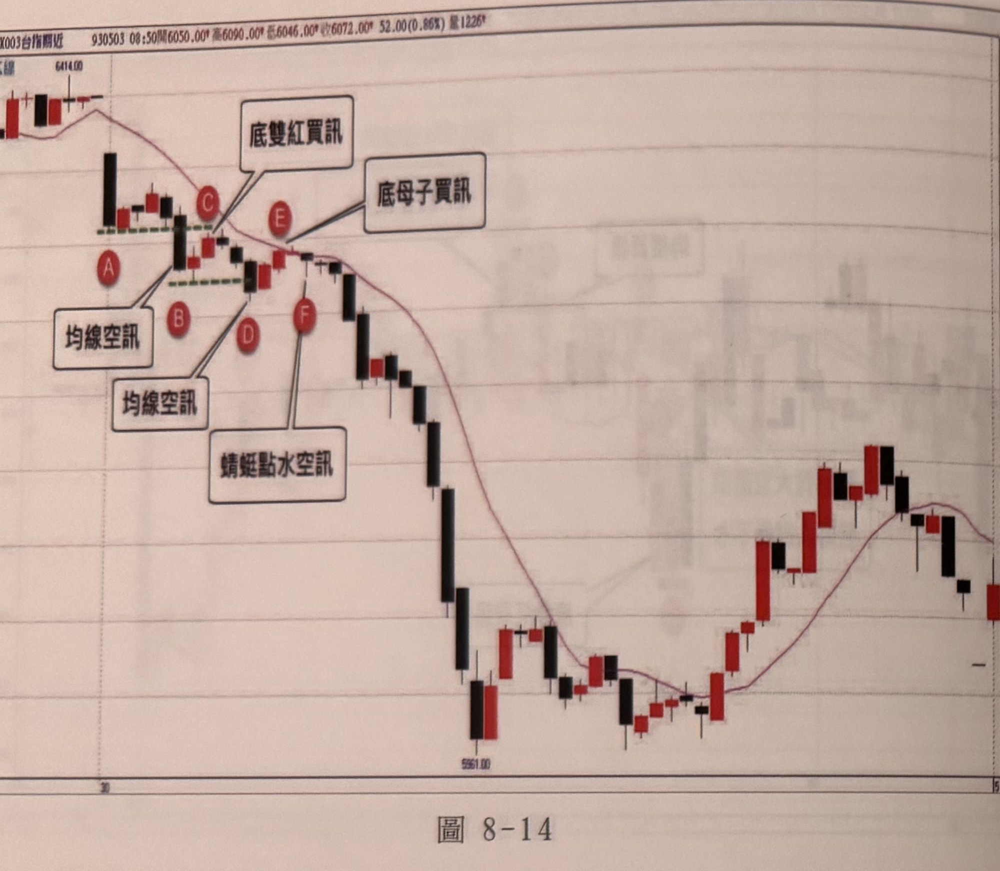
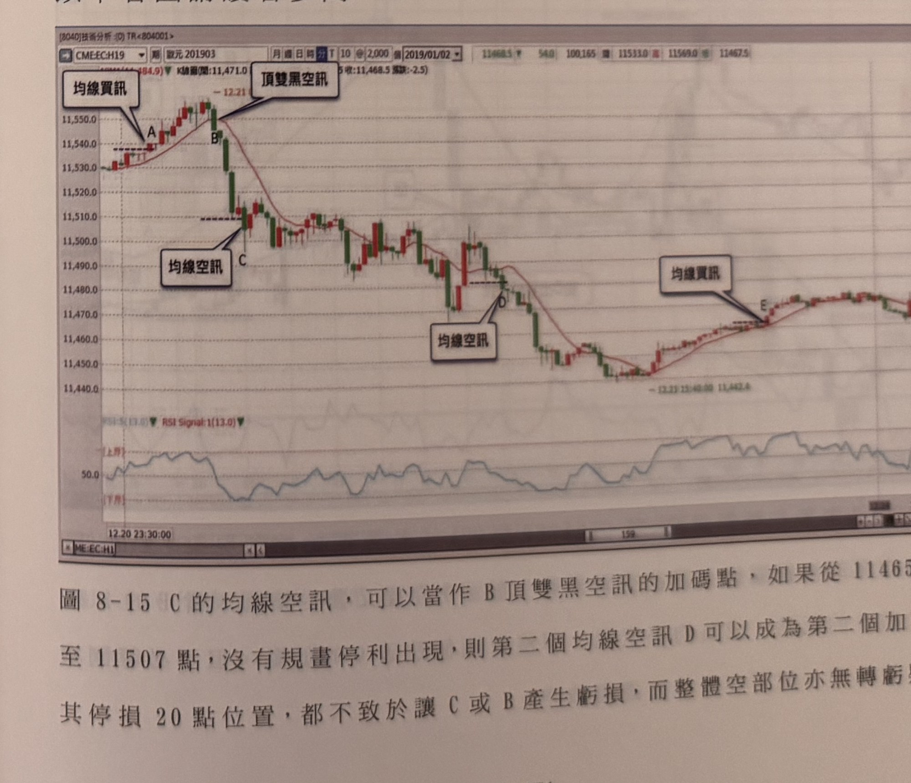

## p.170

**圖 8-14**

> 圖說（figure notes）: 台指期分時K線走勢圖，頁首標示「AX003台指期近 930503 08:50開6050.00 高6090.00 低6046.00 收6072.00 52.00(0.86%) 量1226」，圖中另繪有紅色均線。走勢左側先小幅震盪回落，標記圓圈「A」處紅框標註「均線空訊」以線條指向此K線；隨後行情持續下探，於黃綠色虛線標示區出現K線組合（標記圓圈「B」，紅框標註「均線空訊」以線條指向B）；隨後行情止穩反彈，標記圓圈「C」處紅框標註「底雙紅買訊」以線條指向C；隨後行情再度回落，標記圓圈「D」處紅框標註「蜻蜓點水空訊」以線條指向D；標記圓圈「E」處紅框標註「底母子買訊」以線條指向E；標記圓圈「F」於E下方；隨後行情持續下殺至最低點「5961.00」附近，經過中段反彈整理，最終於圖右側回升後再度小幅回落。此圖對應本文說明：順逆向混用，使得操作更加靈活，但在某些重要日子明顯偏多或偏空時，最好只採用順向訊號，逆向訊號此時可能是豬隊友的角色，並無法替操作帶來加分；例如在2004年4月30日，消息面有國際原油價格飆破40美元，指出大陸經濟將降溫影響，使得中國大陸將祭出宏觀調控，外界預期預料大陸內需市場將呈現緊縮，造成全球原物料市場恐慌再起，台股應聲下跌，當日明顯不利多頭狀況下，除非行情在盤中能彈升超過前一個短波高點，否則不宜做逆向反多動作；圖8-14是當日的走勢，開盤即跳低開盤，之後小幅反彈橫走，但不出首根黑K線高低範圍，當B跌破A低點，形成均線空訊時，隔二根卻形成底雙紅買訊，但根本沒彈升力道，隨即向下跌破B低點，在D形成另一種均線空訊，但隨後二根紅K，在E形成底母子買訊，在F又形成蜻蜓點水空訊（之後的章節會介紹），明知當日跌勢壓力沉重，若搭配逆向訊號，會發現不斷地進場亂了原先空單的順暢走勢，可能好好賺一把，卻被逆向訊號搞得不停觸損反手，而我們可以注意到，開盤後的行情中，沒有一次反彈能超過前一個層級1的峰點，代表多頭在重大利空罩頂下，根本無力回天，只能用順向訊號，才不會遇到豬隊友亂局。

順逆向混用，使得操作更加靈活，不管行情呈現震盪來回，或是趨勢前進，都能根據訊號多空雙向，感覺起來相當完美，但在某些重要日子明顯偏多或偏空時，最好只採用順向訊號，逆向訊號此時可能是豬隊友的角色，並無法替操作帶來加分，例如在2004年4月30日，消息面有國際原油價格飆破40美元，指出大陸經濟將降溫影響，使得中國大陸將祭出宏觀調控，外界預期預料大陸內需市場將呈現緊縮，造成全球原物料市場恐慌再起，台股應聲下跌，當日明顯不利多頭狀況下，除非行情在盤中能彈升超過前一個短波高點，否則不宜做逆向反多動作，圖8-14是當日的走勢，開盤即跳低開盤，之後小幅反彈橫走，但不出首根黑K線高低範圍，當B跌破A低點，形成均線空訊時，隔二根卻形成底雙紅買訊，但根本沒彈升力道，隨即向下跌破B低點，在D形成另一種均線空訊，但隨後

## p.171

# 第八章 五分鐘順向策略

二根紅K，在E形成底母子買訊，在F又形成蜻蜓點水空訊（之後的章節會介紹），明知當日跌勢壓力沉重，若搭配逆向訊號，會發現不斷地進場亂了原先空單的順暢走勢，可能好好賺一把，卻被逆向訊號搞得不停觸損反手，而我們可以注意到，開盤後的行情中，沒有一次反彈能超過前一個層級1的峰點，代表多頭在重大利空罩頂下，根本無力回天，只能用順向訊號，才不會遇到豬隊友亂局。

### 以下各圖請讀者參閱

**圖 8-15** C的均線空訊，可以當作B頂雙黑空訊的加碼點，如果從11465反彈至11507點，沒有規畫停利出現，則第二個均線空訊D可以成為第二個加碼點，其停損20點位置，都不致於讓C或B產生虧損，而整體空部位亦無轉虧疑慮。

> 圖說（figure notes）: 歐元期貨（CME:EC:H19，歐元201903）10分鐘K線走勢圖含RSI副圖，頁首資訊列顯示「K線圖(開:11,471.0 高:11,484.9 低:[?] 收:11,468.5 漲跌:-2.5)」，日期「2019/01/02」，右側數值「11468.5 跌54.0 100,165 量 11533.0 高 11569.0 低 11467.5」。走勢左側先小幅上攻至標記字母「A」（紅框標註「均線買訊」以線條指向此處），隨後續攻至標記字母「B」（紅框標註「頂雙黑空訊」以線條指向B，價位「12.21」），隨後行情快速下殺至標記字母「C」（紅框標註「均線空訊」以線條指向C，水平虛線標示11,510附近）；持續下探至標記字母「D」（紅框標註「均線空訊」以線條指向D，水平虛線標示11,480附近）；隨後行情止穩反彈至標記字母「E」（紅框標註「均線買訊」以線條指向E，標示「12.23 15:40:00 11,442.6」）；最終於圖右側持續上攻至11,470附近震盪。下方RSI副圖顯示「RSI:5(13.0) RSI Signal:1(13.0)」，數值於30~80之間震盪，橫軸時間刻度自「12.20 23:30:00」起。此圖對應本文說明：C的均線空訊，可以當作B頂雙黑空訊的加碼點，如果從11465反彈至11507點，沒有規畫停利出現，則第二個均線空訊D可以成為第二個加碼點，其停損20點位置，都不致於讓C或B產生虧損，而整體空部位亦無轉虧疑慮。
