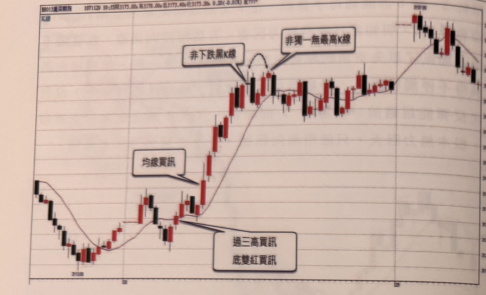
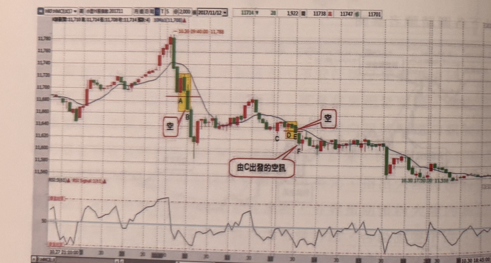
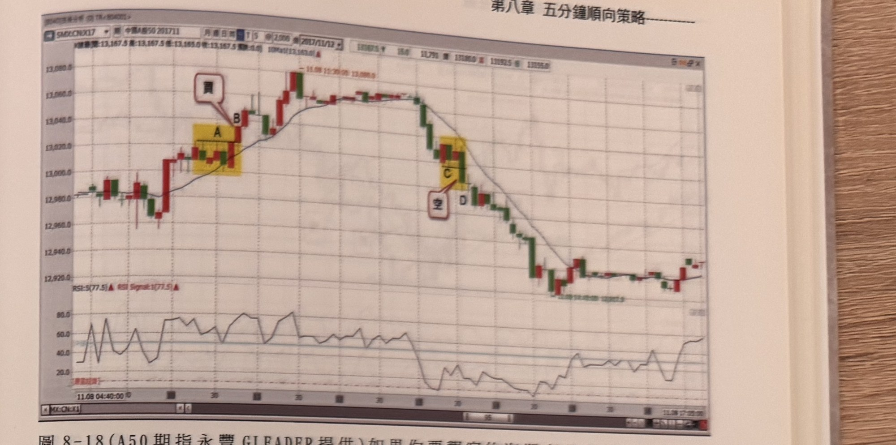
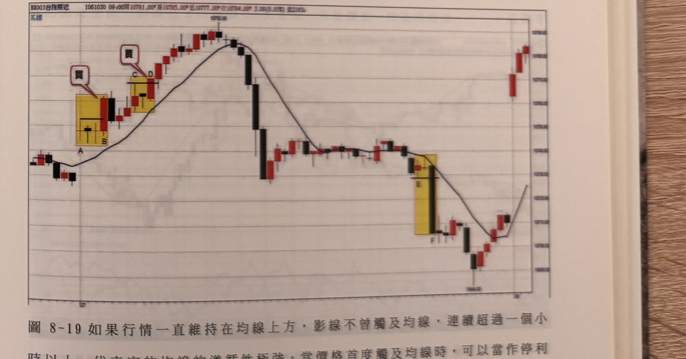

## p.172

**圖 8-16** 滬深 300 期指，停損點設 10 大點

> 圖說（figure notes）: 滬深300期指 5 分鐘 K 線走勢圖搭配均線，標題列「BX013滬深期指 1071129 10:35開3175.00漲 高3176.00漲 低3173.40漲 收3175.20漲 0.20(-0.01%) 量777張」，左上角「K線」字樣。走勢左側先在高點盤整後下跌至底部區間反覆震盪（底部以對話框「過三高買訊」「底雙紅買訊」指向此處連續兩根紅K與其後突破前波高點的位置），隨後以對話框「均線買訊」指向突破均線起漲的紅K；此後價格強勢上漲，沿均線一路走高，中途出現一根被弧形虛線及對話框「非下跌黑K線」標示的黑K（說明此黑K並非真正下跌訊號）及緊接的紅K以對話框「非獨一無最高K線」標示（說明其非單一最高點）；價格續創高後在高檔區間（約 3197.00 附近）盤整震盪數根，最終回落收尾至接近起漲點的價位。

**圖 8-17**（小 H 股指數期貨 永豐 GLEADER 提供）C 位置開始縮腳現象，C 的低點成為空訊的濾網關鍵，而在空訊未產生前，D 位置又發生縮腳，當 E 的 K 線收盤跌破 D 的低點，成為均線空訊，卻沒有順便跌破 C 的低點，但不必等到 F 跌破 C 的低點，就可在 E 位置進場放空。

> 圖說（figure notes）: 小型國企指數期貨 5 分鐘 K 線走勢圖搭配均線及 RSI 指標（下方副圖），標題列「HKF:HMCE:X17 週 小型H股指數 201711 月週日時 T 5 @2,000 圖2017/11/12」，數值列「11714 28 1,922量 11738高 11747高 11701」，K線圖(開):11,710 高:11,714 低:11,708 收:11,714(幅:4) 10Ma1(11,708)。走勢左側於高檔（標「10.30 09:40:00 11,788」）出現一段被黃色網底標示的K棒，紅字「A」「B」標示於此並以紅框「空」指向此放空訊號；隨後價格重挫下跌後反彈整理，在約 11,640 附近再度出現一段被黃色網底標示的K棒，標「C」「D」「E」，並以紅框「空」及對話框「由 C 出發的空訊」指向此處；此後價格持續下跌，中途在「10.30 17:50:00 11,339」附近出現明顯跌勢，最終在約 11,540～11,560 區間震盪收尾。下方 RSI 指標（RSI:5(61)、RSI Signal:1(61)）隨價格漲跌在高低檔間反覆震盪，跌勢加深時降至低檔。

## p.173

**圖 8-18**（A50 期指 永豐 GLEADER 提供）如果你要觀察的海期商品在電子盤的價格跳動都常常發呆不動，最好在當地日盤進場操作。

> 圖說（figure notes）: 中國A50期指 5 分鐘 K 線走勢圖搭配均線及 RSI 指標（下方副圖），標題列「SM$:CN$X17 期 中國A股50 201711 月週日時 1 5 @2,000 圖2017/11/12」，數值列「13087.5 18.0 11,791量 13108.0高 13092.5低 13035.0」，K線圖(開):13,167.5 高:13,167.5 低:13,165.0 收:13,167.5(幅:-0.0) 10Ma1(13,163.0)。走勢左側於約 12,980 起漲，出現一段被黃色網底標示的紅K與黑K，紅圈「A」、「B」標示於此，並以對話框「買」指向此進場點；隨後價格續漲至高點約 13,080（標「11.08 11:20:00 13,080.0」），在高檔盤整後轉折向下，於被黃色網底標示的另一段K棒處標紅圈「C」「D」，並以對話框「空」指向此處放空訊號；此後價格持續下跌至約 12,915～12,920 低檔區間震盪，尾段小幅回升收尾。下方 RSI 指標（RSI:5(77.5)、RSI Signal:1(77.5)）在起漲階段於 40～80 間反覆震盪，價格轉折向下後降至 20 附近低檔盤旋，尾段小幅回升。

**圖 8-19** 如果行情一直維持在均線上方，影線不曾觸及均線，連續超過一個小時以上，代表它的均線的遵循性極強，當價格首度觸及均線時，可以當作停利點看待。

> 圖說（figure notes）: 台指期近月 5 分鐘 K 線走勢圖搭配均線，標題列「BX003台指期近 1061030 09:00開10781.00漲 高10785.00漲 低10777.00漲 收10784.00漲 3.00(0.03%) 量2185張」，左上角「K線」字樣。走勢左側先在低檔小幅震盪後起漲，出現一段被黃色網底標示的K棒區間，標「A」「B」並以對話框「買」指向此進場位置；隨後續漲，再出現一段被黃色網底標示的K棒（標「C」「D」），再以對話框「買」指向此加碼/再進場位置；價格持續上揚至最高點「10752.00」，隨後反轉重挫下跌，中途在被黃色網底標示的一根長黑K處標「E」「F」；價格續跌至低點「10664.0」附近止跌，隨後緩步回升，最終在右側強勢反彈拉出兩根紅K收在接近前波高點的價位。

