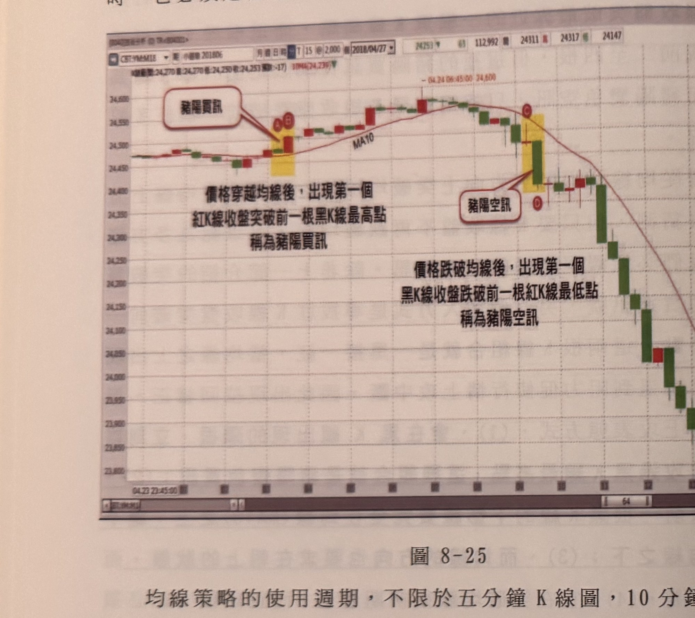
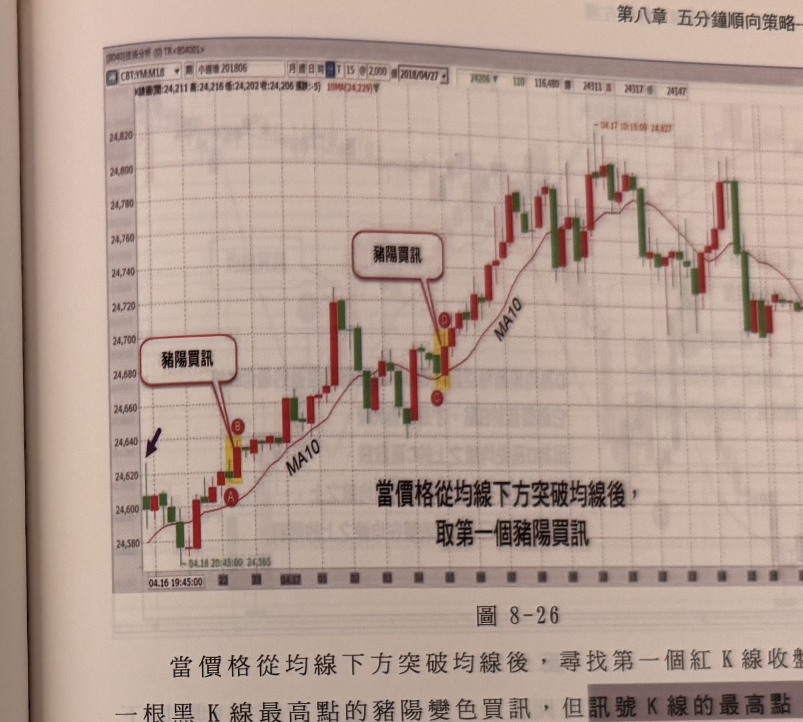

## p.178

產生這種豬陽空訊時，均線必須朝下行情中，當價格處在橫向整理時，均線會逐漸走平，代表跌勢受到抵抗，此時豬陽空訊不見得代表空方的強硬表態，因此均線朝下是必要的，(4)、當出現豬陽空訊時，它必須是行情跌破均線後最低K線。

**圖 8-25**

> 圖說（figure notes）: 小道瓊期貨（CBT:YM:M18，小道瓊201806）15分鐘K線走勢圖，頁首資訊列顯示「K線圖(開:24,270 高:24,270 低:24,250 收:24,253 漲跌:-17) 10MA(24,239)」，日期「2018/04/27」，右側數值「24253 跌63 112,992 量 24311 高 24317 低 24147」，圖中另繪有紅色MA10均線。走勢左側先小幅震盪，黃底標示區出現K線組合（標記圓圈「A」「B」），紅框標註「豬陽買訊」以線條指向此區，其下方文字說明「價格穿越均線後，出現第一個紅K線收盤突破前一根黑K線最高點稱為豬陽買訊」；隨後行情持續上攻至價位「24,600」附近（標示「04.24 06:45:00 24,600」），經過中段整理後於另一黃底標示區出現K線組合（標記圓圈「C」「D」），紅框標註「豬陽空訊」以線條指向此區，其下方文字說明「價格跌破均線後，出現第一個黑K線收盤跌破前一根紅K線最低點稱為豬陽空訊」；隨後行情持續下殺至圖右側低檔區間。此圖對應本文說明：均線策略的使用週期，不限於五分鐘K線圖，10分鐘、15分鐘或30分鐘K線圖均可，交易時間愈長的商品，都可以採用比五分鐘更大的K線圖；本圖是小道瓊期指採用15分鐘K線圖，均線都是以MA10為主，行情先在均線下方超過3根K線收盤以上，隨著價格突破均線，均線也呈現走平向上，在A出現回跌的黑K線（綠線），它的下影線維持在均線之上，隔根B即以紅K線收盤突破A的高點，形成豬陽買訊。

均線策略的使用週期，不限於五分鐘K線圖，10分鐘、15分鐘或30分鐘K線圖均可，交易時間愈長的商品，都可以採用比五分鐘更大的K線圖，在圖8-25是小道瓊期指採用15分鐘K線圖，均線都是以MA10為主，行情先在均線下方超過3根K線收盤以上，隨著價格突破均線，均線也呈現走平向上，在A出現回跌的黑K線（綠線），它的下影線維持在均線之上，隔根B即以紅K線收盤突破A的高點，形成豬陽買訊。

## p.179

# 第八章 五分鐘順向策略

**圖 8-26**

> 圖說（figure notes）: 小道瓊期貨（CBT:YM:M18，小道瓊201806）15分鐘K線走勢圖，頁首資訊列顯示「K線圖(開:24,211 高:24,216 低:24,202 收:24,206 漲跌:-5) 10MA(24,229)」，日期「2018/04/27」，右側數值「24206 跌110 116,480 量 24311 高 24317 低 24147」，圖中另繪有紅色MA10均線。走勢左側標示黑色箭頭指向起點K線（時間「04.16 20:45:00 24,565」），紅框標註「豬陽買訊」以線條指向黃底標示區（標記圓圈「A」「B」）；隨後行情持續上攻，於另一黃底標示區出現K線組合（標記圓圈「C」「D」），紅框標註「豬陽買訊」以線條指向此區；下方文字說明「當價格從均線下方突破均線後，取第一個豬陽買訊」；隨後行情持續上攻至最高點「24,827」附近（標示「04.17 10:15:00 24,827」），經過中段震盪整理後於圖右側緩步走低。此圖對應本文說明：當價格從均線下方突破均線後，尋找第一個紅K線收盤突破前一根黑K線最高點的豬陽變色買訊，但**訊號K線的最高點，必須為突破均線後最高K線，這是重要的限制，而突破均線之前，宜至少有三根K線位在均線下方，如果K線數小於三根，則訊號K線為最高K線必須比對更早具有三根K線在均線下方的波段高點。**例如在圖8-26的小道瓊五分鐘K線圖裡，AB形成了均線豬陽買訊，但要認定是否為突破均線後的最高K線，比較的對應點要以圖上左邊第一根黑K線高點，而非A的高點，因為在均線下方的K線收盤只有二根，應該要三根才符合條件，既然沒有三根以上K線在均線下方，那應要對對更早的最高K線，而CD所形成的均線豬陽買訊，因為在均線下方有連續三根K線收盤，因為比對的高點，在它的前4根K線高點，非以更早前的最高K線。

當價格從均線下方突破均線後，尋找第一個紅K線收盤突破前一根黑K線最高點的豬陽變色買訊，但訊號K線的最高點，必須為突破均線後最高K線，這是重要的限制，而突破均線之前，宜至少有三根K線位在均線下方，如果K線數小於三根，則訊號K線為最高K線必須比對更早具有三根K線在均線下方的波段高點。例如在圖8-26的小道瓊五分鐘K線圖裡，AB形成了均線豬陽買訊，但要認定是否為突破均線後的最高K線，比較的對應點要以圖上左邊第一根黑K線高點，而非A的高點，因為在均線下方的K線收盤只有二根，應該要三根才符合條件，既然沒有三根以上K線在均線下方，那應要對對更早的最高K線，而CD所形成的均線豬陽買訊，因為在均線下方有連續三根K線收盤，因為比對的高點，在它的前4根K線高點，非以更早前的最高K線。
