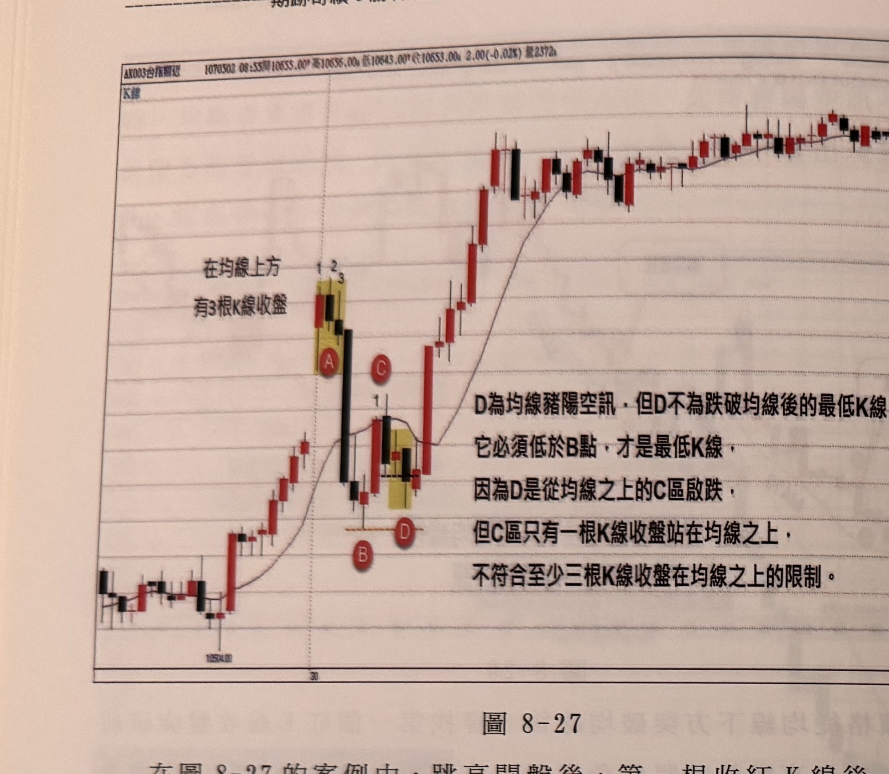
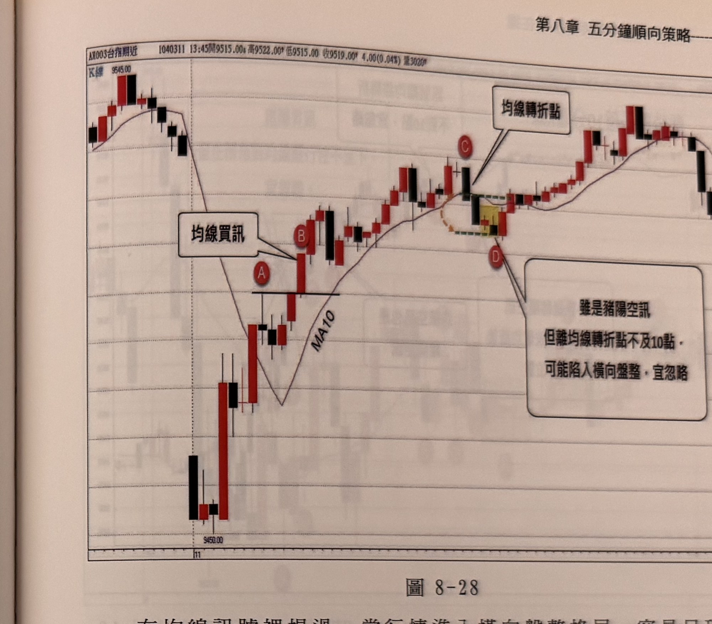

## p.180

**圖 8-27**

> 圖說（figure notes）: 台指期分時K線走勢圖，頁首標示「AX003台指期近 1070502 08:55開10655.00 高10656.00 低10643.00 收10653.00 2.00(-0.02%) 量2372」，左上角標示「K線」。走勢左側先小幅上攻，於黃底標示區出現K線組合（標記數字「1」「2」「3」，標記圓圈「A」），文字說明「在均線上方有3根K線收盤」；隨後行情下探至標記圓圈「B」，反彈至標記圓圈「C」（標記數字「1」），另一黃底標示區出現K線（標記圓圈「D」），旁註文字說明「D為均線豬陽空訊，但D不為跌破均線後的最低K線，它必須低於B點，才是最低K線，因為D是從均線之上的C區啟跌，但C區只有一根K線收盤站在均線之上，不符合至少三根K線收盤在均線之上的限制。」；隨後行情持續上攻，經過中段震盪，最終於圖右側高檔區間震盪，價位最高達「10680.00」附近。此圖對應本文說明：跳高開盤後，第一根收紅K線後，隨即下殺4根黑K線，直抵均線下方的B低點，反彈到C收盤突穿均線，但隔根即再度壓回均線下方，在均線彎頭之初，即形成D的黑K線收盤跌破前一根紅K線低點，但D並不能當作均線豬陽空訊，因為在均線上方只有一根K線收盤，因此D必須比前波跌破均線後的最低點B更低，才能成為跌破均線後最低K線，最低K線包含二項意思，它必須是跌破均線後最低收盤價，同時也是跌破均線後最低點。如果從B點反彈走勢突破均線，且超過3根線站上均線，而不是只有C一根K線，那麼D的豬陽空訊，就能視為訊號，而不用採取忽略動作。

在圖8-27的案例中，跳高開盤後，第一根收紅K線後，隨即下殺4根黑K線，直抵均線下方的B低點，反彈到C收盤突穿均線，但隔根即再度壓回均線下方，在均線彎頭之初，即形成D的黑K線收盤跌破前一根紅K線低點，但D並不能當作均線豬陽空訊，因為在均線上方只有一根K線收盤，因此D必須比前波跌破均線後的最低點B更低，才能成為跌破均線後最低K線，最低K線包含二項意思，它必須是跌破均線後最低收盤價，同時也是跌破均線後最低點。如果從B點反彈走勢突破均線，且超過3根線站上均線，而不是只有C一根K線，那麼D的豬陽空訊，就能視為訊號，而不用採取忽略動作。

## p.181

# 第八章 五分鐘順向策略

01 在均線訊號裡提過，當行情進入橫向盤整格局，容易呈現價格在均線非常窄的區間內上下穿梭，造成多空單進場都會被黏著，因此當訊號位置離均線轉折點（彎曲中點）不及10點，應該選擇忽略訊號，避免進場後，發現忽多忽空，不知所措，如圖8-28的行情中，標示C開始跌破MA10，並在D出現黑K線跌破前一根紅K線最低點，形成均線豬陽空訊，但訊號D的收盤離均線轉折點小於10點，暗示行情有可以進入盤整格局，應該避免陷入泥沼行情，進退兩難，因此只要透過均線產生訊號的位置，宜距離均線轉折點超過10點以上，比較不會誤踩地雷區。

**圖 8-28**

> 圖說（figure notes）: 台指期分時K線走勢圖，頁首標示「AX003台指期近 1040311 13:45開9515.00 高9522.00 低9515.00 收9519.00 4.00(0.04%) 量3020」，左上角標示「K線」，圖中另繪有均線MA10。走勢左側先高檔震盪下探至最低點「9450.00」附近，隨後止穩反彈，紅框標註「均線買訊」以線條指向標記圓圈「A」附近；隨後行情持續上攻至標記圓圈「B」，經過中段整理後於標記圓圈「C」達到高點，紅框標註「均線轉折點」以線條指向C右側的橘色虛線弧形轉折處；隨後行情下探至黃底標示區（標記圓圈「D」），紅框標註「雖是豬陽空訊，但離均線轉折點不及10點，可能陷入橫向盤整，宜忽略」以線條指向D；隨後行情持續反彈上攻，經過中段震盪，最終於圖右側高檔區間震盪後小幅回落。此圖對應本文說明：在均線訊號裡，當行情進入橫向盤整格局，容易呈現價格在均線非常窄的區間內上下穿梭，造成多空單進場都會被黏著，因此當訊號位置離均線轉折點（彎曲中點）不及10點，應該選擇忽略訊號；本例中，標示C開始跌破MA10，並在D出現黑K線跌破前一根紅K線最低點，形成均線豬陽空訊，但訊號D的收盤離均線轉折點小於10點，暗示行情有可以進入盤整格局，應該避免陷入泥沼行情，進退兩難。
