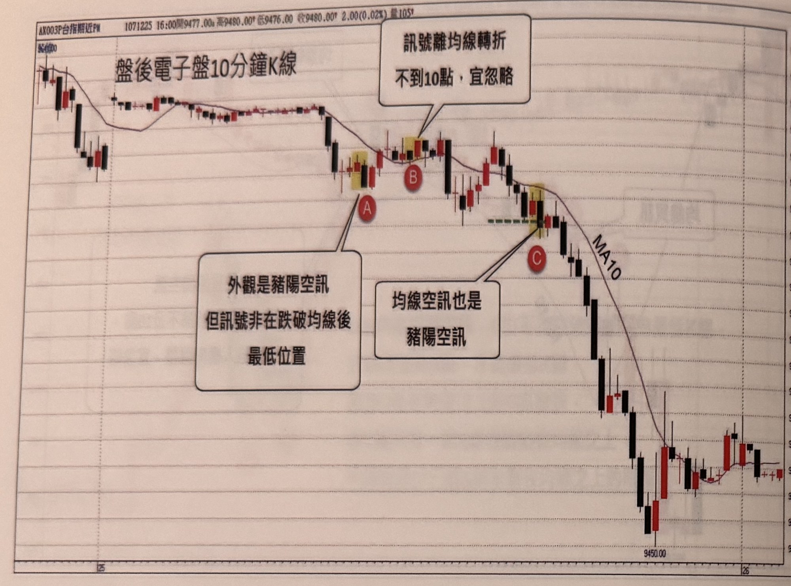
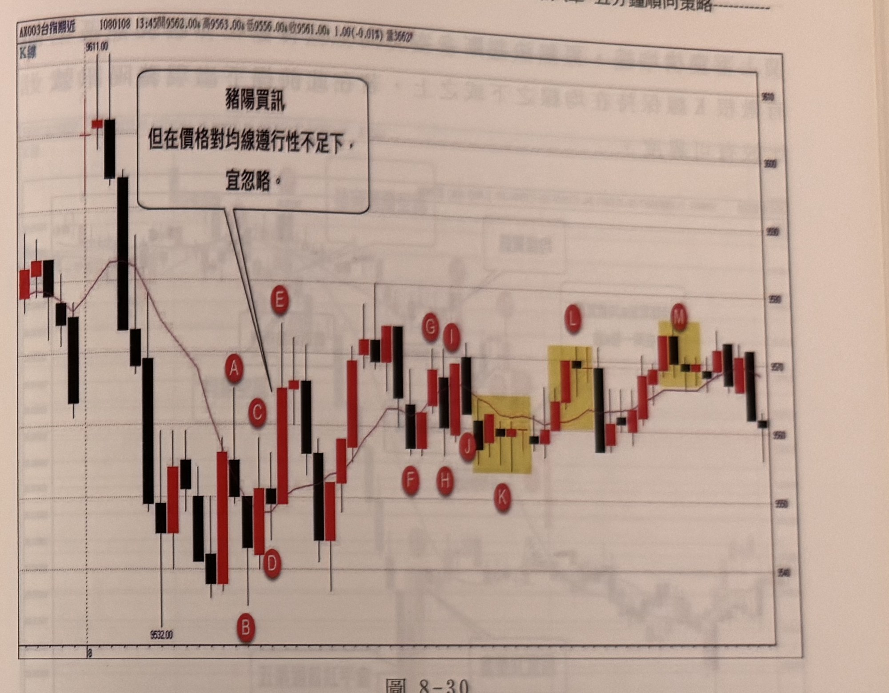

## p.182

**圖 8-29**

> 圖說（figure notes）: 台指期近月盤後電子盤 10 分鐘 K 線走勢圖搭配 MA10 均線，標題列「AX003P台指期近PW 1071225 16:00開9477.00漲 高9480.00漲 低9476.00 收9480.00漲 2.00(0.02%) 量105張」，左上角「K線」字樣及圖內標題「盤後電子盤10分鐘K線」。走勢左側先於高點下跌整理，中段止跌回穩後小幅反彈，於被黃色網底標示的K棒處標紅圈「A」，並以對話框「外觀是豬陽空訊但訊號非在跌破均線後最低位置」指向此處，說明此處雖外觀像豬陽空訊但不符合條件應忽略；隨後價格再反彈，於另一段被黃色網底標示的K棒處標紅圈「B」，並以對話框「訊號離均線轉折不到10點，宜忽略」指向此處；此後價格重挫下跌，於第三段被黃色網底標示的K棒處（伴隨一小段綠色虛線水平標記）標紅圈「C」，並以對話框「均線空訊也是豬陽空訊」指向此處，說明此為真正符合條件的放空訊號；隨後價格沿 MA10 均線持續重挫下跌，一路跌至標示「9450.00」的低點，尾段小幅反彈收在約 9480～9490 附近。

只要操作的商品交易時間長達 10 個小時以上，不僅可以用 10 分鐘或 15 分鐘 K 線來判斷行情，也可以用豬陽訊號來發現多空訊號，均線的參數不變，例如在圖 8-29 為台指盤後電子盤 10 分鐘 K 線圖，在下午盤通常行情呈現窄幅游走，不適合進場，通常在 8 點甚至美股開盤後，行情才會活潑交投，圖 8-29 是 107 年聖誕夜迎來川普在推特上亂放話抨擊國會及 FED 升息預期，造成行情大跌，在 A 位置出現的豬陽空訊，但它不是跌破均線後的最低 K 線，不符合條件，必須忽略，接著行情反彈回均線之上，並在 B 位置再發生豬陽買訊，但訊號 K 線收盤離均線轉折點不到 10 點，而且它也非突破均線後的最高 K 線，還是要忽略訊號，等到行情再跌破均線後，在 C 產生的豬陽空訊，才是真正符合條件的放空訊號。

## p.183

**圖 8-30**

> 圖說（figure notes）: 台指期近月 5 分鐘 K 線走勢圖搭配均線，標題列「AX003台指期近 1080108 13:45開9562.00漲 高9563.00漲 低9556.00漲 收9561.00漲 1.00(-0.01%) 量3662張」，左上角「K線」字樣。走勢左側於高點「9611.00」附近出現一根長黑K重挫下跌，並以對話框「豬陽買訊 但在價格對均線遵行性不足下，宜忽略。」指向下跌途中的紅圈「A」「C」「E」附近的反彈K棒；價格續跌至低點「9532.00」（紅圈「B」），止跌後於紅圈「D」附近小幅反彈又拉回，再度上攻至紅圈「E」附近；此後價格在紅圈「F」「G」「H」「I」「J」「K」一帶反覆震盪整理，其中「J」「K」附近一段K棒被黃色網底標示；隨後價格緩步走高，於紅圈「L」及「M」處各出現一段被黃色網底標示的K棒；最終價格在右側小幅拉回收尾。

當行情準備走入盤整格局，MA10 將失去參考性，不具支撐也不具壓力，造成價格自由穿梭，均線走平或緩慢上下移動，此時若發生的訊號容易出現失敗；因此，當價格突破均線後，K 線的下影線應該要有數根不再觸碰均線，來表達均線對價格的支撐效果；反之，價格跌破均線後，K 線的上影線也必須有數根不觸碰均線，才能讓均線具有壓力效果。像在圖 8-30 的例子，跳平高盤後，行情逐根下殺破平盤，當空壓稍輕時，行情橫走，企圖反攻，當 A 影線過均線，收盤未過；從 B 低點再攻一次，C 收盤過均線後，D 的下影線又觸碰均線之下，這個現象顯示均線並沒有對行情產生支撐，正常 C 突破均線後，後續的 K 線影線應保持在均線之上，因此當 E 出現豬陽買訊，就要小心盤局未變，也導致稍後被停損；再如 F 到 J 之間，行
