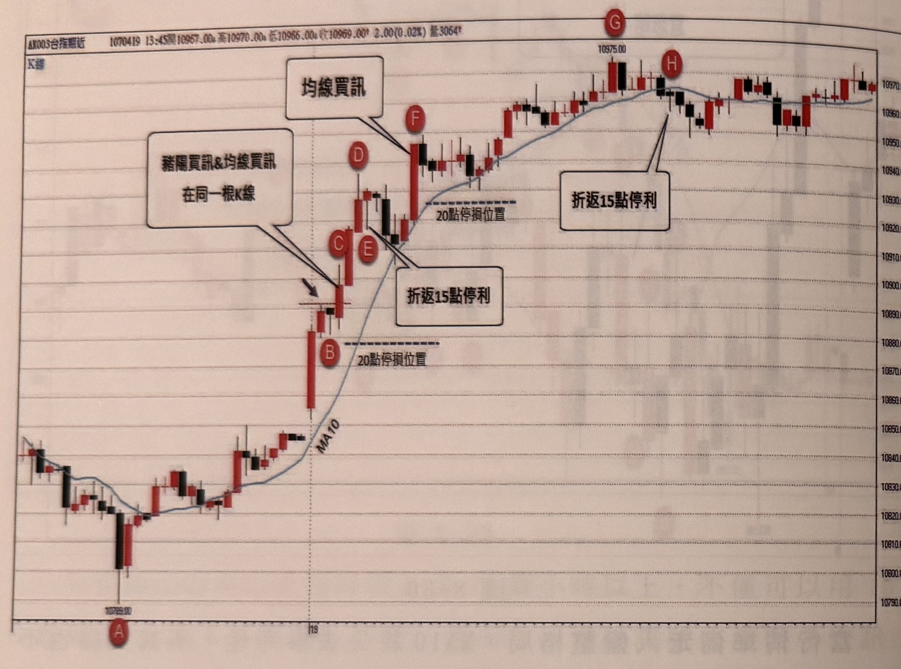
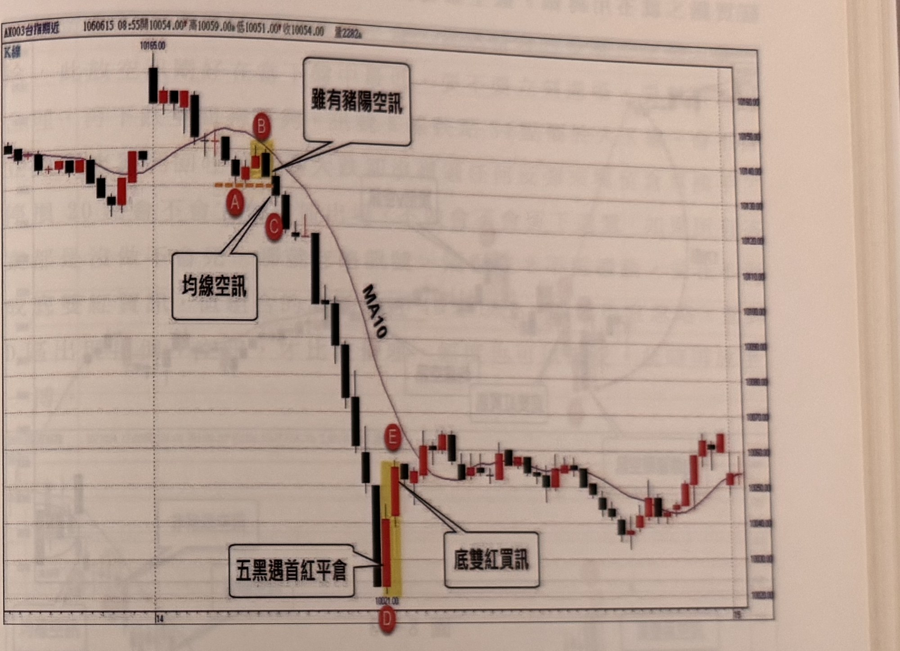

## p.184

情上下穿梭均線，更無法判斷多空方向，只有像在 K 區或 L 區，都有數根 K 線保持在均線之下或之上，若在此前提下出現豬陽訊號，比較有可靠度。

**圖 8-31**

> 圖說（figure notes）: 台指期近月 5 分鐘 K 線走勢圖搭配均線，標題列「AX003台指期近 1070419 13:45開10957.00漲 高10970.00漲 低10965.00漲 收10969.00漲 2.00(0.02%) 量3064張」，左上角「K線」字樣。走勢左側於低點「10789.00」（紅圈「A」）止跌回升，沿 MA10 均線緩步上揚；於紅圈「B」附近出現一根長紅K重挫拉回（標示「20點停損位置」水平虛線），隨後於紅圈「C」「E」處以對話框「豬陽買訊&均線買訊在同一根K線」標示（箭頭指向 C/E 一帶的K棒）；於紅圈「D」附近另有一段標示；價格突破均線後於紅圈「F」處以對話框「均線買訊」指向一根長紅K（該處亦標「20點停損位置」虛線）；此後價格持續走高，於紅圈「G」（標「10975.00」高點）及紅圈「H」處各以對話框「折返15點停利」標示；最終價格在右側於約 10960～10970 區間小幅震盪收尾。

開盤前均線已經在昨天朝上發展，本日再跳高開盤，任何點都將是突破均線後的最高 K 線，這種狀況不必考慮前波高點來確認訊號，但若訊號 K 線離開盤後最低點，超過 60 點以上，宜忽略訊號，如圖 8-31 的行情，跳平高盤開出，行情便向上快攻，並在 B 出現拉回帶下影黑 K 線，隔根 C 向上攻過黑 K 高點，形成豬陽買訊（亦是均線買訊），此時 C 的收盤距離開盤最低點約 46 點，未超過 60 點，仍屬有效訊號，不會造成上檔無利可圖，當行情到達 D 的盤中最高點時，拉回 15 點停利會在 E 點平倉，並在 F 出現另一種均線買訊，再重新進多單，之後，到達 G 盤中最高點，依然設 15 點折返停利，像

## p.185

這樣上漲的行情，被切割成二次交易，雖然無奈，但停利機制一旦設定好，就得遵守規則進行。

**圖 8-32**

> 圖說（figure notes）: 台指期近月 5 分鐘 K 線走勢圖搭配均線，標題列「AX003台指期近 1060615 08:55開10054.00漲 高10059.00漲 低10051.00漲 收10054.00 量2282張」，左上角「K線」字樣。走勢左側於高點「10165.00」附近高檔震盪，於紅圈「A」附近（伴隨一小段橘色虛線水平標記）出現被黃色網底標示的K棒，紅圈「B」標於其上，並以對話框「雖有豬陽空訊」指向此處，說明外觀雖像豬陽空訊；隨後於紅圈「C」處出現「均線空訊」對話框指向的黑K，此後價格重挫直落，沿 MA10 均線一路下殺；於低點「10021.00」附近（紅圈「D」）出現被黃色網底標示的長黑K與紅K，紅圈「E」標於其上，並以對話框「五黑遇首紅平倉」及「底雙紅買訊」分別指向此處；此後價格止跌回升，在約 10030～10060 區間反覆震盪，尾段小幅走高收尾。

每個當沖交易，最喜歡的狀況莫過於進多單，行情就直上青天，中間沒有任何讓人覺得不妥而想提前離場的黑 K 線，一路長紅，而放空單，一下單後，行情突然根根收黑，愈跌愈快，黑 K 線愈來愈大根，就像圖 8-32 的案例，跳高開盤即收黑，但跳得不夠高，否則就是開盤戰法中的跳高收黑空訊，當價格跌破均線後，在 A 出現兩根紅 K 反彈到 B 點，反攻均線無望，隔根收黑 K 線，雖像豬陽空訊，但非跌破均線後最低 K 線，因此忽略，再隔根的 C 進一步跌破 A 的低點，形成均線空訊，彌補帶瑕疵的豬陽空訊，隨後行情宛如被詛咒般，踢落斷崖，根根黑 K 線，跌到最一根黑 K 線反而跌點最大，
