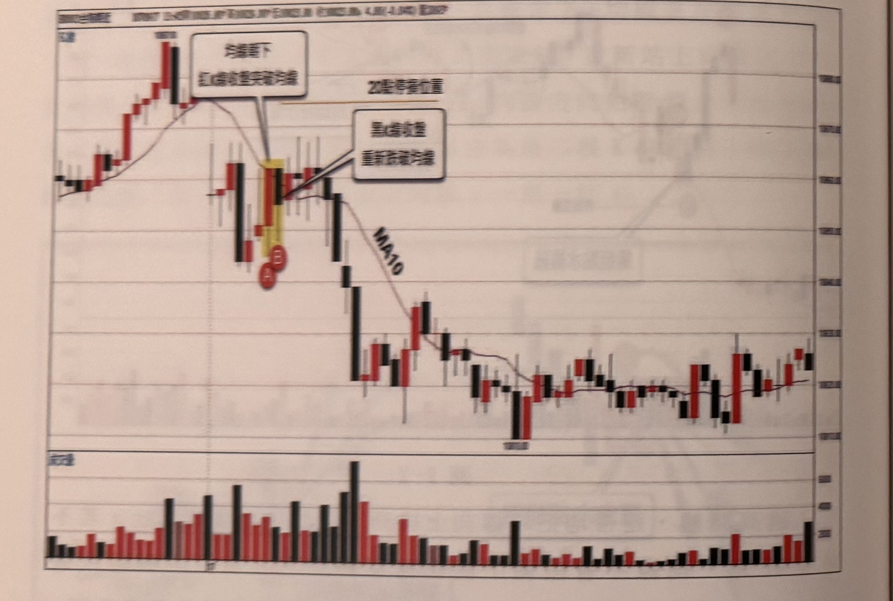
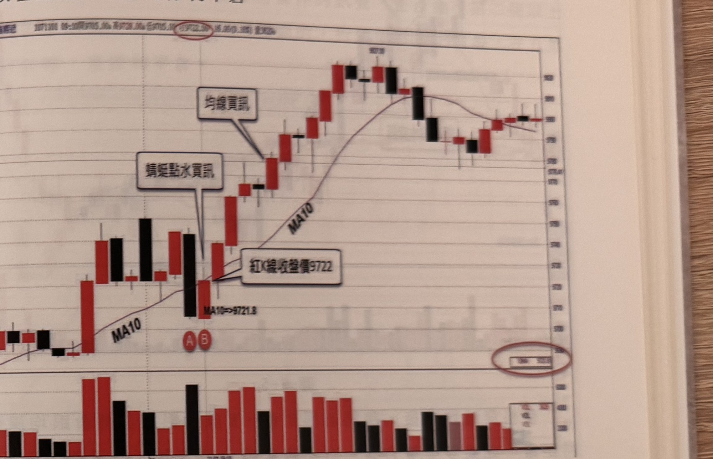

## p.192

時也是五黑遇首紅買訊，跳高開盤常有此種狀況，宜多注意，到了中盤階段，出現行情由均線下方向上方攻擊，在 D 點形成峰點，開始拉回，此時要**觀察峰點距離均線的轉折點（均線谷點或上彎中點）是否超過 20 點**，如果小於 20 點，代表均線並沒有明顯朝上運行，行情並沒有與均線拉開距離，在本例中是符合 20 點的要求，拉回到 E 點時，K 線收盤跌破均線，但均線仍然繼續上揚，因此當 F 收紅重新站上均線，形成另一個蜻蜓點水買訊。

**圖 9-3**

> 圖說（figure notes）: 台指期近月 5 分鐘 K 線走勢圖搭配均線及成交量（下方副圖），標題列數值約「開9825.00 高9828.00 低9823.00 收9823.0 4.00(-0.04%) 量2007」。走勢左側於高點附近以對話框「均線朝下 紅K線收盤突破均線」指向轉折高點（黑K收盤跌破均線處），並以水平橙色虛線標示「20點停損位置」；隨後於被黃色網底標示的一段K棒（紅圈「A」「B」）處以對話框「黑K線收盤重新跌破均線」指向；此後價格沿 MA10 均線一路重挫下跌，中途在低點（標示「10810.00」附近）止跌小幅反彈，再度下探至更低點，隨後緩步走低並在右側區間內多次上下震盪，尾段小幅回升收尾。下方為成交量長條圖，紅黑相間，左半段量能較大，右半段逐漸縮小。

當行情換成跳低開盤，也會將均線扯下來，均線朝下運行時，若價格出現層級 1 的谷點，請測量當下盤中最低點距離均線峰點（下彎中點）是否超過 20 點以上，符合這個條件後，若在均線出現紅 K 穿過，接著黑 K 線跌回，則可以進行放空。例如在圖 9-3 的案例中，跳低開盤，均線隨之下彎走跌，當出現層級 1 谷點時，低點至均線下彎峰

## p.193

點超過 20 點，並在 A 點收盤穿破均線，隨即 B 重新跌回均線之下，形成蜻蜓點水空訊，並設好 20 點停損位置，當行情果然向下發展，可以在五黑遇首紅時停利平倉。

**圖 9-4**

> 圖說（figure notes）: 台指期近月 5 分鐘 K 線走勢圖搭配均線及成交量（下方副圖），標題列「1071208 09:10開9705.00漲 高9728.00漲 低9705.00漲 收9722.5?漲 4.0(0.1?%) 量?52?」，右上角圈註開盤數值。走勢左側於低檔盤整後出現一段長黑K與紅K，紅圈「A」「B」標於此，並以對話框「蜻蜓點水買訊」指向此二棒，另以對話框「紅K線收盤價9722」及文字「MA10=>9721.8」標示 B 棒收盤價與當下均線數值；隨後價格強勢上漲，沿 MA10 均線一路走高，中途以對話框「均線買訊」指向一根突破均線起漲的紅K；價格持續上揚至最高點（標示「9873.00」附近），此後於高檔區間（980一線）反覆震盪盤整數根，尾段小幅拉回，於右側以紅色橢圓圈註一個數值方框（顯示「39x 30x」樣式的報價/量值），收在約 980 附近。下方為成交量長條圖，紅黑相間，左半段量能較大且不規則，右半段相對平緩。

盤前的均線若已經朝上運動，開盤第一根 K 線最低點與昨天最後收盤 K 線重疊，可以沿用昨天尾盤行情，假如昨天最後一根 K 線為黑 K 線，且收盤跌破 MA10，而本日開盤開低在 MA10 之下，但收盤站上均線之上，均線沒有任何下彎移動，形成蜻蜓點水買訊；而均線朝下跌的狀況，則反過來推想。在圖 9-4 的例子中，開盤首根 K 線跳高收黑，剛好與昨天收盤 K 線重疊（即最低點侵入昨收盤 K 線最高點之下），外觀好像是連續盤，均線也沒有因跳空所出現的貶升，當在 A 的收盤跌破 MA10，隔根 B 的收盤隨即重回均線之上，本例中收盤剛好頂住 MA10，大於 MA10，視為蜻蜓點水買訊。
