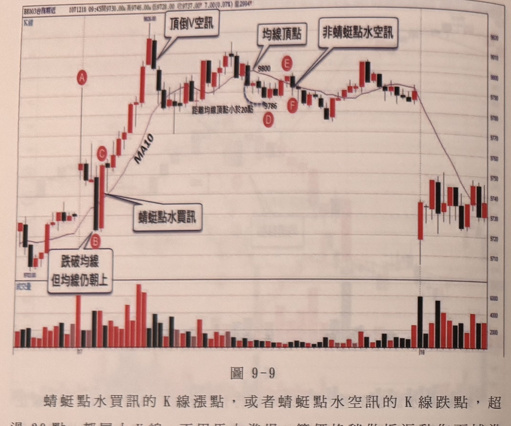
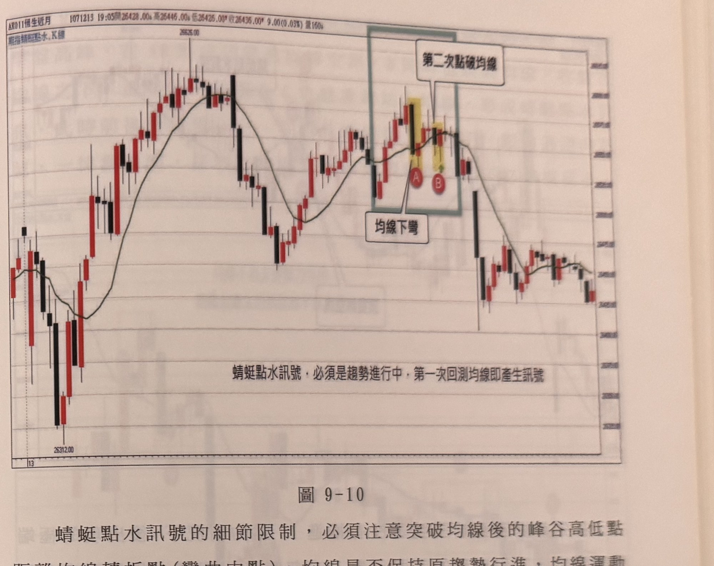

## p.198

**圖 9-9**

> 圖說：台指期近月（BX003台指期近）5 分鐘 K 線圖，報價列顯示「1071218 09:45開9730.00 高9746.00 低9728.00 收9737.00 7.00(0.07%) 量2994」。K 線走勢：左側低點 9702.00 附近起漲，標記紅底白字圓標 **A**（跳高開盤處），隨即出現一根長黑 K 急殺，跌破均線，標記圓標 **B**，文字框「跌破均線／但均線仍朝上」指向此處；隔一根 K 線逆漲重新站上均線，標記圓標 **C**，文字框「蜻蜓點水買訊」以指線指向 C 附近。其後價格持續急漲至高點 9826.00，文字框「頂倒V空訊」指向此高點的頂點；隨後拉回整理，MA10 均線走平於高檔，文字框「均線頂點」與數值「9800」標示於一個局部高點，另一處低點標示「9786」與圓標 **D**；價格再度小幅反彈至一點，標記圓標 **E**，文字框「非蜻蜓點水空訊」指向此處；隨後出現圓標 **F** 於鄰近低點；文字框「距離均線頂點小於20點」標示於 D、F 附近區間。其後價格於 9750～9810 區間橫盤震盪多根 K 線，尾段出現一根長黑 K 大幅下跌，跳空缺口後價格落在 9720～9750 區間持續盤整收在 9737.00 附近。下方副圖為成交量柱狀圖（紅漲黑跌），量能在 B 點附近及尾段長黑 K 下跌時明顯放大（達 6000），其餘時段量能多在 2000～4000 之間。

蜻蜓點水買訊的 K 線漲點，或者蜻蜓點水空訊的 K 線跌點，超過 30 點，都屬大 K 線，不用馬上進場，等價格稍做折返動作再補進場，停損儘量控制在買訊 K 線的最低點，或空訊 K 線的最高點，若採取立刻在大 K 線收盤進場，則設在大 K 線實體中點或直接設 20 點停損。例如在圖 9-9 的行情，A 點跳高開盤，使得原本均線前一天尾盤揚升的角度加大，但 A 之前立刻帶來殺盤，直接殺到跌破均線，直達 B，但均線仍朝上不變，多頭在隔根 C 位置，逆漲 30 點重新站上均線，形成蜻蜓點水買訊，因為 C 屬於大 K 線，可以稍讓行情拉回再進場，或直接進場，停損設在 C 的實體中點，但最大虧損仍控制在 20 點。

## p.199

**圖 9-10**

> 圖說：恆指近月（AX011恆生近月）K 線圖，報價列顯示「1071213 19:05開26428.00 高26446.00 低26425.00 收26436.00 9.00(0.03%) 量160」，左上文字「期指蜻蜓點水.K線」。K 線走勢：左側先急跌至低點 26312.00，隨後反彈走高，MA10 均線同步上揚，價格續漲至波段高點 26625.00 附近後拉回，於中段回檔至一個低點再度反彈；在圖右側以灰藍色方框標示一個區域，框內先出現一根長黑 K（以黃底標示），其下方標記紅底白字圓標 **A**，文字框「均線下彎」指向此區域下方的均線彎折處；框內右側緊接另一根 K 線（亦以黃底標示），下方標記圓標 **B**，文字框「第二次點破均線」指向 B 上方。其後價格轉為下跌，出現一根長黑 K 大幅下探，其後於低檔區窄幅盤整收在 26436.00 附近。圖下方另有文字框（非副圖，位於價格圖內部下方空白處）：「蜻蜓點水訊號，必須是趨勢進行中，第一次回測均線即產生訊號」。

蜻蜓點水訊號的細節限制，必須注意突破均線後的峰谷高低點距離均線轉折點（彎曲中點），均線是否保持原趨勢行進，均線運動持續根數不宜只有三根以內，另外蜻蜓點水出現也須具有區間單一性，即突破均線或跌破均線後，宜在第一次折返突破或跌破均線，即產生訊號，即使要發生第二次訊號，若間隔小於 10 根 K 線，則屬無效訊號，因此蜻蜓點水發生前，不宜在 10 根 K 線內也出現 K 線收盤突破或跌破均線二根或不符條件的蜻蜓點水。例如在圖 9-10 的案例中，錄色框線區域中，標示 A 的蜻蜓點水，因為均線走平下移而不符條件，間隔 3 根 K 線後，又在標示 B 再發生一次蜻蜓點水買訊，它均線仍在上行，但它是整段突破均線後的上漲行情第二次點破均線，不符合區間單一的條件，屬無效訊號，不宜操作。
