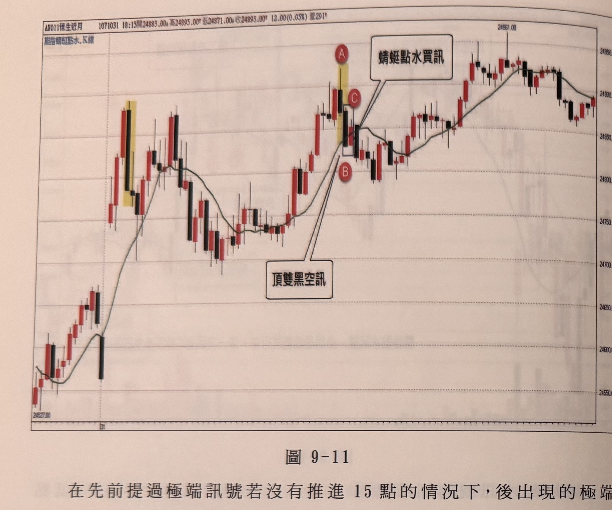
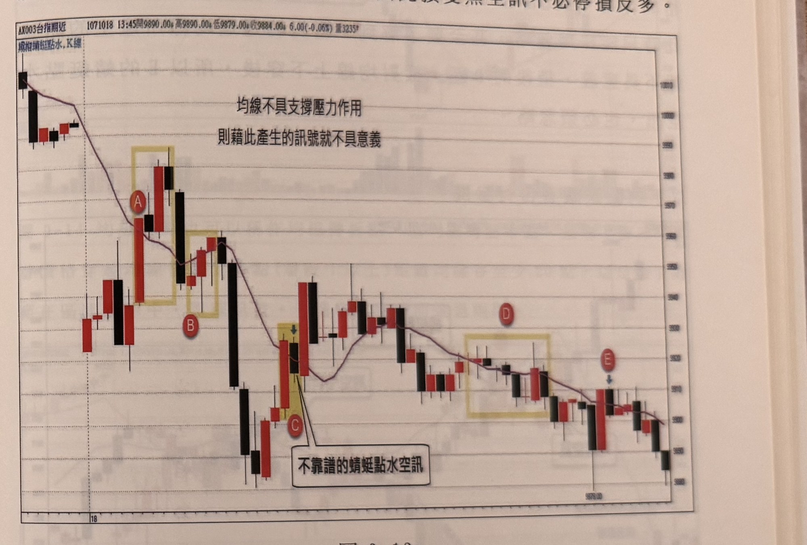

## p.200

**圖 9-11**

> 圖說：恆指近月（AX011恆生近月）K 線圖，報價列顯示「1071031 18:15開24883.00 高24895.00 低24871.00 收24893.00 13.00(0.05%) 量291」，左上文字「期指蜻蜓點水.K線」。K 線走勢：左側低點 24527.00 附近起漲，一路上揚（以黃底標示一段紅黑 K 線）後拉回整理，於低檔區來回震盪數根 K 線，MA10 均線走平後再度上揚；價格續漲至一根長紅 K（以黃底標示）後標記紅底白字圓標 **A**，文字框「頂雙黑空訊」以指線指向 A 下方鄰近的黑 K；其後緊鄰一根 K 線標記圓標 **C**，文字框「蜻蜓點水買訊」指向 C；另一根 K 線下方標記圓標 **B**，B 亦與「頂雙黑空訊」指線相連。其後行情持續走高，MA10 均線同步上揚，價格一路攀升至高點 24961.00 附近，其後於高檔區橫盤震盪（K 線紅黑交錯）收在 24893.00 附近。

在先前提過極端訊號若沒有推進 15 點的情況下，後出現的極端訊號收盤侵入先出現的訊號收盤，宜忽略後出現者；如果兩者分屬順逆向訊號若出現衝突時，要如何操作呢？首先要了解順向訊號只要均線不斷向上或向下，條件符合下，它可以產生均線策略訊號或均線豬陽訊號，也可以產生蜻蜓點水訊號，但這些順向訊號無法確認它是否處在盤中的高低點，換言之，順向的買訊可能買在盤中最高點，空訊有可能空在盤中的最低點，而極端逆向訊號通常產生在盤中的極高或極低位置，因此順向訊號進場後，若隔根或還沒推進 15 點即遇到逆向訊號（如頂底雙紅黑、V 字訊號等），暗示行情可能到達極端點，必須隨之停損並反手加入逆向訊號；但逆向訊號發動都在極高極低，在沒推進 15 點或隔根即遇到順向訊號，可以忽略順向訊號，總之，當順逆向訊號發生衝突，一律以逆向訊號為優先。

## p.201

如圖 9-11 的案例中，當日行情跳高開盤，中盤拉回後再沖高，突破早盤高峰，在 AB 形成頂雙黑反轉空訊，B 同時也跌破均線，收盤在均線之下，進場後，隔根在 C 收盤重新站上均線，形成蜻蜓點水買訊，此時前後根出現一空一多，此時遵循上述說明，順向遇逆向訊號，一律靠邊閃，採取忽略動作，因此頂雙黑空訊不必停損反多。

**圖 9-12**

> 圖說：台指期近月（BX003台指期近）K 線圖，報價列顯示「1071018 13:45開9890.00 高9890.00 低9879.00 收9884.00 6.00(-0.06%) 量3235」，左上文字「或稱蜻蜓點水.K線」。圖中上方以文字標示「均線不具支撐壓力作用／則藉此產生的訊號就不具意義」。K 線走勢：左側先出現一根長黑 K 起跌，隨後連續下跌數根 K 線；以黃色方框標示一區域，內含紅黑 K 線各一根，下方標記紅底白字圓標 **A**；緊鄰右側另一黃色方框，內含紅黑 K 各一根，下方標記圓標 **B**；MA10 均線在此區間走平後轉為下彎。其後出現一根長黑 K 大幅下探，隨後以黃色方框標示一根紅 K 與一根黑 K，下方標記圓標 **C**，文字框「不靠譜的蜻蜓點水空訊」指向此區；緊接一根長紅 K 與長黑 K，其後價格於中段區間橫盤震盪數根 K 線。其後價格續跌，MA10 均線同步下彎；以另一黃色方框標示一段橫盤震盪的紅黑 K 線區域，標記圓標 **D**。其後價格再度下跌至低點 9878.00 附近，標記圓標 **E**（以藍色箭頭指示緊鄰的長紅 K），其後價格續跌收在圖右下角。

可以透過均線來產生交易訊號的前提，必須均線對價格具有屏障的效果，即均線朝上時，價格靠近均線就會被牽引向上，得到支撐效果，而均線朝下時，價格靠近均線就扛不住壓力而走跌，像蜻蜓點水，就是建立在均線支撐壓力效果，任何短暫刺穿均線，折回均線時，將順著均線方向運動，形成跟隨趨勢的切入訊號，反之，若價格隨意穿梭，均線沒被尊重，就失去支撐壓力效果，則訊號就不具參考價值。如圖 9-12 的行情，跳低開盤後，開始企圖反彈，在[cut off]
