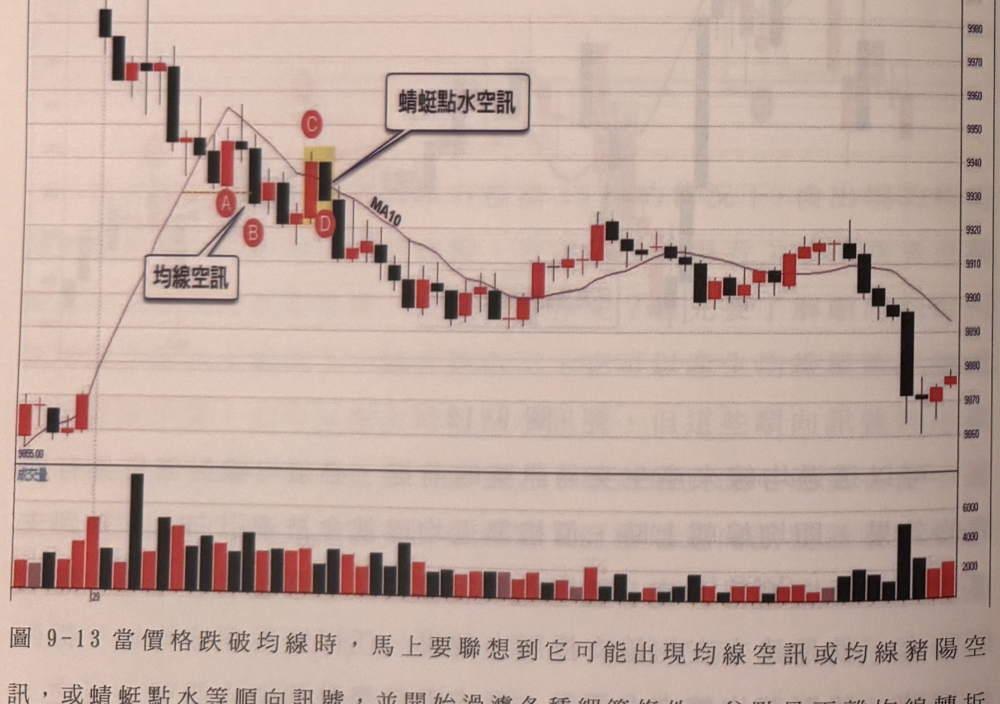
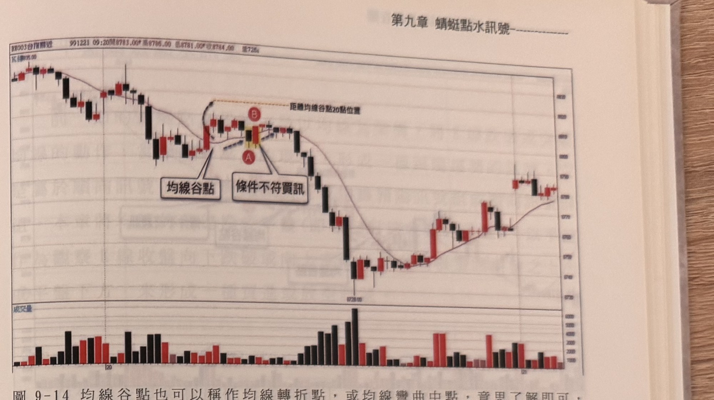
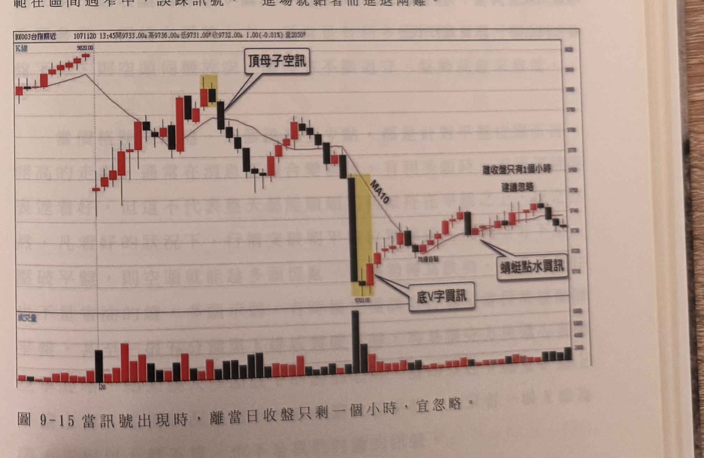

## p.202

A 穿過均線，並帶領四根 K 線停留在均線之上，此時均線仍朝下，代表均線對價格並沒有壓力效果，之後重新跌落均線下方，均線卻從 B 區開始上揚，但價格的下影線都在均線之下，顯然均線也不具支撐效果，從 A 與 B 兩區的走勢，判斷均線在當日並不具有約束價格的作用，因此當在 C 發生蜻蜓點水空訊，就不具操作的參考價值，此時只能採用忽略，甚至要了解到，當日的透過均線所產生的訊號都不具意義，稍後的 D 區一樣對均線上下穿梭，所以 E 的蜻蜓點水空訊，也必須忽略。

以下例圖請讀者自行參閱

**圖 9-13** 當價格跌破均線時，馬上要聯想到它可能出現均線空訊或均線豬陽空訊，或蜻蜓點水等順向訊號，並開始過濾各種細節條件，谷點是否離均線轉折點 20 點以上，均線下彎是否超過 3 根，或者訊號必須在跌破均線後的最低 K 線等不同訊號的細部限制條件。

> 圖說：台指期近月（BX003台指期近）5 分鐘 K 線圖，報價列顯示「1071129 13:45開9875.00 高9879.00 低9874.00 收9877.00 3.00(0.03%) 量2339」。K 線走勢：左側低點 9855.00 附近起漲，價格急拉走高至一波段高點後拉回，MA10 均線同步上揚後轉為下彎；價格回檔過程中標記紅底白字圓標 **A**、**B**，文字框「均線空訊」以指線指向 A、B 之間的黑 K 線；隨後一根紅 K 與黑 K 以黃底標示，標記圓標 **C**（上）與 **D**（下），文字框「蜻蜓點水空訊」指向此區。其後行情持續下跌，MA10 均線同步下彎，價格於中段區間（9895～9925）窄幅震盪多根紅黑 K 線，其後小幅反彈至 9920 附近再度回落，尾段出現一根長黑 K 大幅下探至 9880 附近，隨後小幅反彈收在 9877.00 附近。下方副圖為成交量柱狀圖（紅漲黑跌），量能在起漲段與尾段長黑 K 下跌時明顯放大，中段盤整期量能維持低檔。

## p.203

**圖 9-14** 均線谷點也可以稱作均線轉折點，或均線彎曲中點，意思了解即可，當價格穿越均線後產生峰點（層級 1 以上）距離均線谷至少 20 點，這是為了防範在區間過窄中，誤踩訊號，一進場就黏著而進退兩難。

> 圖說：台指期近月（BX003台指期近）K 線圖，報價列顯示「991221 09:20開8783.00 高8796.00 低8781.00 收8784.00 量728」。K 線走勢：左側高點附近起跌，連續黑 K 線下探，MA10 均線同步下彎後走平；價格於低檔區反彈，均線由彎曲轉為走平，文字框「均線谷點」以指線指向此均線轉折處，其旁標記紅底白字圓標 **B**；緊鄰一根 K 線以黃底標示，標記圓標 **A**，文字框「條件不符買訊」指向此處；上方另以橙色虛線標示「距離均線谷點20點位置」。其後行情持續下跌，MA10 均線同步下彎，價格一路下探至低點 8728.00 附近，其後止跌反彈，MA10 均線由下彎轉為上揚，價格於中段區間震盪走高，尾段於高檔區窄幅盤整收在圖右側。下方副圖為成交量柱狀圖（紅漲黑跌），量能在低點反彈段明顯放大，其餘時段量能相對平緩。

**圖 9-15** 當訊號出現時，離當日收盤只剩一個小時，宜忽略。

> 圖說：台指期近月（BX003台指期近）5 分鐘 K 線圖，報價列顯示「1071120 13:45開9733.00 高9736.00 低9731.00 收9732.00 1.00(-0.01%) 量2050」，左上文字「K線」。K 線走勢：左側高點 9820.00 附近起跌，連續紅黑 K 線震盪下行，中段出現一根紅 K 與黑 K（以黃底標示），標記文字框「頂母子空訊」指向此區；MA10 均線同步下彎，價格續跌，於低點 9703.00 附近出現一根長黑 K 大幅下探（以黃底標示，MA10 標籤緊鄰其右），文字框「底V字買訊」指向此低檔區，緊鄰下方另有小字標示「均線谷點」；其後行情反彈，文字框「蜻蜓點水買訊」指向反彈段中的一根 K 線；右上角另有文字框「離收盤只有1個小時／建議忽略」。其後價格於高檔區窄幅震盪整理收在 9732.00 附近。下方副圖為成交量柱狀圖（紅漲黑跌），量能在底部長黑 K 下探時明顯放大，其餘時段量能維持低檔平緩。

