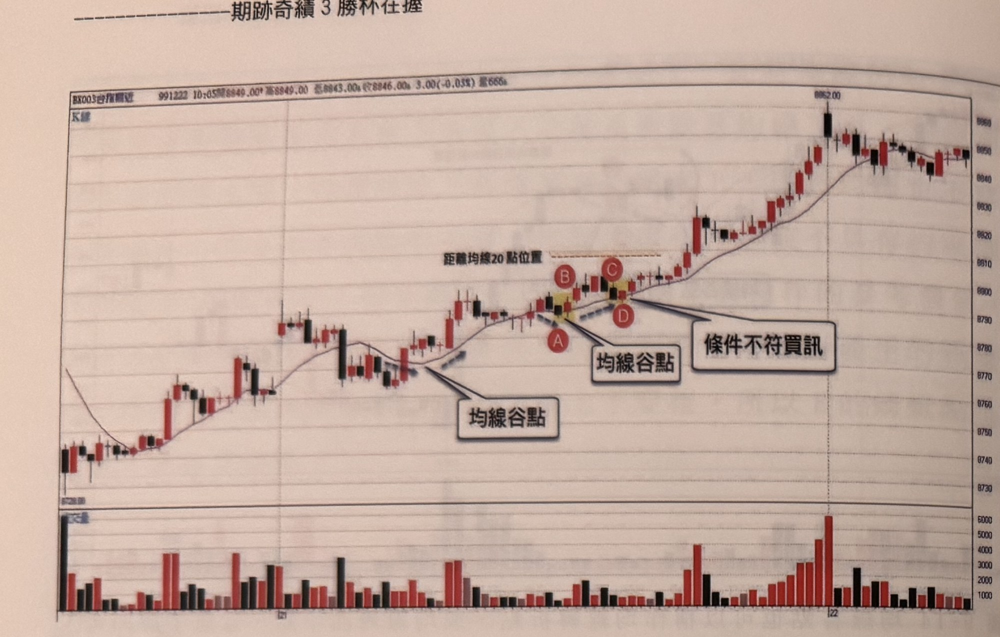

## p.204

**圖 9-16** 蜻蜓點水最重要的條件，均線不能因為價格收盤突破或跌破時，造成均線出現上勾或下彎，繼之觀察價格峰谷點距離均線峰點是否大於 20 點，兩者先符合時，訊號就好找。

> 圖說：台指期近月（BX003台指期近）K 線圖，報價列顯示「991222 10:05開8849.00 高8849.00 低8843.00 收8846.00 3.00(-0.03%) 量666」。K 線走勢：左側低點 8728.00 附近起漲，MA10 均線由下彎轉為走平後上揚，價格持續攀升，中段一處均線由上揚轉為下彎再走平，文字框「均線谷點」以指線指向此均線轉折處。價格續漲後小幅拉回，於另一均線轉折處再次標示文字框「均線谷點」，其正上方以橙色虛線標示「距離均線20點位置」；緊鄰標記紅底白字圓標 **A**、**B**、**C**、**D**（A 在下方黃底 K 線處，B、C 在上方兩根 K 線，D 在右下方黃底 K 線處），文字框「條件不符買訊」以指線指向 C、D 附近的 K 線。其後行情持續走高，MA10 均線同步上揚，價格一路攀升至高點 8962.00，隨後小幅拉回於高檔區窄幅震盪（K 線紅黑交錯）。下方副圖為成交量柱狀圖（紅漲黑跌），量能在左側起漲初期及尾段高檔區明顯放大（達 4000～6000），中段量能維持在 1000～3000 之間。

## p.205

# 二、平盤蜻蜓點水訊號

前一節的蜻蜓點水訊號，是以均線為架構，將 K 線跌破或突破均線的動作，當作蜻蜓點水的現象，形成一種跟隨趨勢的訊號，它是屬於順向訊號，可以與均線訊號或均線豬陽訊號組成順向訊號群組。本章將均線的基礎換成平盤（即昨日日線收盤的位置），以平盤作為觀察 K 線收盤向下跌破或向上突破，又在隔根重回平盤之上，或平盤下方，來形成一種買進或放空訊號。

昨日 K 線收盤的意義，代表昨日交易時段，多空互軋的共識結果，在分析上與最高最低形成判斷上三個重要因子，像美國線（BAR CHART）一般只畫出最高最低及收盤三個要素，而很多指標的基礎都是採用日線收盤為採樣，因此平盤如同一日均線般，是判斷多空的重要參考，行情在平盤上方，通常是有利多頭作價，若行情掉到平盤下方，則空頭伺機放空，讓多方不斷退守，盤勢就愈來愈低。

當價格跳高開盤，這個跳高多少點，都是針對平盤位置而言，開高的走勢，通常在消息面綜合變數後，有利多頭時，市場便跳高表達看好，但這不代表整天都能順順利利維持在平盤之上，反之亦然，凡看好的狀況下，行情突破朝平盤位置靠近，代表空方下壓，壓破平盤，則空頭就能趁多頭慌亂，使漲勢轉為跌勢，但多頭往往也不是省油的燈，多頭示弱，有時候是種誘空行為，當行情被壓回平盤，甚至一根五分鐘黑 K 線收盤破平盤，容易讓空方見獵心喜而空單陡增，結果誤入多頭設下的誘捕陷阱，隨即以紅 K 線重新翻上平盤上方，這種狀況通常以 K 線收盤跌破平盤，且只有一根 K 線為限，二根以上都不算，也不是我們討論的訊號。
