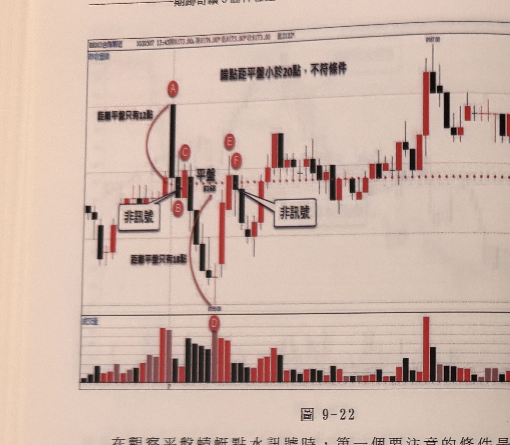
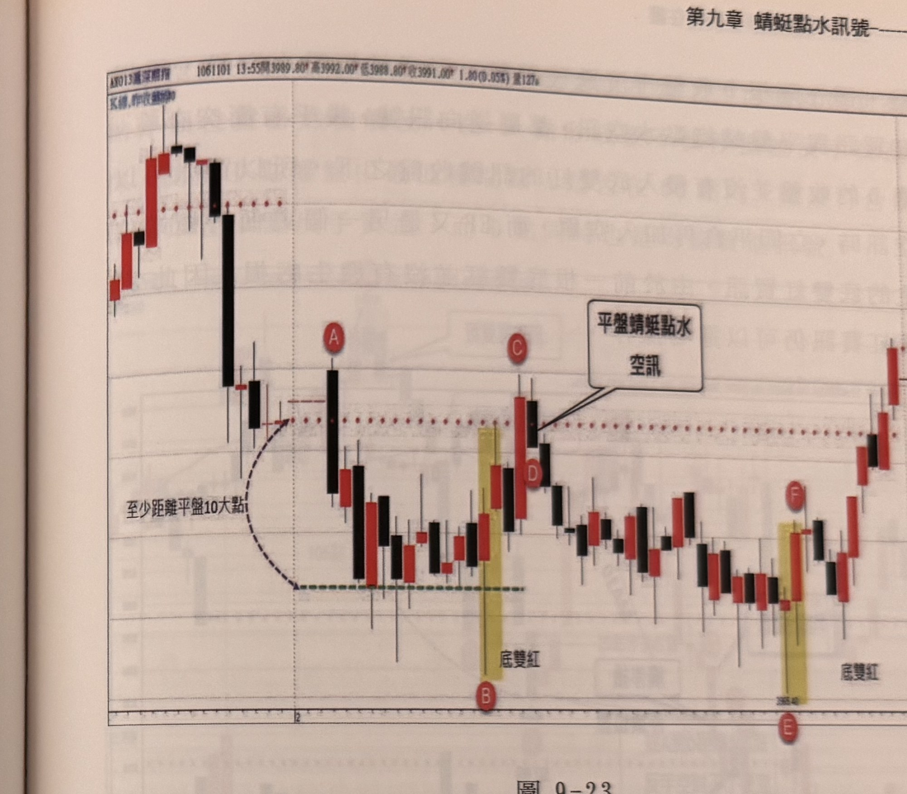

## p.212

**圖 9-22**

> 圖說（figure notes）: 台指期分時K線走勢圖含成交量副圖，頁首標示「BX003台指期近 1020507 13:45開8173.00 高8176.00 低8173.00 收8173.00 量2132」，左上角標示「均線」。走勢圖上方文字說明「端點距平盤小於20點，不符條件」。走勢左側跳高開盤，第一根長黑K線標記圓圈「A」，紅色弧線由A指向紅色水平虛線「平盤」附近，旁註「距離平盤只有12點」；隨後K線組合標記圓圈「B」「C」於平盤附近，紅框標註「非訊號」以線條指向B；隨後行情下探至最低點（標記圓圈「D」，旁註「距離平盤只有18點」），紅色弧線由平盤附近連接至D；隨後行情反彈至標記圓圈「E」「F」附近平盤上方，紅框另標註「非訊號」以線條指向E、F之間；隨後行情持續上攻至最高點「9187.00」附近，經過中段震盪，最終於圖右側高檔區間震盪。下方成交量副圖以紅黑柱狀圖顯示各K線成交量，於D附近成交量明顯放大。此圖對應本文說明：跳高開盤第一根K線即收黑靠向平盤，此時先看開盤高點A距離平盤只有12點，因此BC雖像蜻蜓點水，但端點距離平盤小於20點，一律不予考慮，稍後行情並沒有維持在平盤上方，在C之後數根黑K線下跌，直到D收長下影十字線才見止跌，此時D的低點距離平盤也只有18點，顯然行情處在窄幅盤整，因此當E的收盤突破平盤，隔根F重新跌破平盤，形成蜻蜓點水空訊，同樣因距離不符合條件，都不可當作操作訊號。

在觀察平盤蜻蜓點水訊號時，第一個要注意的條件是平盤上方或下方的極端位置距離平盤是否超過20點，而這個20點的距離是較寬鬆的限制，如果要更嚴格限制，亦可採40點，在第一型及第二型的訊號，採取40點亦可，第三及第四類型訊號，若用40點為條件，則訊號不容易產生。圖9-22的例子中，跳高開盤第一根K線即收黑靠向平盤，此時先看開盤高點A距離平盤只有12點，因此BC雖像蜻蜓點水，但端點距離平盤小於20點，一律不予考慮，稍後行情並沒有維持在平盤上方，在C之後數根黑K線下跌，直到D收長下影十字線才見止跌，此時D的低點距離平盤也只有18點，顯然行情處在窄幅盤整，因此當E的收盤突破平盤，隔根F重新跌破平盤，形成蜻蜓點水空訊，同樣因距離不符合條件，都不可當作操作訊號。

## p.213

# 第九章 蜻蜓點水訊號

如果將蜻蜓點水訊號，運用在滬深300期指行情，極端點距離平盤宜在10大點以上，其它的條件都一體適用，而均線蜻蜓點水訊號歸類在順向訊號，因為均線蜻蜓點水買訊，必然發生在均線朝上的情況下，因此是順向訊號無誤。但平盤蜻蜓點水訊號則屬於逆向訊號，就像交易訊號之直覺操作下冊介紹的平行支撐壓力訊號，乃基於昨高或昨低具有壓力與支撐效果，當價格接近昨高時，出現破最高接近K線低點為空訊，平盤蜻蜓點水的基礎是認定昨日收盤（平盤）具有支撐壓力作用，準此，亦屬逆向訊號。如圖9-23為滬深300期指，跳高開盤在A即下殺盤下，並在低檔橫向震盪近一個小時，當最低打到B點，開始上攻，B點距離平盤超過10大點，因此符合條件規定，而B與隔根紅K線形成底雙紅買訊，當C的K線收盤突

**圖 9-23**

> 圖說（figure notes）: 滬深300期指分時K線走勢圖，頁首標示「AX013滬深期指 1061101 13:55開3989.80 高3992.00 低3988.80 收3991.00 1.80(0.05%) 量127」，左上角標示「K線,昨收盤斜線」。走勢左側跳高開盤後一根長黑K線快速下殺，止跌後於紅色水平虛線（標示「平盤」）下方橫向盤整，黑色虛線弧形箭頭由平盤附近向下標註「至少距離平盤10大點」，指向最低點（綠色虛線標示），標記圓圈「A」（黑K線，開盤高點）及「B」（最低點）；隨後行情止穩反彈，於黃底標示區出現K線組合（標記「底雙紅」），行情持續上攻至標記圓圈「C」「D」附近（黃底區右側），紅框標註「平盤蜻蜓點水空訊」以線條指向C、D之間；隨後行情自高點回落整理，於另一黃底標示區出現K線組合（標記圓圈「F」，標示「底雙紅」，價位「3965.40」，標記圓圈「E」於下方）；最終於圖右側持續反彈上攻。此圖對應本文說明：跳高開盤在A即下殺盤下，並在低檔橫向震盪近一個小時，當最低打到B點，開始上攻，B點距離平盤超過10大點，因此符合條件規定，而B與隔根紅K線形成底雙紅買訊，當C的K線收盤突破平盤，隔根D重新跌破平盤，形成平盤蜻蜓點水空訊。
