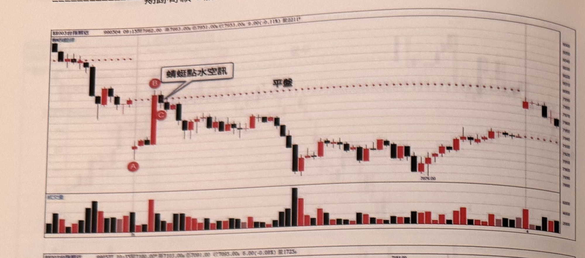
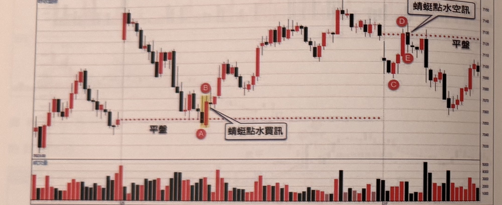
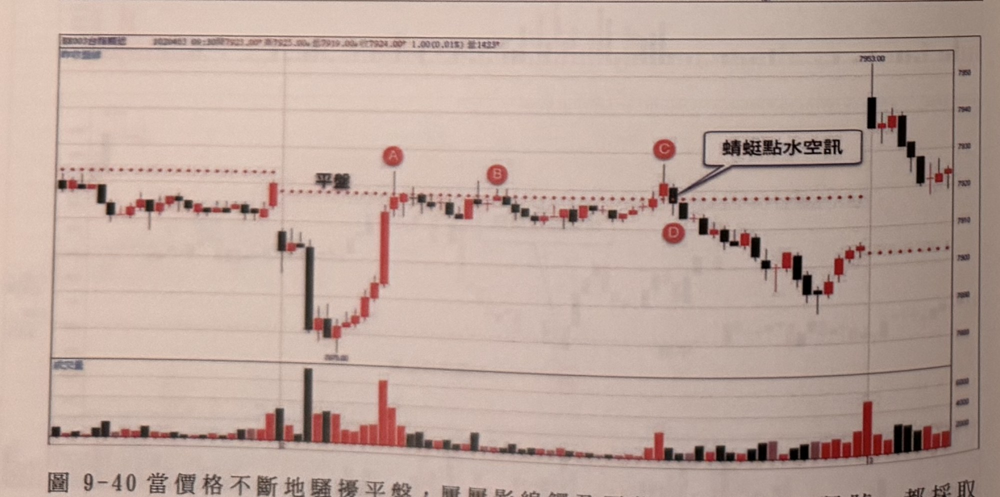
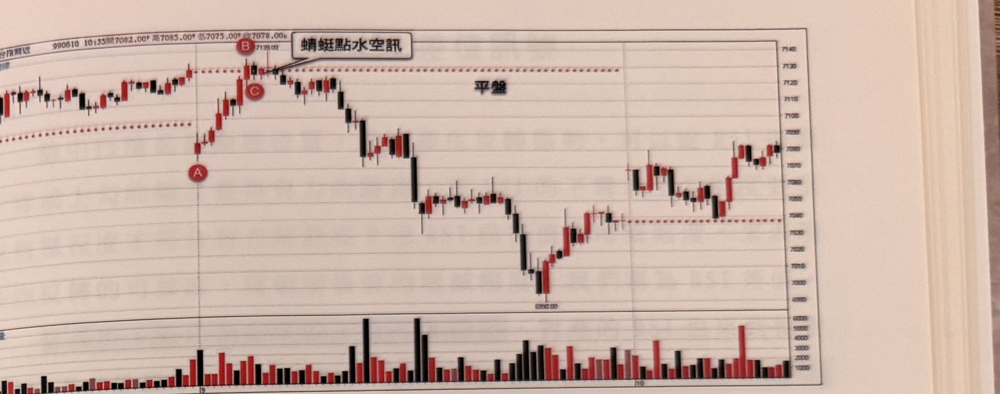
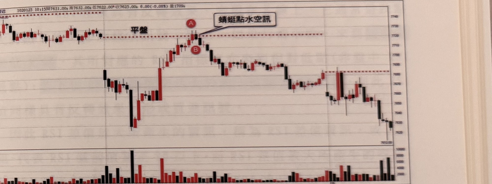
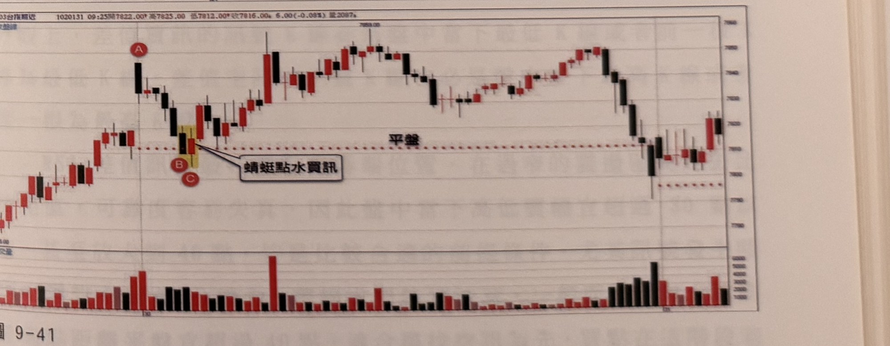

## p.224

[本頁前兩張圖無隨附說明文字，僅圖表本身]

> 圖說：台指期近月（BX003台指期近）K 線圖，報價列顯示「990504 09:15開7962.00 高7963.00 低7951.00 收7953.00 9.00(-0.11%) 量2211」。K 線走勢：左側震盪走低，圖中以紅色虛線標示「平盤」位置；價格跌破平盤後止跌，標記紅底白字圓標 **A**（低點附近）；隨後反彈站上平盤，以一根長紅 K 標記圓標 **B**、**C**（B 在上、C 在紅K線旁），文字框「蜻蜓點水空訊」以指線指向 B、C 之間。其後行情持續下跌，價格一路震盪走低至低點 7876.00 附近，其後於中後段區間反覆震盪走高，尾段小幅拉回收在圖右側。下方副圖為成交量柱狀圖（紅漲黑跌），量能在左側起跌段、B、C 訊號區及中段明顯放大，其餘時段量能相對平緩。

> 圖說：台指期近月（BX003台指期近）K 線圖，報價列顯示「990527 10:35開7100.00 高7103.00 低7091.00 收7085.00 6.00(-0.08%) 量1725」。K 線走勢：左側震盪走高走低交錯，圖中以紅色虛線標示「平盤」位置；價格回落至平盤附近，以黃底標示一根黑 K 與一根紅 K，標記紅底白字圓標 **A**、**B**，文字框「蜻蜓點水買訊」以指線指向此區。其後行情持續走高，價格一路攀升至高點 7154.00 附近，其後拉回至平盤附近，標記圓標 **C**，隨後再度反彈標記圓標 **D**、**E**，文字框「蜻蜓點水空訊」以指線指向 D 附近。其後行情反轉持續下跌，價格於中後段區間震盪走低，尾段於低檔區小幅反彈收在圖右側。下方副圖為成交量柱狀圖（紅漲黑跌），量能在左側起伏段及 A、B 訊號區明顯放大，其餘時段量能相對平緩。

圖 9-40 當價格不斷地騷擾平盤，屢屢影線觸及平盤，則 CD 發生訊號，都採取忽略。

**圖 9-40**

> 圖說：台指期近月（BX003台指期近）K 線圖，報價列顯示「1020403 09:30開7923.00 高7925.00 低7919.00 收7924.00 1.00(0.01%) 量1423」。K 線走勢：左側震盪走高後回落，圖中以紅色虛線標示「平盤」位置；價格跌破平盤大幅下探後急拉反彈，標記紅底白字圓標 **A**（反彈起漲的長紅 K）；其後於平盤附近反覆震盪多根紅黑 K 線，標記圓標 **B**；緊接標記圓標 **C**、**D**（相鄰於平盤附近的一紅一黑 K 線），文字框「蜻蜓點水空訊」以指線指向此區。其後行情持續下跌，中段於低檔區反彈走高後再度急漲至高點 7953.00 附近，隨後拉回。下方副圖為成交量柱狀圖（紅漲黑跌），量能在 A 反彈段及尾段急漲時明顯放大，其餘時段量能相對平緩。

## p.225

> 圖說：台指期近月（BX003台指期近）K 線圖，報價列顯示「990610 10:35開7082.00 高7095.00 低7075.00 收7078.00」。K 線走勢：左側震盪走高，圖中以紅色虛線標示「平盤」位置及上方另一條水平參考虛線；價格回落至平盤附近，標記紅底白字圓標 **A**；隨後反彈急漲至高點 7139.00 附近，標記圓標 **B**、**C**，文字框「蜻蜓點水空訊」以指線指向 B 附近。其後行情反轉持續下跌，價格一路震盪走低至低點 6990.00 附近，其後止跌反彈，中後段價格於區間內震盪走高，尾段收在圖右側。下方副圖為成交量柱狀圖（紅漲黑跌），量能在中段下跌段及低點反彈時明顯放大，其餘時段量能相對平緩。

> 圖說：台指期近月（BX007台指期近）K 線圖，報價列顯示「1020125 10:15開7631.00 高7632.00 低7622.00 收7625.00 6.00(-0.08%) 量1709」。K 線走勢：左側震盪走高走低交錯，圖中以紅色虛線標示「平盤」位置；價格於左段下探後反彈急漲，突破平盤持續走高，標記紅底白字圓標 **A**（高點附近），其下方標記圓標 **B**，文字框「蜻蜓點水空訊」以指線指向 A 附近。其後行情反轉持續下跌，價格一路震盪走低，中段於低檔區小幅反彈後再度下探至尾段低點收在圖右側。下方副圖為成交量柱狀圖（紅漲黑跌），量能在左段下探及 A 訊號附近明顯放大，其餘時段量能相對平緩。

**圖 9-41**

> 圖說：台指期近月（BX003台指期近）K 線圖，報價列顯示「1020131 09:25開7822.00 高7825.00 低7812.00 收7816.00 6.00(-0.08%) 量2087」。K 線走勢：左側起漲一根長紅 K，標記紅底白字圓標 **A**，圖中以紅色虛線標示「平盤」位置；價格回落至平盤附近，以黃底標示一根黑 K 與一根紅 K，標記圓標 **B**、**C**，文字框「蜻蜓點水買訊」以指線指向此區。其後行情持續走高，中段一根長紅 K 大幅上攻，價格續漲至高點 7959.00 附近，隨後拉回，尾段於低檔區小幅反彈收在圖右側。下方副圖為成交量柱狀圖（紅漲黑跌），量能在 B、C 訊號區、中段長紅 K 及尾段反彈時明顯放大，其餘時段量能相對平緩。

[圖 9-41 下方沒有印刷內容；所見淡字為背面 p.226 的透印（左右鏡像），不轉錄。]
