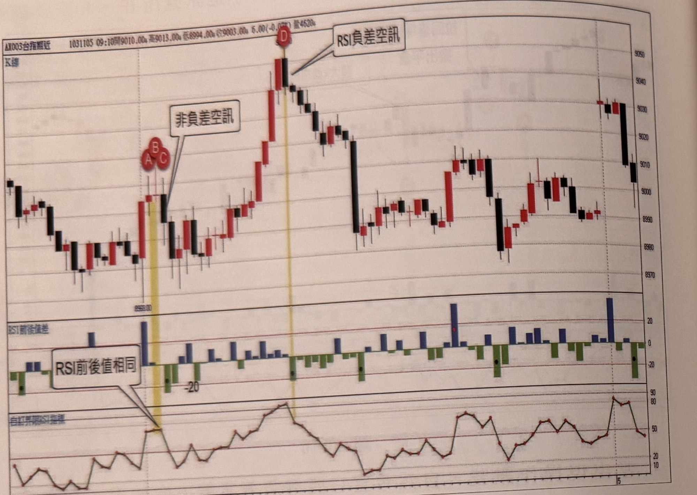
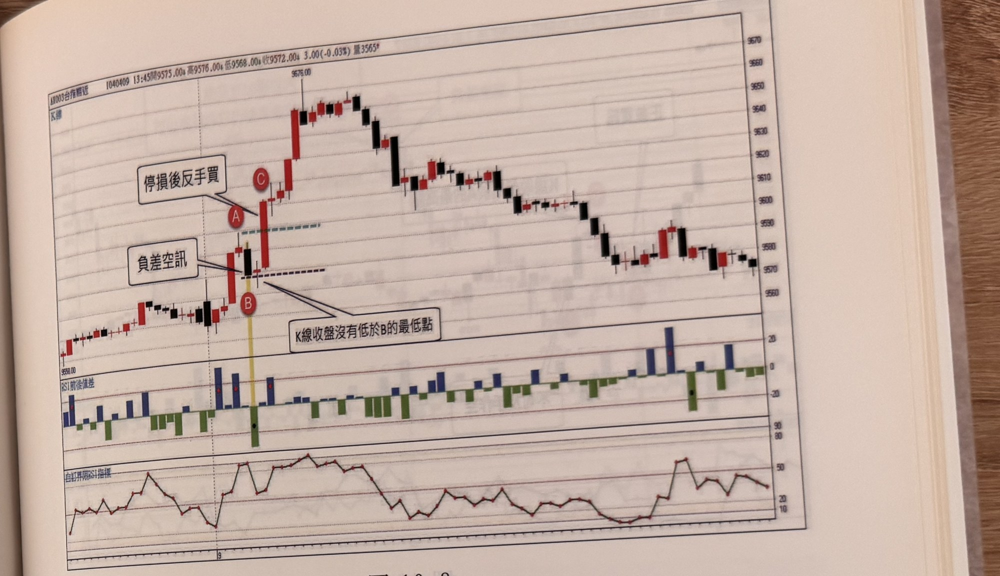

## p.234

使用。

**圖 10-7**

> 圖說：台指期近（AX003台指期近）K 線圖，報價列顯示「1031105 09:10開9010.00高9013.00低8994.00收9003.00 5.00(-0.05%)量4620」，左上另標示「K線」。K 線走勢：左側震盪下跌後回穩，標示紅底白字圓標 **A**、**B**、**C**（三點緊鄰，黃色直線標示於此處，價位約 8958.00），文字框「非負差空訊」指向此處；此後價格急速上揚，經多根紅 K 線後於高點附近標示 **D**（黃色直線標示，對應一根黑 K 線），文字框「RSI負差空訊」指向 D；隨後價格急跌一段（一根長黑 K 線），此後於中段區間反覆震盪整理，右側末端小幅回升後又轉跌。下方兩個副圖：上方「RSI前後值差」柱狀圖（藍色柱正值、綠色柱負值，刻度 20、-20），文字框「RSI前後值相同」以線指向 A、B、C 相鄰處對應的柱狀圖區域（該處柱值極小接近零）；下方「自訂界限RSI指標」曲線圖，隨 K 線走勢同步起伏，於 D 對應處達到高點（約 80）後回落，右側末端於高點（約 80）再度出現後小幅回落。

如果 RSI 呈現前後值相同，通常表示 K 線收盤維持與前一根 K 線收盤相同，隔一根 RSI 若出現上勾或下彎，不視為差值訊號；RSI 在相對高或低，外觀上必須是處在上漲或下跌進行中，因此不包括水平移動，舉例來說明，在圖 10-7 中，標示 A 與 B 的 K 線收盤價是一樣的，代表 B 雖然創新高，收盤未續漲，表現在 RSI，便呈現水平移動，RSI 前後值是一樣的，等到標示 C 出現 RSI 快速下彎，前後值差距超過 20，但 RSI 卻不是呈現上漲進行中，突然下彎，這種狀況的負差空訊，必須剔除忽略訊號；必須等到標示 D 位置，當根 K 線收黑，RSI 也由最高值快速下彎，才算形成負差空訊。

## p.235

既然差值訊號，必須發生在盤中的極端位置，但是極端位置並不是不能被攻破的，一旦極端高點並沒有產生回跌行情，反而只是冷卻過熱指標，就再突破新高，或者極端低點出現差值買訊，卻沒有反彈，隨即向下創新低，除非停損動作外，某些狀況下，可以反手操作，讓新的方向帶領獲利的機會，如圖 10-8 的例子，盤中出現 A 最高點後，在 B 出現 RSI 負差空訊，但之前卻沒有 K 線收盤低於 B 的最低點，反而重新向上突破 A 的高點，這種情況出現時，即使原先進場設 20 點停損，不必等觸及停損，在 C 的收盤突破 A 高點時，反手追買，跟進多單，顯然行情並沒有受制於 RSI 過熱的現象。如果 B 出現 RSI 負差空訊後，後續行情，K 線收盤曾經低於 B 的最低點，則不能做反手買動作。

**圖 10-8**

> 圖說：台指期近（AX003台指期近）K 線圖，報價列顯示「1040409 13:45開9575.00高9576.00低9568.00收9572.00 3.00(-0.03%)量3565」，左上另標示「K線」。K 線走勢：左側盤整後上揚，標示紅底白字圓標 **B**（一根黑 K 線，價位低點，文字框「負差空訊」指向此處），正上方緊鄰標示 **A**（文字框「停損後反手買」指向 A），A、B 之間有一條虛線水平標示（藍色短虛線標示 B 之前的相對高點延伸線），B 下方另有一條虛線（黑色短虛線標示「K線收盤沒有低於B的最低點」水平延伸線，文字框指向 B）；價格自 B 附近急速上揚，標示 **C**，繼續上漲至高點 9676.00，隨後震盪回落，經一段整理後持續下跌至右側低點區間（9570～9580 附近），末端小幅盤整。下方兩個副圖：上方「RSI前後值差」柱狀圖（藍色柱正值、綠色柱負值，刻度 20、-20），於 B 對應位置出現較大綠色柱（標示黑點），右側另有兩處較大藍色柱（各標示紅點）；下方「自訂界限RSI指標」曲線圖，隨 K 線走勢同步起伏，於左段反覆震盪於 20～50 之間，中段下探至低點（約 10）後於右側回升至相對高點（約 50）再小幅下滑。
