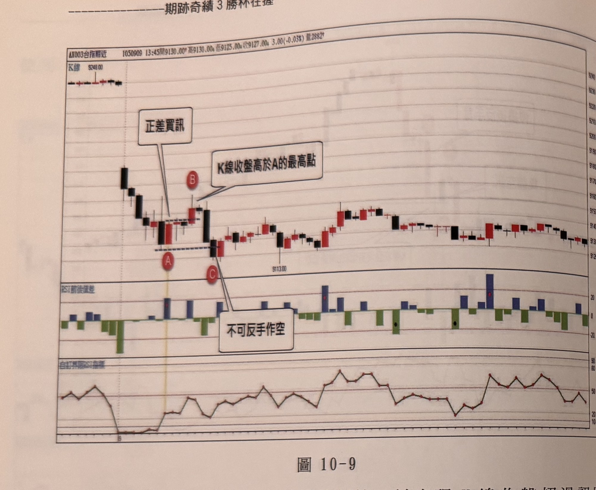
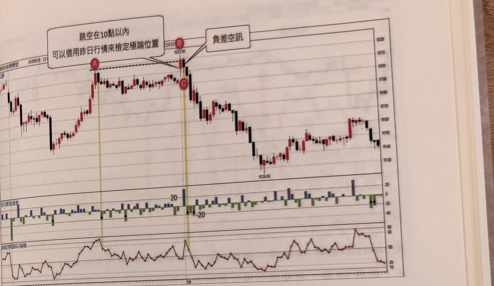

## p.236

**圖 10-9**

> 圖說：台指期近（AX003台指期近）K 線圖，報價列顯示「1050909 13:45開9130.00高9130.00低9125.00收9127.00 3.00(-0.03%)量2882」，左上另標示「K線」，並有一價位標示 9248.00。K 線走勢：左側急跌後緩步回穩，文字框「正差買訊」以線指向一根紅 K 線，其下方標示紅底白字圓標 **A**（黃色直線標示，對應一條藍色虛線水平延伸），正上方緊鄰標示 **B**，文字框「K線收盤高於A的最高點」指向此處；此後價格短暫下探，標示 **C**，文字框「不可反手作空」指向此處；隨後價格觸底反彈，沿震盪緩步走高，經多根紅黑相間 K 線後於中段標示低點 9113.00，此後持續在 9120～9160 區間震盪起伏，右側末端小幅回落整理。下方兩個副圖：上方「RSI前後值差」柱狀圖（藍色柱正值、綠色柱負值，無標示刻度數字但格線清楚），右側中段兩處出現較大藍色柱（各標示紅點）；下方「自訂界限RSI指標」曲線圖，隨 K 線走勢同步起伏，左段自高點急墜至低點後於中右段反覆震盪於 20～80 之間，右側末端於高點區間震盪後小幅回落。

如果出現差值訊號，進場後的行情，曾出現 K 線收盤超過訊號 K 線的最高點（正差買訊）或 K 線收盤跌破訊號 K 線的最低點（負差空訊），這種狀況下，若行情突破創新高或跌破創新低，只能進行停損，不能再反手順著新方向操作，例如在圖 10-9，開盤跳低走低，下探到 A 出現 RSI 正差買訊，之後 B 的 K 線收盤超過訊號 A 的最高點，B 的上影線高點比 A 的收盤高 20 點，換言之，如果選擇固定點數平倉是可以變成獲利的操作，假設不以 20 點為滿足，則拉回亦得在 A 的進場點撤單平倉，只要 K 線收盤曾經高過訊號 A 的最高點，則遑論超過 1 點或 20 點，折返向下跌破盤中最低谷點時，如 C 位置，不可反手作空。當然本例的考慮點，還有反手空的 C 位置，離平盤 120 點，除非當日重挫盤，不然討不到便宜。因此反手位置若盤中震幅已經超過 100 點以上，通常不宜再反手。

## p.237

**圖 10-10**

> 圖說：台指期近（AX003台指期近）K 線圖，報價列顯示「1030818 13:...開...24300...」（左側部分數值被上方文字框遮擋），左上另標示「K線」。K 線走勢：左側震盪回升，標示紅底白字圓標 **A**（黃色直線標示），文字框「跳空在10點以內 可以借用昨日行情來檢定極端位置」指向此處；價格上揚後於高位區間橫向盤整數根 K 線，隨後標示 **B**（價位 9223.00），文字框「負差空訊」指向 B，其正下方緊鄰標示 **C**（黃色直線標示，B、C 之間有一條黑色虛線水平延伸連接）；此後價格自 B/C 高點急速下跌，經多根黑 K 線持續探底至低點 9126.00 附近，隨後觸底反彈，沿震盪緩步走高，右側末端於 9140～9160 區間小幅震盪回落。下方兩個副圖：上方「RSI前後值差」柱狀圖（藍色柱正值、綠色柱負值，刻度 20、-20），於 B/C 對應位置出現當日最大藍色柱；下方「自訂界限RSI指標」曲線圖，隨 K 線走勢同步起伏，於 A 附近上揚至相對高點，B/C 附近達最高點後急速下彎，中右段反覆震盪於 20～50 之間，右側末端於高點區間（約 70～80）後小幅回落。

經過一天市場訊息消化的結果，開盤或多或少都會以跳空形式來表現，如果跳空點數小於 10 點，視為昨天尾盤的延續，可以短暫性合併觀看；盤中的極端位置，通常規定高低震幅 30 點以上或者跳空後高低點距離平盤超過 40 點，如果跳空 10 點內，可以當作昨日行情的延續，則不受盤中震幅 30 點之極端位置規定；例如圖 10-10 的特例，當開盤跳高 10 點內開出，B 為第一根 K 線，A 為昨天區間最高點，由於小跳空得併入昨天行情觀看，使得 B 成為昨日行情的極端高位置，因此當 C 點出現 RSI 負差空訊時，可以免受震幅 30 點限制，視為操作訊號，但如果跳空超過 10 點，且第一根無法比昨區間高點更高，則不能使用這種特例。

以下附圖請讀者自己參閱比對訊號。
