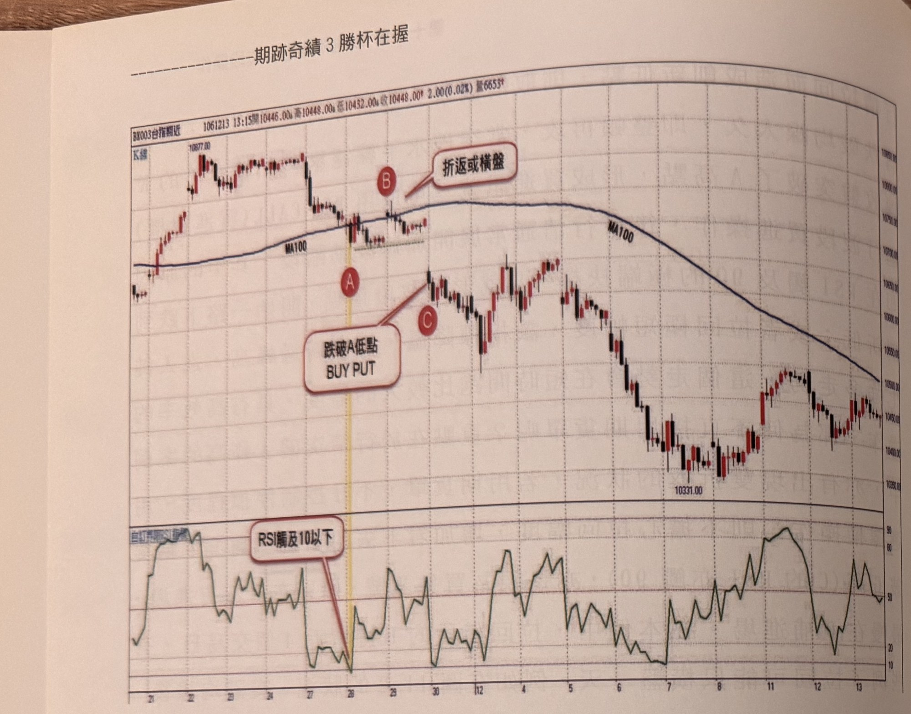
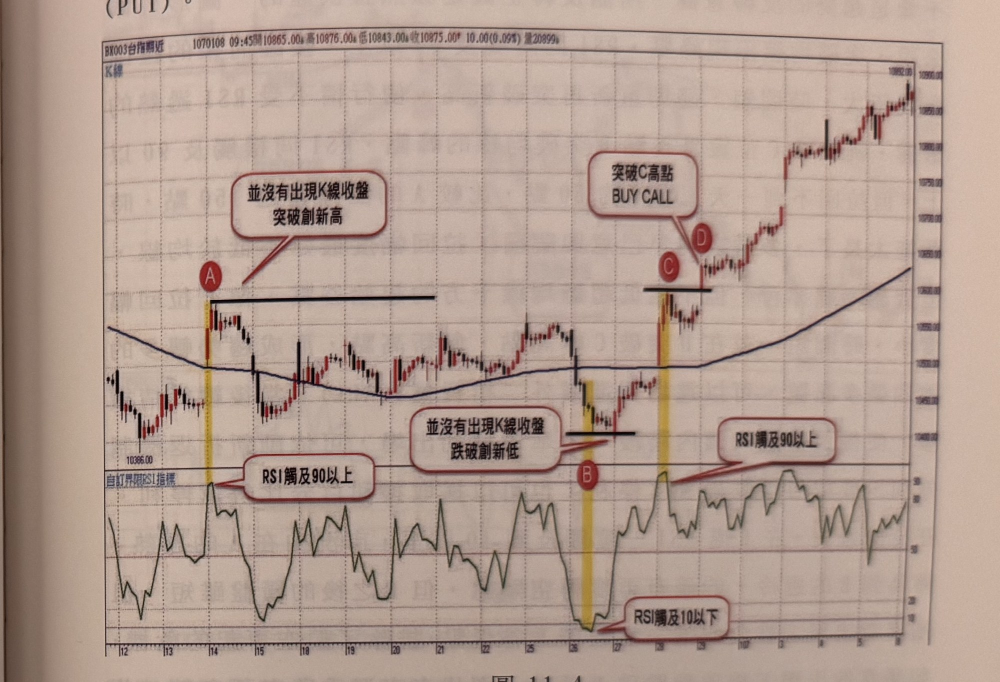

## p.250

**圖 11-3**

> 圖說：台指期近（BX003台指期近）K 線圖，報價列顯示「1061213 13:15開10446.00高10448.00低10432.00收10448.00 2.00(0.02%)量6653」。K 線走勢：左側價格在高點 10877.00 附近震盪，隨後向下拉回跌破藍色 MA100 均線，在均線下方形成一個低點，標示紅底白字圓標 **A**（黃色直線標示 A 的位置），A 的最低點以黑色水平線向右延伸標示。價格自 A 反彈向上突破均線，標示 **B**，文字框「折返或橫盤」指向 B 附近的橫盤區。此後價格再度回落，跌破 A 的水平濾網線，標示 **C**，文字框「跌破A低點 BUY PUT」指向 A 與 C 之間（顯示當 K 線收盤跌破 A 最低點時，買進賣權訊號）。跌破後價格出現一段反彈整理（在均線上下震盪），隨後持續走低，均線同步轉為下彎，途經低點 10331.00，最終於右側在 10450～10500 區間附近震盪整理。下方副圖為「自訂界限RSI指標」曲線圖，文字框「RSI觸及10以下」以指線指向 A 對應的 RSI 低點區域（曲線觸及圖表下緣 10 附近），此後曲線隨後續價格反彈與下跌多次於中高、中低區間往返震盪。

如果原先在均線上方移動的行情，向下拉回靠向均線，若出現 K 線收盤跌破均線，RSI 居然觸及嚴重超賣區 10 以下，均線可能只是走平，此時，拉回動作有可能只是多頭中途的拉回，但也有可能發展成反轉走空的初階走勢，因為 RSI 觸及 10 以下，若跌破均線的谷點在反轉後，再次向下跌破，則可以斷定往偏空趨勢發展。例如在圖 11-3 的例子中，原來還在均線上的多頭走勢，出現拉回走勢，K 線收盤跌破均線，並在均線下方的 A 位置形成谷位，此時 RSI 觸及 10 以下，可以在谷位 A 的最低點畫水平線，做為轉空的觀察濾網，而後行情呈現在均線橫向盤整，此階段反彈修正格局，沒限制不能超過均線，但不能反彈高點變成盤面新高點，那就不用再觀察轉空，當行情整理二天後，向下跳空，C 的 K 線收盤跌破谷點 A 最低點，破了水平濾網，形成空訊，可以買進價外二檔的賣權（PUT），像跳空

## p.251

下跌的 C 收盤在 10650 附近，因此可以買進價外二檔的 10400 賣權（PUT）。

**圖 11-4**

> 圖說：台指期近（BX003台指期近）K 線圖，報價列顯示「1070108 09:45開10865.00高10876.00低10843.00收10875.00 10.00(0.09%)量20899」。K 線走勢：左側價格自低點 10386.00 附近反彈上揚，快速突破藍色 MA100 均線，標示紅底白字圓標 **A**（黃色直線標示），文字框「並沒有出現K線收盤突破創新高」以指線指向 A 上方一條黑色水平延伸線（即 A 之後價格未能持續創高的區間上緣），另文字框「RSI觸及90以上」指向 A 對應的 RSI 高點。此後價格在均線附近橫向盤整，中途一度小幅走低跌破均線並形成低點，標示 **B**，文字框「並沒有出現K線收盤跌破創新低」以指線指向 B 附近的黑色水平延伸線（顯示 B 之後價格未再創新低），另文字框「RSI觸及10以下」指向 B 對應的 RSI 低點。此後價格重新向上突破先前 A 的水平濾網線，標示 **C**，隨即向上跳空突破，標示 **D**，文字框「突破C高點 BUY CALL」指向 C、D 之間（顯示 K 線收盤突破 C 高點時的買進買權訊號），另文字框「RSI觸及90以上」指向 C 附近的 RSI 高點。突破後價格沿均線之上強勢上揚，最終上探右上角高點 10952.00 附近，均線同步轉為上揚。下方副圖為「自訂界限RSI指標」曲線圖，附上下參考線，曲線在 A 附近觸及 90 以上、B 附近觸及 10 以下、C 附近再度觸及 90 以上，與 K 線走勢的關鍵轉折點相互對應。

突破均線隨處可見，RSI 指標值觸及 90 也不罕見，突破均線是一種轉變的現象，可以是真的也可以是假的，因為當下是看不到未來的走勢，無法確定真假，所以我們在突破當下，並不急於跳進去操作，而是等更多的證據來支持扭轉局面，因此用 RSI 來增強證據力，RSI 觸及 90 雖是過熱的市況，也代表物極必反的暗示，但它最重要是表明市場的強度，這對判斷趨勢是否反轉是重要的因素，如圖 11-4 的案例，均線向下移動時，縱使在 A 處開盤即突破均線，能說行情已經由空翻多了嗎？不確定，RSI 在 A 處觸及 90 以上，市況過熱，強度也展現出來，過熱就可能拉回降溫，如果後續行情開始拉回，而且不過 A 高持續了 10 天之久，拉回的低點 B 幾乎回到圖左
