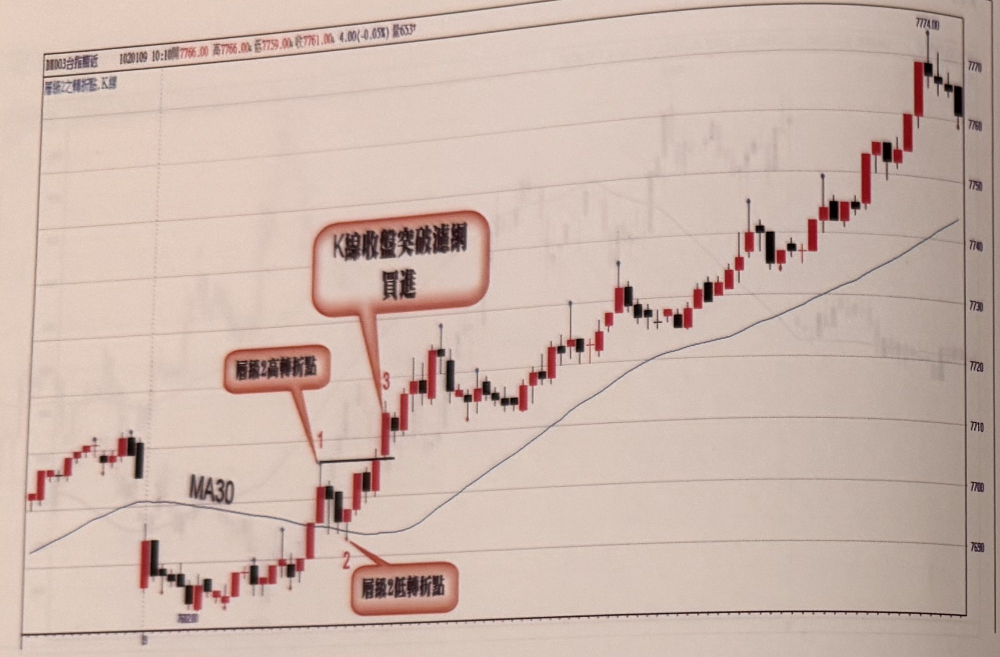
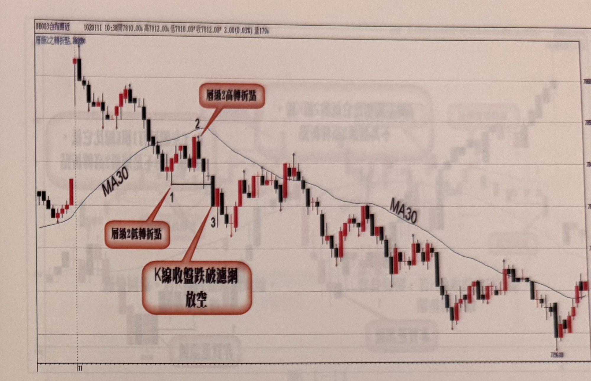

## p.8

盤中走勢若具有朝上發展的短趨勢，而不是窄幅盤整，則價格通過均線後，密切觀察行情產生第一個層級2轉折峰點並標示它為數字1，既然峰點出現，即代表行情開始進行拉回修正，如果它是一種修正狀態，則可預見價格呈現小幅拉回，而最重要的觀察為K線收盤是否跌破均線，如果沒有跌破，同時也出現層級2轉折谷點，便在谷點標示數字2，若行情從谷點向上恢復攻擊力道，並出現K線收盤突破數字1的峰點，則為買進訊號，並標示為數字3，代表行情訊號的發生三步驟完成。如圖1-8的例子，行情以跳低開盤，即位在均線（MA30）之下，在經過短暫價格探低後，即向上靠攏均線，並持續向上突破均線，建立標示1的層級2轉折峰點，接著拉回K線收盤沒有跌破均線，並產生層級2轉折谷點，以數字2標示之，再向上突破峰點，K線收盤的站上，代表買進訊號（標示3），果然行情隨後逐步推升，獲利自然可期。

**圖 1-8**

> 圖說：台指期近日K線圖（代碼DN003台指期近），時間1020109 10:10，開7766.00　高7766.00　低7759.00　收7761.00，漲跌4.00(-0.05%)，量633[?]。圖表左上角圖例文字：「層級2之轉折點，K線」。圖中畫有MA30均線（藍色曲線）。標示點1：層級2高轉折點（K棒站上均線後拉出的峰點）；標示點2：層級2低轉折點（拉回未跌破均線所形成的谷點）；標示點3：K線收盤向上突破標示1峰點的位置，紅色對話框標註「層級2高轉折點」與「K線收盤突破濾網　買進」。走勢說明：行情自左側低點區間整理後轉強站上MA30，於標示1形成高點，拉回至標示2止跌（未破均線），再度向上於標示3突破標示1高點確認買進訊號，其後K棒持續沿MA30上方走高，收在7774.00附近。

## p.9

行情若跌破均線（MA30），走勢開始轉空的機率大增，此時要開始尋找是否出現放空三步驟，如在圖1-9的例子裡，跳高開盤後，行情無力推升，逐漸拉回並跌破均線（MA30），當在標示1跌勢停頓，並出現左右各有兩根較高K線（以最低點來比較），代表標示1為一層級2轉折峰點，放空第一步驟已經出現，接著反彈出現，要注意價格反彈過程，有沒有K線收盤穿越均線，若有則破局，若沒有則注意有沒有某根K線左右邊都有兩根較低的K線（以最高點比較），在標示2位置的確是層級2轉折峰點，則放空第二步驟符合了，稍後價格從標示2開始下跌，此時要密切觀察K線收盤何時跌破標示1的谷點，標示3位置的K線收盤跌破標示1轉折谷點，就確認放空訊號出現，此時除了立刻進場放空，還得立刻建立停損位置。停損位置的設立方式，在後面有完整說明。

**圖 1-9**

> 圖說：台指期近日K線圖（代碼DN003台指期近），時間1020111 10:38，開7810.00　高7812.00　低7810.00　收7812.00，漲跌2.00(0.03%)，量179。圖表左上角圖例文字：「層級2之轉折點，K線」。圖中畫有MA30均線（藍色曲線）。標示點1：層級2低轉折點；標示點2：層級2高轉折點；標示點3：K線收盤跌破標示1谷點確認放空的位置，紅色對話框標註「層級2高轉折點」、「層級2低轉折點」與「K線收盤跌破濾網　放空」。走勢說明：行情自左側高點下跌，在標示1附近止跌整理（左右各有較高K線），隨後反彈站上MA30小幅走高至標示2形成高點後受阻回落，最終於標示3處K棒收盤跌破標示1谷點，確認放空訊號成立，其後行情持續下探至7695.00附近才止跌。（頁面右上角與下方另有淡淡的鏡像透印文字，為紙張背面內容透出，非本頁內容，已略過未轉錄。）
