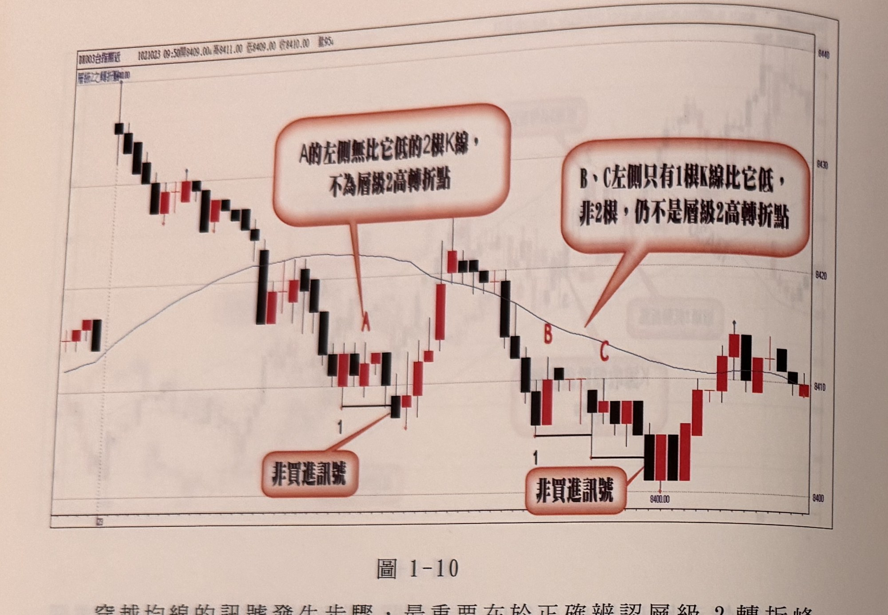
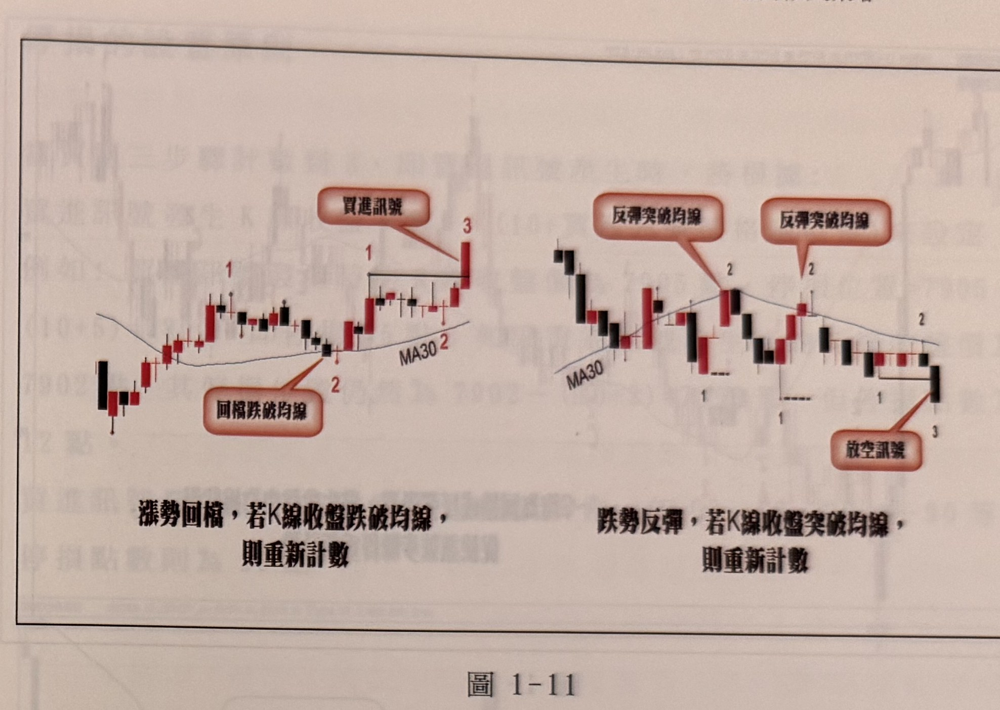

## p.10

穿越均線的訊號發生步驟，最重要在於正確辨認層級2轉折峰谷點，例如在圖1-10的例子，行情跳高開盤後，呈現拉回跌破MA30，並在標示1位置形成層級2轉折谷點，接著期待出現反彈不過均線的轉折峰點，但標示A不是層級2峰點，因為A的左邊並沒有兩根較低的K線，因此A不是轉折峰點，因此放空步驟就無法完成，隨後價格折返均線之上，則所有訊號發生步驟必須重來。相同狀況也發生在標示B及C位置，同樣左側沒有兩根較低的K線，使得B及C亦非層級2轉折峰點，因此在圖上沒有任何放空訊號出現。

只要三大步驟任一步驟條件不符合，都沒有妥協空間，必須重新尋找符合步驟與條件的走勢。

**圖 1-10**

> 圖說：台指期近日K線圖（代碼DN003台指期近），時間1021023 09:50，開8409.00　高8411.00　低8409.00　收8410.00，量95。左上角圖例「層級之轉折點00」（藍字，部分被裁切）。圖中畫有MA30均線。左半部：行情自左側高點一路下跌，於標示1處形成谷點（下方紅色對話框「非買進訊號」），隨後小幅反彈於A點受阻，但A左側僅有K線走勢下滑、並無兩根較低K線支撐，故A不構成層級2高轉折點（紅色對話框說明「A的左側無比它低的2根K線，不為層級2高轉折點」），因此對應的谷點1未能產生有效買進訊號。右半部：行情續呈區間震盪，於另一處再度出現標示1的谷點（「非買進訊號」），其後反彈至B、C兩個相近高點，但B、C左側都只有1根較低K線（不足2根），紅色對話框說明「B、C左側只有1根K線比它低，非2根，仍不是層級2高轉折點」，故亦不構成有效峰點、不產生放空訊號。圖右側行情其後才落底回升至8410～8415附近。

## p.11

在觀察交易訊號產生三步驟過程，只要折返出現K線收盤穿越或跌破均線，代表條件不符合步驟要求，流程得重新計數。折返過程發生穿越均線，往往代表價格對於均線的支撐或壓力不夠尊重，行情呈現在均線上下震盪盤整居多。

圖1-11解說重新計數的狀況，左圖在尋找突破均線後的買進訊號過程，標示1的層級2轉折峰點出現後，價格拉回整理，卻發生K線收盤跌破均線（MA30）情事，造成尋找買進訊號得重新來過。當價格重新站上均線並創下另一種層級2轉折峰點，重新標示為1，接著拉回整理，K線收盤不破均線時，並出現左右各有二根較高K線的谷點，便可標示為2，當後來的K線收盤突破標示1的峰點時，標示為3，代表買進訊號出現。右圖為放空訊號產生過程，價格反彈時，K線收盤卻突破均線，都必須重新計數，跌破均線出現層級2轉折谷點為標示1，反彈時K線收盤不突破均線，則標示為2，再下跌破了標示1谷點時，即為放空訊號出現。

**圖 1-11**

> 圖說：兩張並排的示意K線圖（均附MA30均線），說明「重新計數」規則。左圖標題（圖下方黑字說明）：「漲勢回檔，若K線收盤跌破均線，則重新計數」。走勢：先出現標示1的峰點，價格回檔，紅色對話框「回檔跌破均線」標示K線收盤跌破MA30（圖中標示2，位於「MA30」字樣旁），此時原本計數作廢須重新開始；隨後行情重新站上均線，出現新的谷點2（左右各兩根較高K線），最後K線收盤向上突破前高，標示3並以紅色對話框「買進訊號」標示，確認買進訊號成立。右圖標題：「跌勢反彈，若K線收盤突破均線，則重新計數」。走勢：行情沿MA30下方走跌，反彈時K線收盤一度突破均線（紅色對話框「反彈突破均線」，標示2），造成計數重新開始，其後又出現一次反彈突破均線（第二個「反彈突破均線」對話框，亦標示2），計數再次歸零，圖中並有兩處標示1的谷點對應這兩次失敗的計數；最終行情再度下跌，K線收盤跌破前一谷點，標示3並以紅色對話框「放空訊號」標示，確認放空訊號成立。
