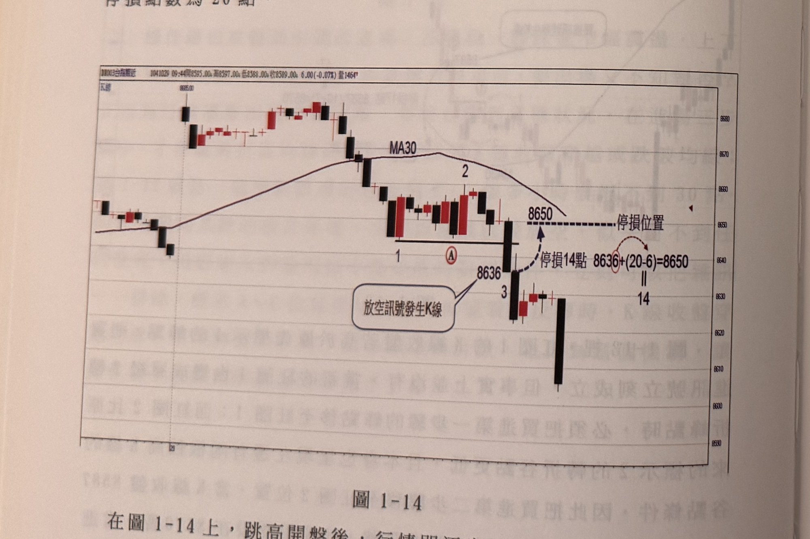

## p.14

場買進後，價格逆向下跌，徘徊在停損位置，報價出現買進8569賣出8570成交8569時，立刻以8566或市價掛賣停損。目前預掛停損的功能，各家證商軟體均有，請依此說明操作。

當放空三步驟計數到3，即放空訊號產生時，將根據：

放空訊號發生K線收盤+（20-放空訊號個位數）來設定停損點。

例如放空訊號發生時K線收盤價為7665點，則停損位置在7665+(20-5)=7680，停損點數為15點。

如放空訊號發生時K線收盤價為7701點，則停損位置在7701+(20-1)=7720，停損點數為19點。

放空訊號發生時K線收盤價之個位數為0，如00、10、20、…90等，停損點數為20點。

**圖 1-14**

> 圖說：台指期近日K線圖（代碼DN003台指期近），時間1041029 09:44，開8595.00　高8597.00　低8588.00　收8589.00，跌6.00(-0.07%)，量1464。左上角圖例「K線」，圖中另標示參考價「8685.00」於左側高點K棒上方。圖中畫有MA30均線，呈先升後降的圓弧走勢。標示點1：層級2轉折谷點（水平黑線向右延伸的低點濾網）；標示A：其後方另一個轉折谷點，位置略高於標示1（以紅圈圈住的A字標示），文字說明指出不應將濾網由標示1移至A；標示點2：MA30轉折後的相對高點；標示點3：行情跌破均線後最低、且收盤無遮蔽的K線，即放空訊號發生K線，紅色對話框「放空訊號發生K線」並標出其收盤價「8636」。圖右側以虛線箭頭與弧形箭頭說明停損設定：「停損14點　8636+(20-6)=8650」，並畫出水平虛線標示「8650．．．停損位置」。走勢說明：行情自左側高檔區間震盪後轉弱跌破MA30，於標示1形成谷點後反彈至標示2、A（兩者皆為左右各兩根較高K線的轉折點），隨後再度下跌，在標示3處的K棒收盤（8636）跌破標示1谷點，確認放空訊號，停損設於8650（14點），其後行情持續破底下跌。

## p.15

後，開始尋找放空訊號三步驟，標示1為左右各有兩根較高K線的層級2轉折谷點，隨後也反彈並出現標示2的轉折峰點，而在形成峰點同時，下方也出現標示A，同樣具有左右兩根較高K線的轉折谷點，不同的是A位置比標示1谷點高，是否要將標示1水平濾網，移至A位置呢？這種狀況是不宜移動的，假若我們把訊號發生位置移到A位置，後續若出現K線收盤跌破標示A轉折谷點的低點，但沒跌破標示1位置的轉折谷點，那會形成放空位置並非價格跌破均線後的最低無遮蔽K線，則訊號的可靠度將有疑慮。看一下標示3位置出現的放空訊號，它的K線是行情跌破均線（MA30）後，最低的K線，且收盤也符合最低且無遮蔽要求。因此，價格跌破均線後，第一個轉折谷點後，若持續出現更高的轉折谷點，不可向上移動。而在本例中，標示3的放空訊號K線收盤為8636點，其停損位置設在8636+(20-6)=8650。後續若行情不跌反漲，並逼近停損位置，當出現買進8650賣出8651成交8651時，要立刻以8654或市價掛買停損。

（本頁下半部另有一段淡淡的鏡像透印文字，為紙張背面內容透出，非本頁內容，已略過未轉錄。）
