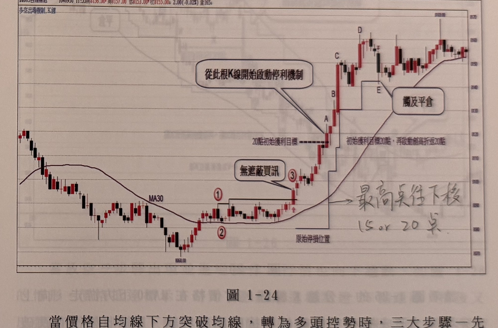

## p.28

**1、固定點數出場法**

每個對期貨操作抱持夢想的操作者，對於當沖的獲利往往期望一趟交易就能創造50點或100點，這樣才叫做爽，但事實上小行情佔了60%，就是訊號所產生的行情一半以上是小利潤行情（只有5～20點之間），很多人不顧相信這種事實，而一直想進場就要賺大的，不屑賺小的，結果結算下來呈現輸的局面。為什麼？看不起小行情利潤！我們要了解一件事實，操作訊號是價格符合條件時就產生，但它不會指出這次訊號能帶出多少利潤，你能做的就是當出現獲利時，你用什麼招式應對，如果你感覺得到價格的波動有點悶，幅度不大，一分鐘K線的漲跌幅都很小，頂多就是3點4點而已，那麼固定點數出場是個不錯的選擇，固定10點就獲利出場，或許能創造積小勝為大勝的局面，所以固定點數平倉主要運用在行情震幅小，沒有出現漲跌幅較大的K線（通常我們以K線漲跌幅超過7點來偵測），那麼進場後，若行情亦緩步波動，則使用固定點數出場。

**2、預設獲利目標到達啟動移動停利法**

另外一種移動停利機制是先預設一個獲利目標點數，它可能是10點、15點、20點或更多亦可，當價格K線收盤超過該位置後，再啟動移動停利，這樣可以避免進場後，行情呈現無感波動時，不會被指標或均線等雜訊而誤導平倉，等到行情正式呈現趨勢運動時，能夠亦步亦趨地跟隨行情前進，擴大戰果，移動停利機制又可細分以下方式：

**(1)、創新高或創新低折返點數：**

通常預設獲利目標點數設為15點或20點，當價格K線收盤過了預設獲利點數後，便開始依據價格創新高（多單）或創新低（空單）出現時，自最高點（多）或最低點（空）折返15點或20點，作為新的

（頁面右側邊緣另有零星淡淡的鏡像透印文字，為紙張背面內容透出，非本頁內容，已略過未轉錄。）

## p.29

停利位置，而這裡所謂創新高是指創新高的紅K線，它必須是K線收盤最高及上影線最高二個條件全符合，更嚴苛的條件則再加K線收盤必須無遮蔽，通常這裡不限制，出現這種創新高紅K線，自最高點折返15點或20點作為停利點，只要盤中跌破1點，即停利平倉。同理創新低是指創新低的黑K線，它必須是K線收盤最低及下影線最低二個條件皆符合，當做空單過程，預設獲利目標到達後，K線收盤創低且其最低點亦是最低時，自這根黑K線最低點向上折返15點或20點作為停利位置，若後續K線影線曾越此停利點超過1點，則立刻停利平倉。

**圖 1-24**

> 圖說：台指期近日K線圖（代碼DA003台指期近），時間1040930 11:55，開8156.00　高8157.00　低8153.00　收8155.00，跌2.00(-0.02%)，量165。左上角圖例「多空出場機制，K線」。圖中畫有MA30均線，呈先下滑後止跌回升走勢。左側行情自高點下跌至低點8068.00附近打底，其後在低檔區間出現標示①（層級2峰點，水平黑線延伸為濾網）與標示②（谷點），行情向上突破①的濾網，產生標示③「無遮蔽買訊」的紅K線（進場買進，下方黑線標示「原始停損位置」）。買進後行情快速上攻，於標示A處收盤達「20點初始獲利目標」水平虛線，紅色對話框「從此根K線開始啟動停利機制」指向A與其後數根K棒，說明自此根K線起啟動移動停利。其後價格續創新高，依序出現標示B、C、D（皆為階段性新高點，虛線階梯狀停利線隨每次新高向上墊高，並註記「初始獲利目標20點，再啟動創高折返20點」），最後在高點附近以手寫註記「最高點往下折　15 or 20 點」說明折返停利點的抓法；標示E處價格自高點拉回，觸及階梯停利線，紅色對話框「觸及平倉」標示出場點，行情最終在8050～8060區間附近震盪收尾，右側最高點以虛線圈出約8059.00。

當價格自均線下方突破均線，轉為多頭控勢時，三大步驟一先峰後谷不破線，再向上突破產生無遮蔽K線收盤，即進場買進，並設好停損位置；如圖1-24所示，再預設20點獲利目標，等到價格抵達標示A後，即啟動創新折返停利機制，自A的上影線最高點，拉回20點做為新的停利點，保障戰果，隨著B、C及D出現創新高

（頁面下方另有一行淡淡的鏡像透印文字，為紙張背面內容透出，非本頁內容，已略過未轉錄。）
