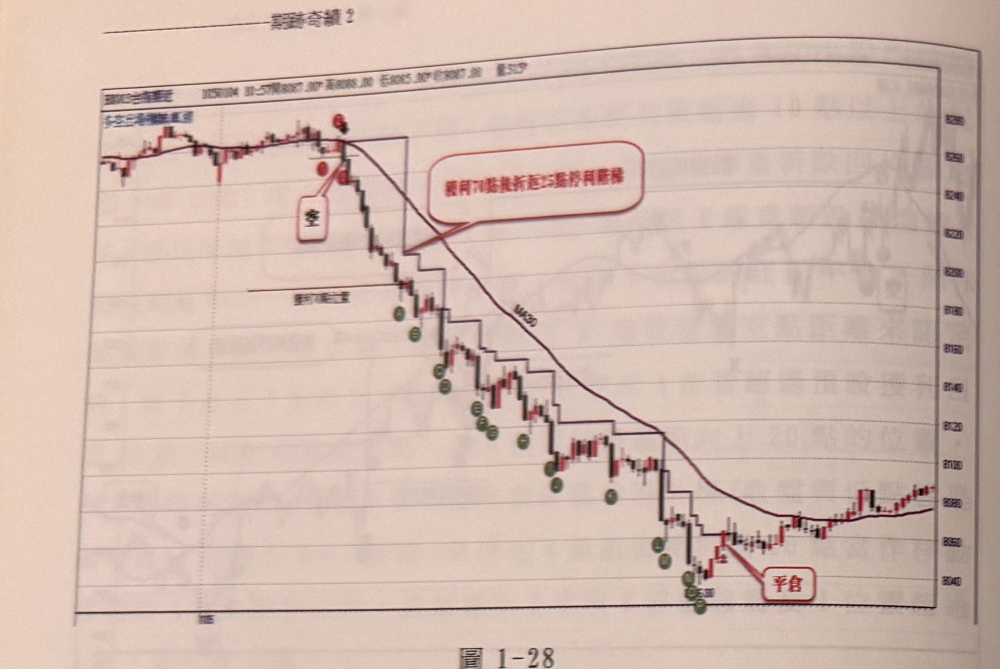
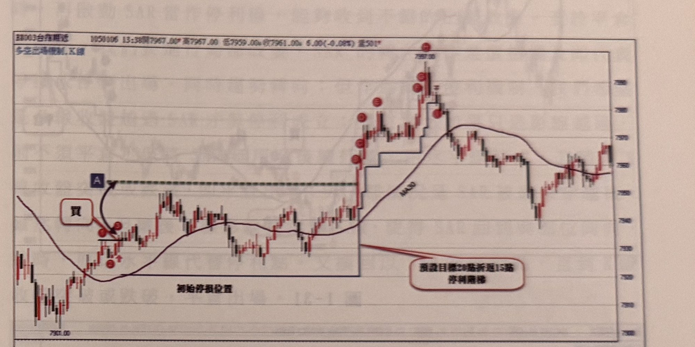
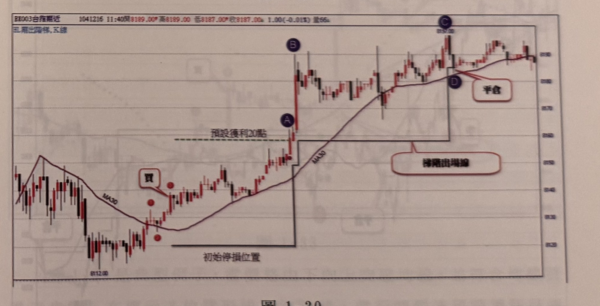

## p.34

**圖 1-28**

> 圖說：台指期近日K線圖，時間1050104 11:57，開8087.00　高8089.00　低8085.00　收8087.00，量317。左上角圖例「多空出場機制」。行情自左側高點區間（約8290附近）反轉直線下跌，紅點與紅色方框「空」標示放空進場位置，其下方水平線標示「濾網位置」（初始停損）。紅色對話框「獲利70點後折返25點停利階梯」指向一條隨MA30階梯狀下移的停利線。隨著行情持續破底，圖上以綠色圓圈字母Ⓐ～Ⓗ依序標出各個創新低點，每次創新低即依25點折返重新設定階梯停利線（藍色直角階梯線）。行情最終於右下角低點（約8040附近）止跌反彈，觸及最後一道階梯停利線，紅色對話框「平倉」標示出場，隨後行情小幅回升。

每個月的交易日裡，通常有5-7天會出現盤中一路向上或一路走跌的行情，而且進場後便快速呈現獲利狀態，這時候會直覺知道行情很大，如果在不到30分鐘內，即讓獲利到達70點水準，中途幾乎沒有違和的感覺，你可以選擇立刻出場，滿足平日未曾遇到賺好快的欣喜，亦可放大折返點數，製造更多的獲利可能；例如在圖1-28裡，期指開盤到現貨開盤初期，行情大致多在平盤上游走，狀態並沒有特別感覺任何大震盪來出現，即便價格跌破走平的均線，亦不會認為風暴來臨，當空訊發生並進場操作空單，不到11分鐘，價格下跌了70多點，甚感滿足之餘，要不要選擇出場或繼續跟，這是態度的決定，沒有說出場不對或留著就對，而是兩者的結果造成的好壞，都平常心接受它，當決定跟隨時，那麼也可以選擇將折返點數放大為25點或30點，代表願意承受跌勢中較大的反彈空間，隨著創新低黑K線不斷下移，直到價格觸及停利點，居然獲利達到208點，超豐盛的一役。這個例子告訴我們，當行情呈現速度極快

## p.35

向有利方向運動時，可以訂定獲利點數超過某一水準後，啟動更寬的折返點數，能夠承受更大的反彈挑戰，創造最大的獲利機會。

以下諸圖示範抵達預設獲利目標，再啟動依創新高或創新低K線折返點數，請讀者自行參閱練習。

**圖 1-29**

> 圖說：台指期近日K線圖，時間1050106 13:38，開7967.00　高7967.00　低7959.00　收7961.00，跌5.00(-0.08%)，量501。左上角圖例「多空出場機制，K線」。左側行情自高點回落打底後，紅點與紅色對話框「買」標示買進進場位置，下方黑線標示「初始停損位置」。價格上漲至方框「A」所在的虛線水準（預設獲利目標）後，開始依創新高K線每次折返15點設定新停利點，圖上以紅色圓圈字母依序標出各創新高點，停利線呈藍色直角階梯狀隨創新高上移，紅色對話框「預設目標20點折返15點停利階梯」說明此機制。行情持續墊高至最高點7997.00（頂端紅點標示），隨後拉回並越過MA30，在7960～7990區間震盪至圖右側。

**圖 1-30**

> 圖說：台指期近日K線圖，時間1041215 11:40，開8189.00　高8189.00　低8187.00　收8187.00，跌1.00(-0.01%)，量66。左上角圖例（多空出場階梯，K線）。左側行情打底後，紅點與紅色對話框「買」標示買進進場位置，下方黑線標示「初始停損位置」。價格上漲至黑色圓圈標示Ⓐ的虛線水準（預設獲利20點）後轉為階梯出場機制，隨後價格急拉至標示Ⓑ，續盤堅至最高點8159.00附近標示Ⓒ，階梯出場線（紅色對話框「階梯出場線」）隨創高持續上移，最終行情自高點拉回，在標示Ⓓ處觸及階梯出場線，紅色對話框「平倉」標示出場位置，其後行情在高檔區間小幅震盪。
