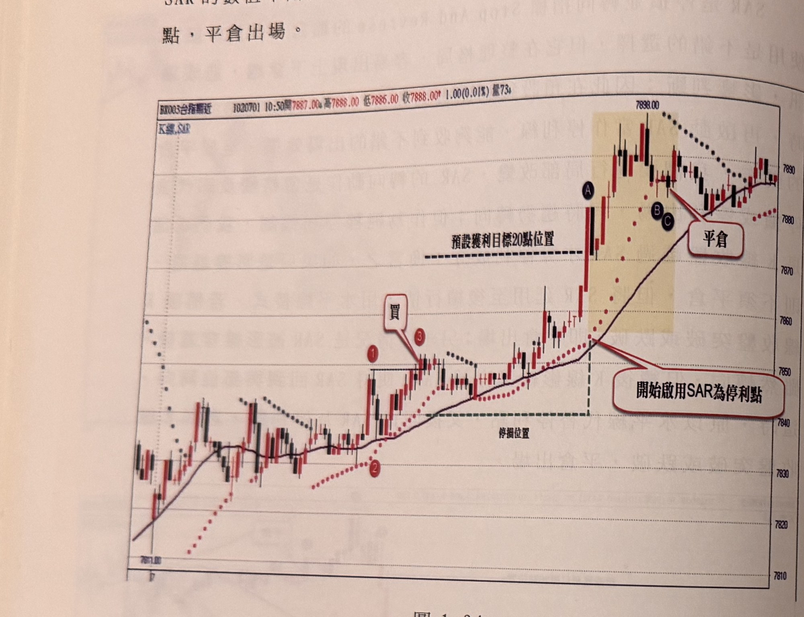
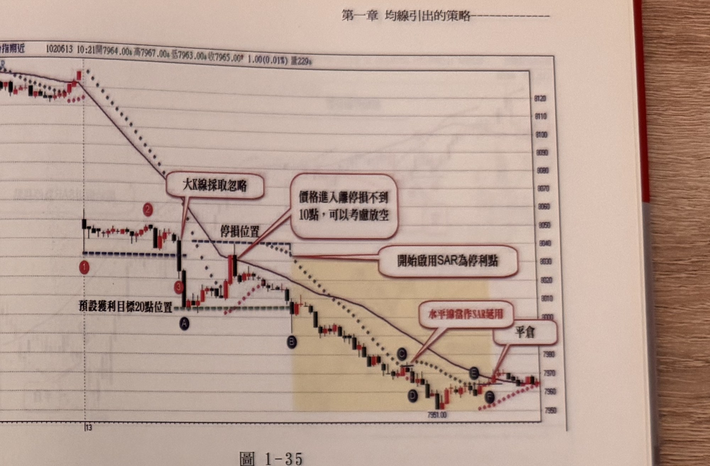

## p.38

SAR的數值不斷向上提升，直到標示C位置K線收盤跌破SAR停利點，平倉出場。

**圖 1-34**

> 圖說（figure notes）：台指期一分鐘K線圖（BX003台指期近，時間1020701 10:50，開7887.00，高7888.00，低7886.00，收7888.00），標題「K線,SAR」，圖上有一條實線均線與一串點狀 SAR 點。走勢圖左段價格自低點（7811.00附近）緩步盤堅，標示「1」為一個相對高點，「2」為隨後的拉回低點，其上對話框「買」搭配標示「3」為突破1的K線收盤買訊位置。買進後價格加速走高，圖上有黑色水平虛線標示「預設獲利目標20點位置」。價格續漲穿越該線並突入黃色網底標示區，於標示「A」處達到高點附近；再上方SAR點由K線下方轉為上方（顏色由紅點轉為黑點），對話框以線段指向「開始啟用SAR為停利點」。其後價格於高點（7898.00）附近震盪走弱，SAR點延伸出的水平線上標示「B」「C」兩點，SAR點被觸及但未跌破的位置以紅線連至「開始啟用SAR為停利點」對話框；最終在標示「C」處K線收盤跌破水平線，對話框「平倉」標示出場點，其後價格延續在7880～7890區間整理。

前面提到SAR只要K線影線曾經穿越，哪怕只過1點，它便停損(或停利)，同時SAR點位在下一根K線立刻轉向，例如在圖1-34裡，當持多單，價格亦抵達標示A--預設獲利目標20點位置，開始啟用SAR停利點，隨著時間進展，SAR亦逐漸上移，到了標示B位置，K線下影線觸及SAR停利點(但收盤沒跌破)，SAR在隔一根立刻跳到上方成為空頭停損點，但我們提過利用SAR停利，必須K線收盤跌破方須平倉，準此我們把標示B的SAR停利點，畫水平線延用為停利點，在稍後的C位置，K線收盤終於跌破水平線，才須平倉出場。

## p.39

**圖 1-35**

> 圖說（figure notes）：台指期一分鐘K線圖（BX003台指期近，時間1020613 10:21，開7964.00，高7967.00，低7963.00，收7965.00），圖上有均線與SAR點。走勢圖左段價格自高點快速下跌，標示「1」為起跌位置，「2」為下跌途中的小反彈高點。標示「3」為一根跌破超過15點以上的大黑K線（放空訊號K線），對話框「大K線採取忽略」以線段指向此K線，其下方有藍色虛線「停損位置」與黑色虛線「預設獲利目標20點位置」。標示「A」位於停損位置附近的紅K線反彈點，對話框「價格進入離停損不到10點，可以考慮放空」指向A點，說明此處雖屬應忽略的大K線訊號，但反彈後價格接近停損僅剩不到10點，可以小博大進場放空。價格續跌，標示「B」處對話框「開始啟用SAR為停利點」，說明此時獲利已超過20點，改用SAR作為停利點參考。價格持續破底進入黃色網底標示區，SAR點在標示「C」處被上影線觸及但收盤未突破，紅色文字「水平線當作SAR延用」以線段指向此處的水平延伸線；其後在標示「D」處SAR點轉為黑點（跌破紅點SAR），與放空方向相同；價格續跌至標示「E」處，上影線再次觸及水平線但收盤未突破，同樣延用水平線為停利點；最終在標示「F」處紅K線收盤突破水平線，對話框「平倉」標示出場位置，K線圖右下角低點標示「7951.00」。

在圖1-35的行情裡，當日一開盤呈現向下跳空80點，亦出現符合步驟，在標示3位置出現空訊，但屬於跌破超過15點以上之大K線，原須採取忽略，但在A之後，出現反彈走勢，使得價格進入原空訊的停損位置不到10點區間，此時可以考慮以小博大，進場放空，停損位置仍設原來位置，當行情下跌到達標示B點，超過預設獲利目標20點後，開始啟用SAR做為停利點，在標示C的紅K線上影線穿過SAR，但收盤未突破SAR，因此把C位置的SAR停利點畫水平線延用，稍後在D位置的黑K線跌破紅點SAR，使得SAR轉向到上方變為黑點，與我們放空同方向，當SAR黑點低於水平線時，恢復以SAR黑點為停利點參考，行情又續跌至標示E位置，其黑K線上影線觸及但收盤未突破，再度使用E位置的SAR停利點畫水平線延用，直到標示F位置的紅K線收盤真的突破水平線，便可利停利平倉出場，完成極漂亮的放空交易。
