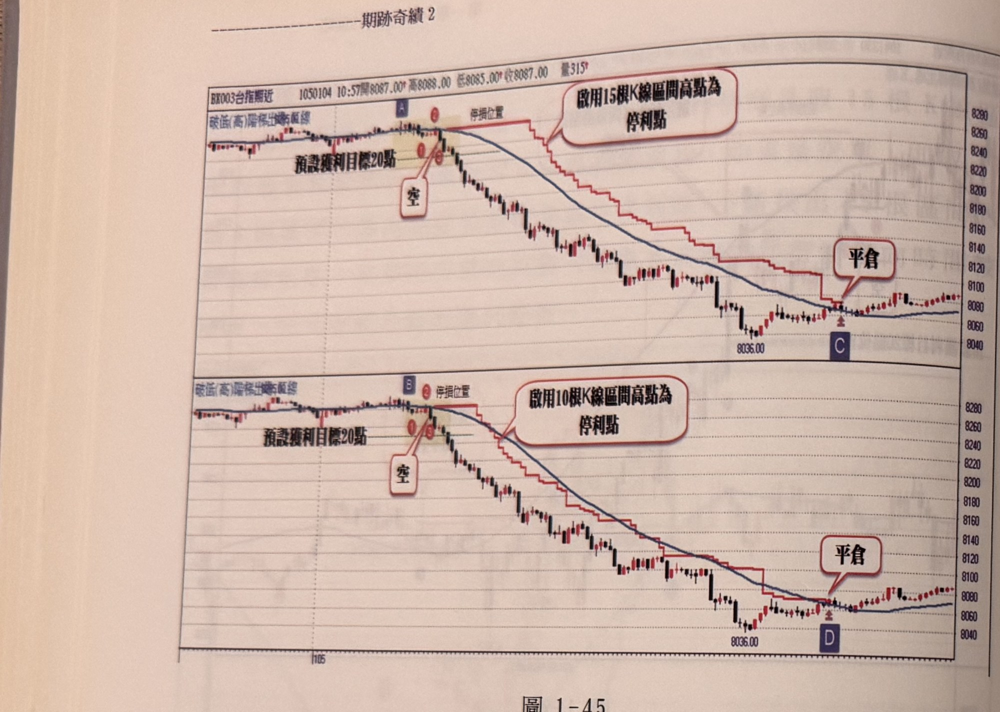
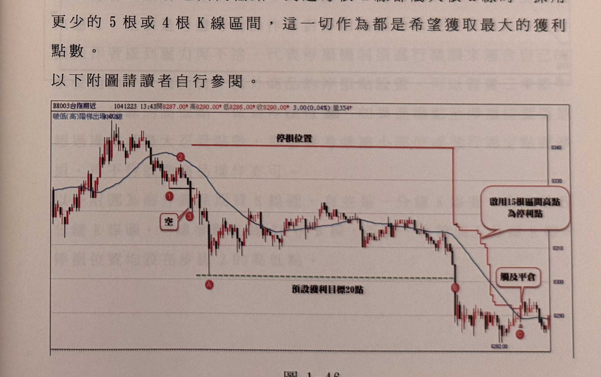

## p.48

**圖 1-45**

> 圖說：上下兩張相同走勢的台指期近日K線圖（代碼BK003台指期近），時間1050104 10:57，開8087.00　高8088.00　低8085.00　收8087.00，量315，用以對照不同區間根數的停利效果。上半圖：左上角圖例（破低（高）階梯出場移動線）。行情高檔盤整，紅點①②③與紅色方框「空」標示放空進場位置（標示Ⓐ），上方水平線標示「停損位置」，下方文字「預設獲利目標20點」。行情跌破目標後，紅色階梯線依「啟用15根K線區間高點為停利點」規則隨每15根K線的區間高點下移，行情持續下跌至低點8036.00附近，最終在標示Ⓒ處觸及階梯停利線，紅色對話框「平倉」標示出場（約8080附近）。下半圖：走勢與上半圖相同，圖例改為（破低（高）階梯出場移動線），放空進場標示為Ⓑ，改採「啟用10根K線區間高點為停利點」規則，停利階梯線較貼近價格（收斂於MA30附近），最終在標示Ⓓ處觸及階梯停利線，「平倉」對話框標示出場，出場位置與上半圖僅相差約一根K線。

圖1-45是個當日快速下跌的行情，上半圖為使用15根K線區間高點做為停利點，下半圖則是採用10根K線區間高點做為停利點，當行情很快的時間抵達預設獲利目標時，此時開始啟用區間最高點為停利點，但如果找出來的區間最高點，卻比放空點原先所設的停損位置還高，那麼不能將停利點移到比初始停損點更高位置，顯然不合理，如標示A及標示B位置，分別是15根K線區間最高點及10根K線區間最高點，比原來的停損位置高，那麼我們將原始停損位置保持不動，直到計算15根或10根K線區間高點不再高於原始停損點，才進行下移動作，而不同的區間高點，在本例中並沒有太大差別，標示C的出場點與標示D的出場點，相差只有一根K線，但移動軌跡來看，10根K線區間內縮在MA30之內，15根K線區間則在MA30外側移動，如果行情屬於速度盤，移動停利點若一直處在

## p.49

MA30外側，則可以縮小區間的根數，以讓停利點更貼近行情。

以15根區間高低點來說，遇到盤整超過20根以上，停利點容易被觸及出場，當發現15根區間高低點與20根K線區間高低點位置相差只有5點以內，此時可擴大為20根K線區間或30根K線區間，稍後行情若出現節奏明快的運動，則立刻採取原來的15根K線區間高低點做為停利點，因為根數愈多的區間，代表獲利回吐的點數相對也愈大，而行情呈現速度盤時，當然也可以採取較少根數的區間，如取8根或10根K線區間的高低點，價格行進速度愈快，K線根數愈少愈能緊跟行情；另外也可以採取多種區間搭配，例如在到達預設獲利目標20點啟用15根或20根K線區間高低點做為停利點，若行情推進速度加快，到達更高的獲利目標如50點，則採用8根或10根K線區間高低點，到達每根K線都屬大根K線時，採用更少的5根或4根K線區間，這一切作為都是希望獲取最大的獲利點數。

以下附圖請讀者自行參閱。

**圖 1-46**

> 圖說：台指期近日K線圖（代碼BX003台指期近），時間1041223 13:43，開8287.00　高8290.00　低8286.00　收8290.00，3.00(0.04%)，量354。左上角圖例（破低（高）階梯出場，K線）。左側行情自高點反轉，紅點①②③與紅色方框「空」標示放空進場位置，上方水平線標示「停損位置」，下方虛線與文字「預設獲利目標20點」。行情跌破目標於標示Ⓐ後，持續下跌至標示Ⓑ，紅色階梯線依「啟用15根區間高點為停利點」規則隨區間高點快速下移（紅色對話框說明），最終在標示Ⓒ附近觸及停利階梯線，紅色對話框「觸及平倉」標示出場位置，最低點約8282.00，其後行情在8285～8295區間小幅震盪。
