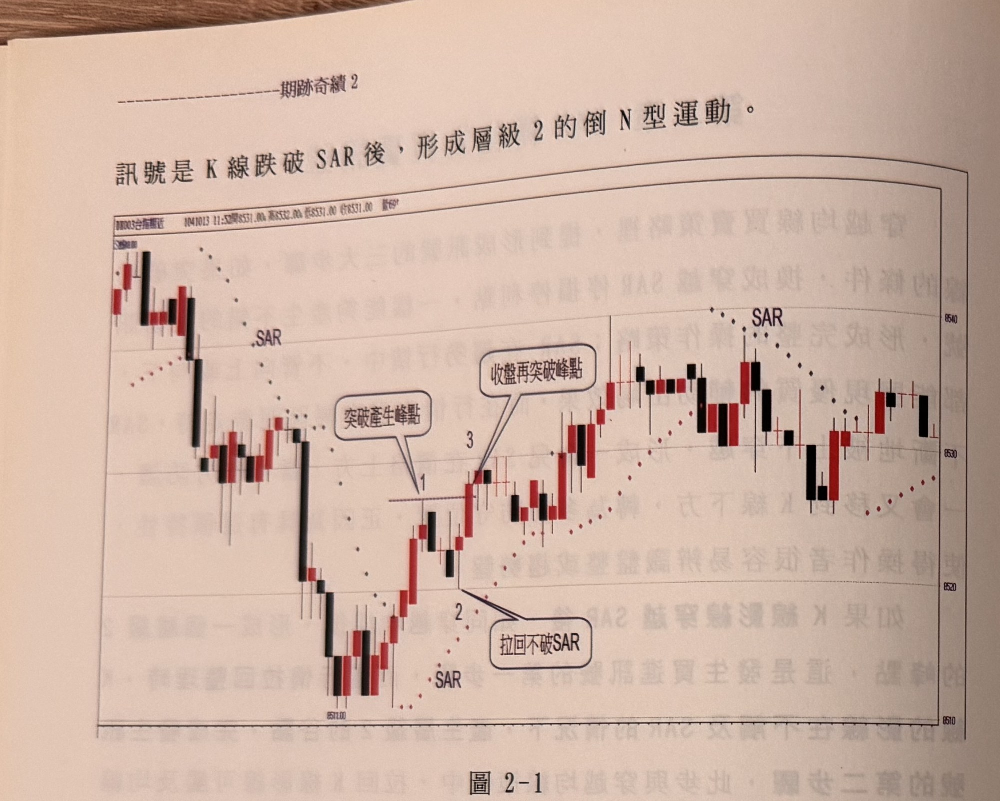
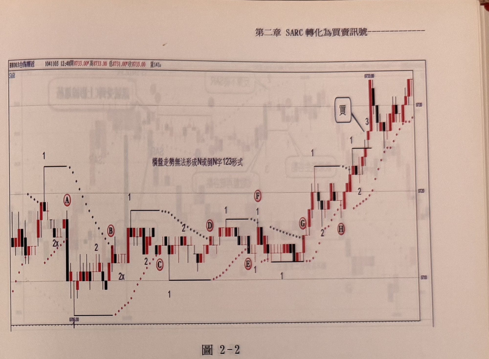

## p.68

訊號是K線跌破SAR後，形成層級2的倒N型運動。

**圖 2-1**

> 圖說：台指期近日K線圖（代碼BK003台指期近），時間1041013 11:52，開8531.00　高8532.00　低8531.00　收8531.00，量69。圖中以紅色點狀線繪出SAR，並以「SAR」文字標示於線上下兩處。左側行情自高點下跌至低點8511.00附近打底，隨後反彈，紅色對話框「突破產生峰點」指向標示1（K線突破SAR當根形成的層級2轉折峰點），拉回時K線下影線未觸及下方SAR，形成標示2的轉折谷點，紅色對話框「拉回不破SAR」說明此點。其後行情再度上攻，紅色對話框「收盤再突破峰點」指向標示3（K線收盤突破標示1峰點，買進訊號成立），其後行情持續在8520～8540區間震盪走高，收在8530附近。

請看圖2-1中央，當K線上影線觸及SAR時，隔根開始，SAR就由原本在上方當空方停利點，下移至區間最低點，轉為多方停損停利點，穿越SAR之後，形成如標示1的層級2轉折峰點，有些情形這個峰點可能在K線突破SAR當根出現（絕對不能出觸及之前），這種情形代表突破SAR隔根，K線的高點就沒再創新高，反而拉回測試處在下方的SAR，在本例中，峰點即已符合，拉回過程，K線下影線也沒有觸及SAR，形成標示2的轉折谷點，當標示3位置的K線收盤突破峰點，買進訊號就此產生，而整個通過SAR形成買進訊號的過程，就是一種N型運動。

操作多單的同時，停損位置的設立方法，與第一章穿越均線的買賣訊號的停損法一樣，此處不再贅述。而透過SAR來做為買賣訊號的產生器，不代表持倉及出場都依SAR的機制，一樣沿用預設獲利目標，再搭配不同的出場機制。

## p.69

當行情陷入窄幅盤整時，SAR會不斷地穿梭上下，如圖2-2的狀況，標示A跌破下方的SAR，出現了層級2谷點，接著反彈也有層級2峰點，但卻少了繼續向下跌破谷點的步驟，反而在標示B位置，向上觸及SAR，在隔根的確出現峰點，但拉回卻沒有符合層級2的谷點（標示為2X），因此，後來繼續有更高的峰點出現，將原來峰點標示移至此（標示1位置），其後雖拉回形成谷點，同樣沒有繼續上攻，就這樣行情不斷地輪迴，當標示G突破SAR後，蠻有機會形成上攻之勢，卻在標示H位置，再次向下點破SAR，就在山窮水盡疑無處，柳暗花明又一村出現符合三大步驟的買訊號。顯然在區間整理過程，會不斷地重新計數三大步驟，直到符合為止。就因為SAR有這種測試橫向盤整的功能，讓操作者不致於隨意進場而陷入泥沼中。

**圖 2-2**

> 圖說：台指期近日K線圖（代碼BX003台指期近），時間1041103 12:48，開8733.00　高8733.00　低8731.00　收8733.00，量141。左上角圖例「SAR」，圖中央文字方框「橫盤走勢無法形成N或倒N字123形式」，並以紅色點狀線繪出SAR。行情呈長時間窄幅盤整：左側標示1（水平線）與紅色圓圈Ⓐ標示第一個峰點，下方標示「2x」表示未符合層級2谷點條件；隨後陸續出現標示Ⓑ、標示1／2／Ⓒ、標示1／2／Ⓓ、標示1／Ⓔ、標示1／Ⓕ、標示Ⓖ、標示2／Ⓗ等一連串峰谷點，多次嘗試皆因步驟不符（如再度出現「2x」或跌破SAR）而重新計數，行情在8705～8720區間反覆震盪。最終在右側標示1、2後，紅色對話框「買」與數字「3」標示K線收盤突破前高、買進訊號成立的位置，其後行情急拉直上至最高點8733.00附近。

（本頁下方另有零星淡淡的鏡像透印文字，為紙張背面內容透出，非本頁內容，已略過未轉錄。）
