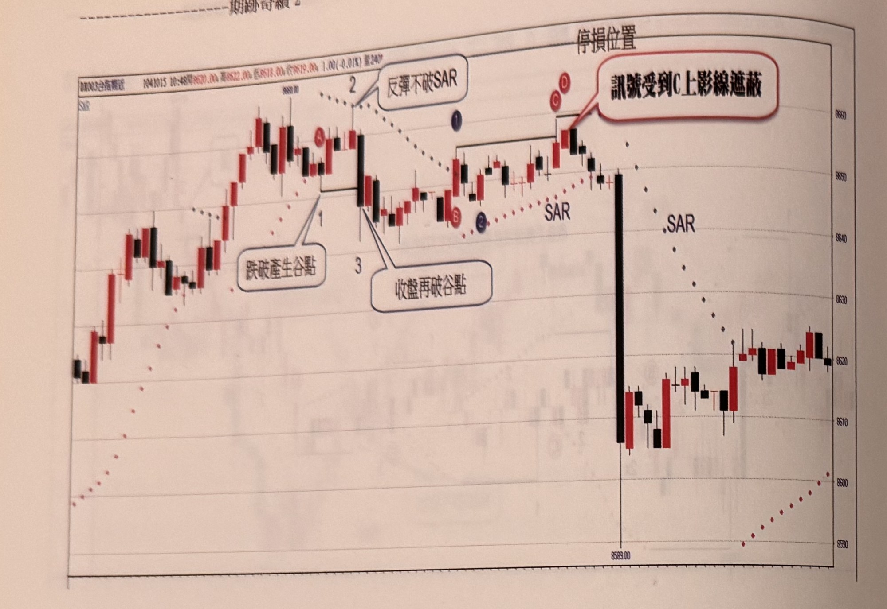
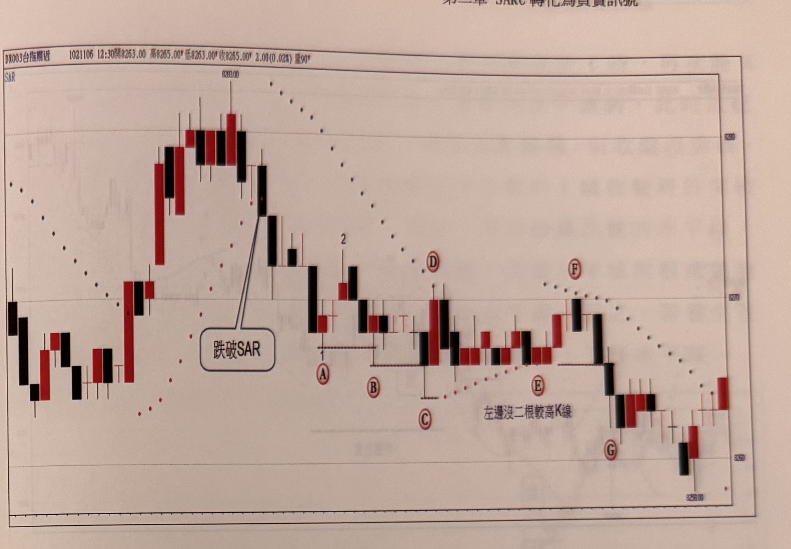

## p.70

當根據一個已發生的訊號進場操作時，開始要注意停損位置有沒有被觸及，另一方面則要留意反向訊號有無出現；如圖2-3的案例，行情在標示A位置向下觸及SAR，接著順利符合三步驟，形成放空訊號，進場操作後，設好停損位置，並留意有沒反向訊號的形成，只要反向訊號發生，必須無條件平倉加入反向訊號的操作行列，在標示B位置出現向上觸及SAR，這時要提高警覺，當步驟2拉回谷點亦符合時，在標示C的K線上影線穿越峰點，收盤沒有過關，隔根標示D雖然收盤越過標示1的峰點，但卻被C的上影線遮蔽，無法成為買進訊號，接著行情向下點破SAR，反向訊號發生的危機至此解除。任何訊號都不具有排他權，只要反向訊號成立，原先的訊號便要平倉，同時加入反向操作。

（以上第一段原書以螢光標示，此處僅照常轉錄文字內容。）

**圖 2-3**

> 圖說：台指期近日K線圖（代碼BK003台指期近），時間1041015 10:48，開8620.00　高8622.00　低8618.00　收8619.00，1.00(-0.01%)，量240。左上角圖例「SAR」，圖上方標示「停損位置」，峰頂價格「8660.00」。圖中以紅色點狀線繪出SAR（先後出現兩段，均標示「SAR」文字）。左側行情上漲至高點區，Ⓐ標示一峰點，其後拉回，標示1（谷點）搭配紅色對話框「跌破產生谷點」，標示3搭配紅色對話框「收盤再破谷點」；行情反彈，標示2並有虛線箭頭與紅色對話框「反彈不破SAR」，Ⓑ、藍色圓圈2標示層級2谷點；行情再度反彈，Ⓒ處K線上影線穿越前高但收盤未過關，隔根Ⓓ（藍色圓圈1）收盤雖越過前高峰點，卻被Ⓒ的上影線遮蔽，紅色對話框「訊號受到C上影線遮蔽」說明此無法構成買進訊號；隨後行情出現一根大黑K直線下跌，跌破SAR，最低觸及8589.00，其後行情在8600～8625區間震盪整理。

## p.71

SAR所產生的買賣訊號，同樣要求符合無遮蔽原則，例如在圖2-4例子裡，當價格跌破SAR，轉為空頭控盤時，在標示A位置出現層級2谷點，雖然之前亦有一谷點，但因它稍後並沒有出現對應的反彈峰點，因此當價格繼續下跌出現A時，要將步驟一的谷點位置下移至A位置，之後出現了反彈的峰點(2)，此時就等向下跌破A的K線收盤；稍後在標示B影線穿跌，但收盤未跌破，接著數根K線之後，標示C的K線收盤跌破了A，但是收盤價卻被標示B的下影線擋住，無法呈現無遮蔽，不能成為放空訊號，到了標示D位置的K線影線觸到SAR，造成行情的多空再度轉向為多頭控盤，之後的拉回(E)又再度跌破SAR，又再度轉空控盤，雖然反彈F的高點沒有碰觸SAR，並向下跌破E的低點，但標示E位置卻不是層級2谷點，它的左邊沒有超過2根以上之較高的K線，因此標示G不為放空訊號。

**圖 2-4**

> 圖說：台指期近日K線圖（代碼DX003台指期近），時間1021106 12:30，開8263.00　高8265.00　低8263.00　收8265.00，2.00(0.02%)，量90。左上角圖例「SAR」，峰頂價格「8283.00」，圖右下角低點價格「8258.00」。圖中以紅色點狀線繪出SAR。行情自左側高點8283.00反轉，紅色對話框「跌破SAR」指向K線影線向下跌破SAR之處，隨後行情持續下跌，依序出現標示1／Ⓐ（層級2谷點）、標示2／Ⓑ（反彈峰點）、Ⓒ（K線收盤跌破A但被B下影線遮蔽，不構成無遮蔽放空訊號）、Ⓓ（K線影線觸及SAR，轉為多頭控盤）、Ⓔ（拉回再跌破SAR，旁註文字「左邊沒二根較高K線」說明Ⓔ不是層級2谷點）、Ⓕ（反彈高點未觸及SAR）、Ⓖ（因Ⓔ不成立，故Ⓖ亦不構成放空訊號）。行情持續下探至右下角低點8258.00附近，尾端小幅反彈。

（本頁下方另有零星淡淡的鏡像透印文字，為紙張背面內容透出，非本頁內容，已略過未轉錄。）
