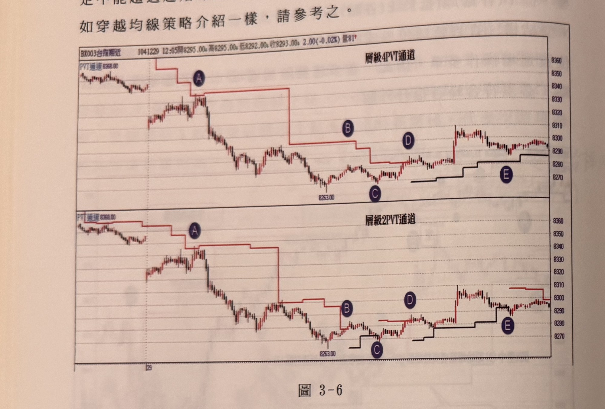
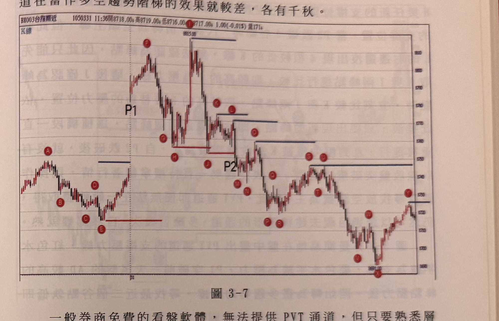

## p.100

定不能超過起始峰點（0）；當訊號確立時，即可進場操作，停損設置如穿越均線策略介紹一樣，請參考之。

**圖 3-6**

> 圖說（figure notes）：上下兩個對照的一分鐘K線子圖，上圖標題「層級4PVT通道」，下圖標題「層級2PVT通道」，兩者為同一段行情（報價列同為「BX003台指期近 1041229 12:05開8295.00高8295.00低8292.00收8293.00 2.00(-0.02%)量81」），僅 PVT 通道的層級參數不同。兩圖左上角皆標示「PVT通道8368.00」，並以深色圓圈字母 A、B、C、D、E 標示相同時間點的位置：K線自左側高檔區反轉下跌，紅色階梯狀 PVT 通道壓力線隨每個新低的峰點下移，標示 A 於第一個下移點，隨後價格續跌至低點「8263.00」；上圖（層級4）中，標示 B 處的紅色階梯線在此並未被向上突破，價格持續於階梯下方盤整，直到標示 D 處才重新向上突破，形成黑色階梯狀「多趨勢階梯」輔助線並隨標示 E 向上遞升；下圖（層級2）中，標示 B 處的紅色階梯線已被向上突破（多空易位），價格在標示 C 附近又再度跌破新的多趨勢階梯，直到標示 D 位置才又重新突破空趨勢階梯，隨後同樣在標示 E 附近沿黑色階梯狀多趨勢階梯走高。兩圖右側末端價格皆呈現小幅震盪走高至約 8300 附近。

PVT 通道的結構基礎不只可以用層級 2 峰谷轉折點來建立，也可以調整參數至層級 4 峰谷轉折點，層級愈高的 PVT 通道，行情符合的峰谷點相對少，所以階梯移動的次數相對降低，比較不受短暫性的波動影響，造成短趨勢反轉。如圖 3-6 的例子裡，從外觀來看，上半圖的層級 4 的 PVT 通道的轉折上下移動的次數，比下半圖的層級 2 的 PVT 通道的轉折次數少，而多空易位的次數上，層級 4 的 PVT 通道的確又比層級 2 少，例如標示 B 位置下半圖的空趨勢階梯被突破了，但上半圖的層級 4 的 PVT 通道卻沒有，而下半圖在 C 位置又再次破多趨勢階梯，接著在標示 D 位置又重新突破空趨勢階梯，但在層級 4 的 PVT 通道裡，卻沒有 B 與 C 這兩次多空易位，顯然層級較高的 PVT 比較不受短時間波動影響，但這不代表層級 2 的 PVT 通

## p.101

道在當作多空趨勢階梯的效果就較差，各有千秋。

**圖 3-7**

> 圖說（figure notes）：一分鐘K線圖（報價列顯示「BX003台指期近 1050331 11:36開8718.00高8719.00低8716.00收8717.00 1.00(-0.01%)量171」，副標題「K線」），為一般看盤軟體常見的普通K線圖，未內建 PVT 通道，改以紅色圓圈字母 A～Z（含 A、B、C、D、E、G、H、J、K、L、O、Q、S、T、M、N、P、R、V、X、Y 等）逐一標示每個層級 4 峰谷轉折點。左側價格先於 A、B、C、D、E 一帶小幅震盪整理，隨後以垂直虛線分隔並標示「P1」，代表當日開盤位置；價格自 P1 附近急漲至最高點「8815.00」，此處以藍色水平線標示壓力線並標示字母「F」（峰點）；隨後價格拉回至 G、H、J，再急漲至次高點（同樣觸及 8815 附近，藍色水平線標示壓力延續），拉回後在 K、L、O 一帶形成依序下移的藍色水平壓力線（階梯狀下移），並標示「P2」於中段一個谷點位置；此後價格持續在 M、N、Q、S、J、T、P、R 等點之間震盪走低，中途以紅色水平線標示支撐線；最終價格於「3691.00」（圖下方標示）觸底，以字母「X」標示最低點，隨後反彈至字母「Y」，右側末端以藍色水平線標示壓力，價格在其下方小幅震盪整理。

一般券商免費的看盤軟體，無法提供 PVT 通道，但只要熟悉層級轉折峰谷點的定義，用眼睛目測，同樣可以得出隱形的 PVT 通道，如圖 3-7 為一般軟體皆有的 K 線圖，記住層級轉折峰谷點的特性，本圖係採用**層級 4 轉折峰谷點，代表任一峰點必須左右各有 4 根較低的 K 線，而任一谷點必須左右兩側各有 4 根較高的 K 線**，這個定義抓住了，就能定位峰谷位置，然後記住兩兩取樣原則，多趨勢取出前後兩個谷點較低位置，空趨勢則取前後兩個峰點較高位置，作為 PVT 通道的支撐壓力線；首先前一天尾盤是被 PVT 壓力線制壓著，假若尾盤屬多趨勢，則取 BC 兩谷點較低的 C 做為支撐線，亦會被跌破，轉成空頭控盤，便取 AD 兩峰點較高者做為壓力線。

當天一開盤 P1 突破壓力線後，立刻取 CE 兩谷點較低的 E 做為 PVT 通道支撐線，當出現另一個谷點 G 時，再比較 EG 谷點，取較低的 E 繼續當支撐線位置，H 谷點出現時，比較 GH 兩谷點，取較低的
